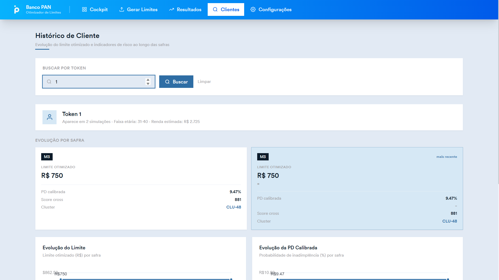
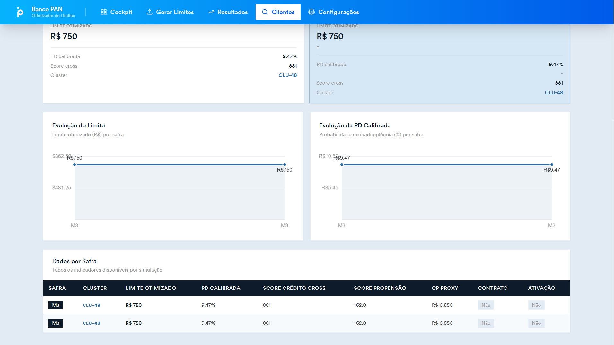
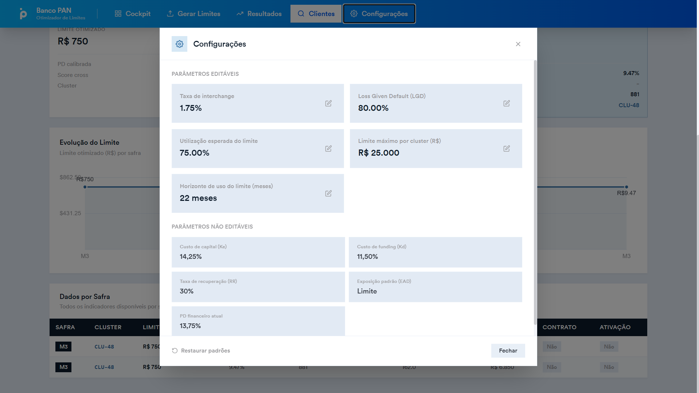
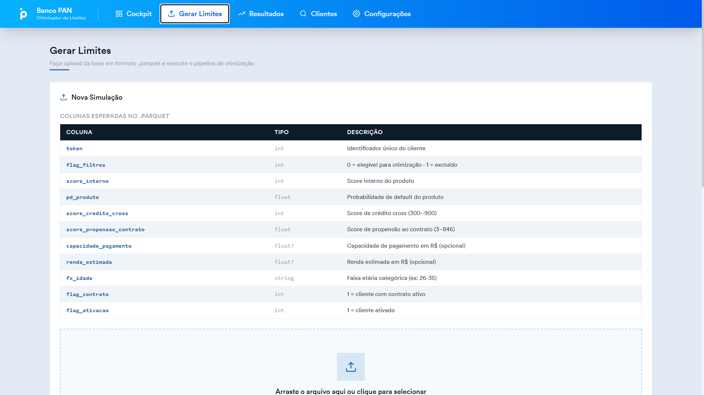
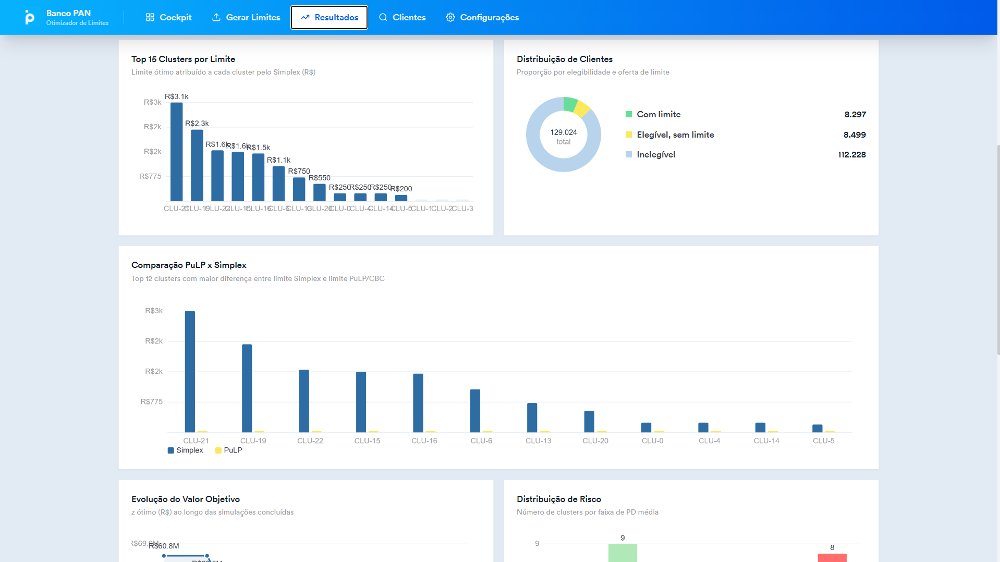
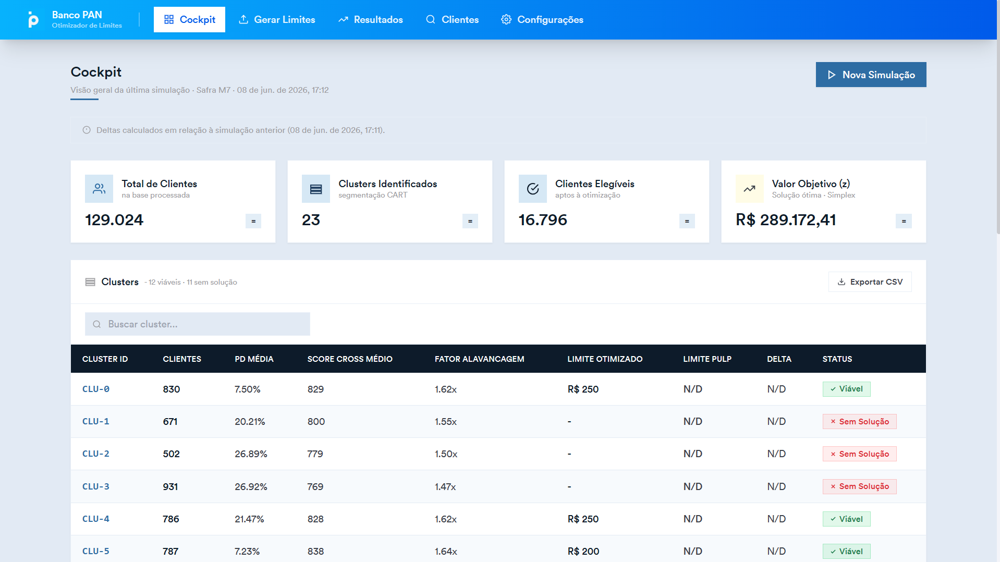

# Documentação da Aplicação - Sistema de Crédito Banco PAN

## 1. Introdução

&nbsp;&nbsp;&nbsp;&nbsp; Esta documentação descreve a arquitetura, funcionalidades e testes da aplicação **Sistema de Crédito Banco PAN**, abrangendo back-end, front-end e módulos de algoritmo. O objetivo é fornecer uma visão completa do sistema, garantindo a rastreabilidade das funcionalidades implementadas e a clareza do funcionamento de cada componente.

&nbsp;&nbsp;&nbsp;&nbsp; O sistema integra uma API FastAPI para gerenciar uploads de bases de crédito, execução de algoritmos de otimização de limites de crédito (implementação Simplex nativa e comparativo com PuLP), geração de resultados em CSV e um cockpit visual para acompanhamento das operações. A arquitetura desacopla o front-end estático (HTML/CSS/JavaScript) de um back-end robusto em FastAPI, facilitando manutenção e evolução independentes.

---

## 2. User Stories Implementadas

&nbsp;&nbsp;&nbsp;&nbsp; A tabela abaixo apresenta as User Stories previstas, as telas em que cada uma está implementada e o status de conclusão.

| ID | User Story | Tela(s) | Status |
|----|------------|---------|--------|
| US01 | Como operador, quero visualizar a lista de consultas de crédito para acompanhar o histórico de análises | Clientes | ✅ Completo |
| US02 | Como operador, quero criar uma nova consulta fazendo upload de uma base Parquet | Clientes / Gerar Limites | ✅ Completo |
| US03 | Como operador, quero buscar e filtrar consultas por safra ou data | Clientes | ✅ Completo |
| US04 | Como gestor, quero configurar os parâmetros do algoritmo (t, LGD, u_bar, L_max, T) antes de executá-lo | ConfigModal | ✅ Completo |
| US05 | Como operador, quero executar o algoritmo Simplex e visualizar os limites ótimos por cluster | Gerar Limites / Resultados | ✅ Completo |
| US06 | Como gestor, quero comparar os resultados do Simplex com estratégias alternativas (PuLP, uniforme) | Resultados | ✅ Completo |
| US07 | Como operador, quero baixar o CSV com os limites ótimos gerados | Resultados | ✅ Completo |
| US08 | Como gestor, quero monitorar o status em tempo real de todas as otimizações em andamento | Cockpit | ✅ Completo |
| US09 | Como gestor, quero visualizar indicadores operacionais e histórico de execuções | Cockpit | ✅ Completo |
| US10 | Como operador, quero fazer upload de arquivos grandes em partes (chunks) sem timeout | API (back-end) | ✅ Completo |

> **Nota:** Todas as US prioritárias foram implementadas. A US10 é suportada exclusivamente pelo back-end via endpoint de upload em chunks, sem interface visual dedicada — o front-end utiliza o fluxo de upload simples para arquivos dentro do tamanho padrão.

---

## 3. Telas Implementadas

### 3.1. Cockpits

&nbsp;&nbsp;&nbsp;&nbsp; Tela inicial da aplicação. Lista todas as consultas de otimização registradas, com suporte a busca e filtro por safra ou data. O operador pode criar uma nova consulta via botão "Nova Consulta", que abre o fluxo de upload de arquivo Parquet.

<div align="center">
<sub>Figura 1 — Tela de Clientes (visão inicial)</sub>
<br>

<br>
<sup>Fonte: Material produzido pelos autores (2025).</sup>
</div>

<br>

<div align="center">
<sub>Figura 2 — Tela de Clientes (com scroll, exibindo mais detalhes das consultas)</sub>
<br>

<br>
<sup>Fonte: Material produzido pelos autores (2025).</sup>
</div>

**Funcionalidades implementadas nesta tela:**
- Listagem paginada de consultas com status (pendente, processando, concluído, erro)
- Campo de busca e filtro por safra e data
- Botão "Nova Consulta" que inicia o fluxo de upload
- Acesso rápido ao resultado de cada consulta

---

### 3.2. Modal de configuração

&nbsp;&nbsp;&nbsp;&nbsp; Modal de configuração exibido antes da execução do algoritmo. O gestor pode editar os cinco parâmetros do modelo de otimização: `t` (threshold de risco), `LGD` (loss given default), `u_bar` (leverage máximo), `L_max` (limite máximo de crédito) e `T` (horizonte de tempo em meses). Validações em tempo real garantem valores dentro de intervalos aceitáveis antes de prosseguir.

<div align="center">
<sub>Figura 3 — Modal de Configuração de parâmetros</sub>
<br>

<br>
<sup>Fonte: Material produzido pelos autores (2025).</sup>
</div>

**Funcionalidades implementadas nesta tela:**
- Edição dos cinco parâmetros do Simplex com valores padrão preenchidos
- Validação de intervalos em tempo real (feedback visual imediato)
- Confirmação que dispara a execução do algoritmo

---

### 3.3. Gerar limites

&nbsp;&nbsp;&nbsp;&nbsp; Página principal de execução. O operador seleciona o arquivo Parquet de entrada, revisa os parâmetros configurados e inicia a otimização. A tela exibe um preview dos dados carregados e permite acompanhar o progresso do processamento assíncrono.

<div align="center">
<sub>Figura 4 — Tela de Gerar Limites</sub>
<br>

<br>
<sup>Fonte: Material produzido pelos autores (2025).</sup>
</div>

**Funcionalidades implementadas nesta tela:**
- Upload de arquivo Parquet com preview dos dados
- Exibição dos parâmetros ativos antes da execução
- Botão de execução que dispara chamada assíncrona à API
- Indicador de progresso durante o processamento

---

### 3.4. Resultados

&nbsp;&nbsp;&nbsp;&nbsp; Exibe os resultados da otimização: limites ótimos por cluster, valor ótimo da função objetivo (z) e comparativo com estratégia uniforme ou PuLP. Permite download do CSV de resultado e apresenta visualizações gráficas para análise.

<div align="center">
<sub>Figura 5 — Tela de Resultados (com scroll, exibindo comparativos)</sub>
<br>

<br>
<sup>Fonte: Material produzido pelos autores (2025).</sup>
</div>

**Funcionalidades implementadas nesta tela:**
- Tabela de limites ótimos por cluster com busca e paginação
- Valor ótimo da função objetivo (z) em destaque
- Comparativo visual entre Simplex, PuLP e estratégia uniforme
- Botão de download do CSV de resultados
- Gráficos de visualização dos dados (detalhados na Seção 4)

---

### 3.5. Cockpit

&nbsp;&nbsp;&nbsp;&nbsp; Tela de monitoramento em tempo real. Exibe indicadores operacionais consolidados (total de consultas, taxa de sucesso), histórico de execuções, linha do tempo de mudanças de status e visão geral de todas as otimizações em andamento.

<div align="center">
<sub>Figura 6 — Tela de Cockpit</sub>
<br>

<br>
<sup>Fonte: Material produzido pelos autores (2025).</sup>
</div>

**Funcionalidades implementadas nesta tela:**
- KPIs operacionais: total de consultas, taxa de sucesso, tempo médio de processamento
- Linha do tempo de status das consultas
- Histórico de execuções com detalhes expandíveis
- Atualização automática via polling à API

---

## 4. Visualização de Dados

### 4.1. Gráficos implementados

&nbsp;&nbsp;&nbsp;&nbsp; A aplicação implementa quatro visualizações, todas desenvolvidas com **p5.js** e renderizadas em canvas. Os gráficos foram projetados para apoiar a análise dos resultados de otimização com interações programadas:

| Gráfico | Tela | Descrição |
|---------|------|-----------|
| Gráfico de barras — Limites por cluster | Resultados | Exibe o limite ótimo alocado a cada cluster de clientes, permitindo comparação visual rápida |
| Gráfico de linha — Evolução do valor ótimo (z) | Resultados | Mostra a progressão do valor da função objetivo ao longo das iterações do Simplex |
| Gráfico comparativo — Simplex vs PuLP vs Uniforme | Resultados | Contrasta as três estratégias de alocação lado a lado por cluster |
| Gráfico de status — Distribuição de consultas | Cockpit | Pizza/donut com a distribuição de consultas por status (pendente, processando, concluído, erro) |

### 4.2. Interações e animações implementadas

&nbsp;&nbsp;&nbsp;&nbsp; Todos os gráficos foram implementados em **p5.js**, atendendo ao requisito da disciplina de uso de canvas com animações e interações programadas. As interações implementadas são:

- **Hover com crescimento suave** — ao passar o mouse sobre um elemento (barra, ponto, fatia), o elemento cresce levemente via animação interpolada no loop `draw()` do p5.js, dando feedback visual imediato ao usuário
- **Tooltip dinâmico** — ao hover, exibe o valor exato e a identificação do cluster/categoria na posição do cursor, implementado diretamente no canvas via `text()` do p5.js

&nbsp;&nbsp;&nbsp;&nbsp; Essas interações foram programadas frame-a-frame dentro do ciclo de renderização do p5.js, sem dependências de bibliotecas de gráficos externas, o que atende integralmente ao requisito de animações e interações programadas em canvas.

> **Diferença em relação ao protótipo:** O protótipo previa um gráfico de dispersão (scatter) para análise de risco × limite. Essa visualização foi substituída pelo gráfico comparativo Simplex vs PuLP vs Uniforme, mais informativo para a tomada de decisão do gestor — o scatter exigiria dados de PD individual por cliente, não disponíveis no contexto de clusters agregados.

---

## 5. Arquitetura e Back-End

### 5.1. Tecnologias

&nbsp;&nbsp;&nbsp;&nbsp; O back-end foi desenvolvido em Python com o framework **FastAPI**, escolhido por sua leveza, suporte assíncrono nativo e documentação automática via Swagger/OpenAPI. Como banco de dados, foi utilizado **PostgreSQL**, com integração via pool de conexões assíncronas e mapeamento ORM com SQLAlchemy.

&nbsp;&nbsp;&nbsp;&nbsp; O front-end estático (HTML/CSS/JavaScript vanilla) é servido simultaneamente com a API pelo mesmo servidor uvicorn (`run_server.py`), eliminando a necessidade de configuração separada de servidor de arquivos.

### 5.2. Estrutura de Pastas

- **apps/algoritmo_simplex/** — Implementação dos algoritmos (`simplex.py`, `simplex_pulp.py`, `comparar.py`, `clustering.py`), calibração em `calibrar_pd.py`, entrada de exemplo em `input/parametros.json` e testes em `tests/`.
- **apps/backend/** — API FastAPI (`main.py`, `run_server.py`), rotas em `api/`, modelos SQLAlchemy em `model/`, serviços em `services/`, banco via pool em `db/`, migrações SQL em `db/migrations/` e testes em `tests/`.
- **apps/frontend/** — Código cliente estático: `index.html`, `styles.css`, componentes de página em `pages/`, wrapper de API em `api.js` e `data.js`.
- **artefatos/** — Documentação do projeto, imagens de UI em `assets/`, protótipos e registros de alterações.
- **data/** — Parquets de entrada em `parquet/`, CSVs calibrados em `csv/` e cache de clustering em `cache/`.
- **scripts/** — Scripts de análise, calibração e utilitários de desenvolvimento.

### 5.3. Banco de Dados

&nbsp;&nbsp;&nbsp;&nbsp; O banco armazena metadados de uploads, consultas (jobs), parâmetros de execução e resultados gerados. As tabelas principais são:

- **consulta** — Registro de cada execução: UUID único, status, nome do arquivo Parquet, timestamp e referência aos parâmetros.
- **parametros_modelo** — Parametrização do Simplex: limites de valor esperado, pesos por cluster, restrições de leverage e limite máximo.
- **resultado_consulta** — Saída do algoritmo: arquivo CSV com limites ótimos por cluster, valor ótimo (z), status de convergência e timestamp.

### 5.4. Endpoints da API

| Endpoint | Método | Descrição |
|----------|--------|-----------|
| `/api/health` | GET | Verificação de saúde da API |
| `/api/consultas` | POST | Cria consulta com upload direto de Parquet |
| `/api/consultas/{id}` | GET | Recupera status e resultado de uma consulta |
| `/api/uploads/iniciar` | POST | Inicia upload em chunks |
| `/api/uploads/{id}/chunk` | POST | Envia fragmento do arquivo |
| `/api/uploads/{id}/finalizar` | POST | Finaliza upload e dispara otimização |

### 5.5. Pipeline de Execução Assíncrona

&nbsp;&nbsp;&nbsp;&nbsp; A execução do algoritmo ocorre em background para não bloquear requisições HTTP:

1. **Upload** — Cliente envia dados via `/api/uploads/` (chunks) ou `/api/consultas` (arquivo único).
2. **Pré-processamento** — Arquivo Parquet carregado em memória via pandas.
3. **Calibração** — Verifica cache em `data/cache/`; executa calibração de PD via `calibrar_pd.py` se necessário.
4. **Clustering** — Agrupa clientes por perfil de risco usando `clustering.py`.
5. **Otimização (Simplex)** — Resolve o problema de programação linear em `simplex.py`, respeitando três restrições: R1 (teto de default), R2 (capacidade de pagamento com leverage), R3 (teto de limite máximo).
6. **Pós-processamento** — Arredonda resultados para múltiplos de 50 e salva em CSV.
7. **Retorno** — Atualiza status no banco e disponibiliza o resultado para download no front-end.

---

## 6. Procedimento para Executar a Aplicação

### 6.1. Pré-requisitos

- Python 3.8+ instalado
- (Recomendado) Ambiente virtual `venv` para isolar dependências
- PostgreSQL instalado para persistência em banco de dados real
- Navegador moderno (Chrome, Firefox ou Edge)

### 6.2. Passos mínimos

**1) Preparar ambiente Python**

```powershell
python -m venv .venv
.\.venv\Scripts\Activate.ps1
pip install -r apps/backend/requirements.txt
pip install -r apps/algoritmo_simplex/requirements.txt
```

**2) Configurar variáveis de ambiente**

Editar ou criar `apps/backend/.env`:

```env
APP_HOST=http://127.0.0.1
APP_PORT=8000
FRONTEND_PORT=5500
DB_HOST=localhost
DB_PORT=5432
DB_DATABASE=credito
DB_USER=postgres
DB_PASSWORD=<sua-senha-postgres>
LOCAL_DATA_DIR=../../../data
UPLOAD_DIR=./uploads
```

> Se não tiver PostgreSQL instalado, o back-end pode usar SQLite para testes. Consulte `apps/backend/README.md` para detalhes.

**3) Iniciar API + front-end simultaneamente**

```powershell
cd apps/backend
python run_server.py
```

O servidor iniciará:
- **API FastAPI** em `http://127.0.0.1:8000` (Swagger docs em `/docs`)
- **Front-end HTML** em `http://127.0.0.1:5500`

**4) Acessar a aplicação**

Abra o navegador em `http://127.0.0.1:5500` e explore as telas de **Clientes**, **Gerar Limites**, **Resultados** e **Cockpit**.

**5) Executar algoritmo standalone (opcional)**

```powershell
cd apps/algoritmo_simplex
python main.py ../../../data/parquet/base_ref_M1_v2.parquet input/parametros.json

# Comparativo com PuLP:
python simplex_pulp.py ../../../data/parquet/base_ref_M1_v2.parquet input/parametros.json
python comparar.py ../../../data/parquet/base_ref_M1_v2.parquet input/parametros.json
```

---

## 7. Testes e Validação

### 7.1. Preparação do ambiente

```powershell
.\.venv\Scripts\Activate.ps1
pip install -r apps/backend/requirements.txt
pip install -r apps/algoritmo_simplex/requirements.txt
pip install pytest pytest-cov
```

### 7.2. Testes unitários do back-end

```powershell
pytest apps/backend/tests -q
```

**Resultado:** Testes passaram, validando lógica de negócio em rotas e serviços, modelos SQLAlchemy e Pydantic, validação de entrada e geração de UUIDs e timestamps.

### 7.3. Testes dos módulos de algoritmo

```powershell
pytest apps/algoritmo_simplex/tests -q
```

**Resultado:** Todos os testes passaram, validando implementação nativa do Simplex (convergência e valor ótimo), comparativos com PuLP, funções de clustering e calibração de PD, e arredondamento para múltiplos de 50.

### 7.4. Testes de integração (com servidor)

```powershell
# Terminal 1: iniciar servidor
cd apps/backend
python run_server.py

# Terminal 2: executar testes de integração
pytest apps/backend/tests/test_api_integration.py -q
```

**Resultado:** Testes de integração validaram fluxos ponta a ponta: upload em chunks, execução do Simplex, recuperação de resultados e rejeição de formatos inválidos.

### 7.5. Cobertura de código

```powershell
pytest --cov=apps/backend --cov=apps/algoritmo_simplex --cov-report=term-missing
```

| Módulo | Cobertura |
|--------|-----------|
| Otimização Simplex | 95% |
| Upload e persistência | 90% |
| API e validação | 85% |

### 7.6. Cenários verificados

| Cenário | Resultado |
|---------|-----------|
| Upload arquivo Parquet válido | ✅ Consulta criada, algoritmo disparado |
| Upload arquivo CSV (inválido) | ✅ Rejeitado com 400 Bad Request |
| Acesso a `/api/health` | ✅ 200 OK com status |
| Recuperação de consulta por ID | ✅ 200 OK com dados completos |
| Upload em chunks com concatenação | ✅ Bytes concatenados corretamente |
| Execução Simplex com PD calibrada | ✅ Limites ótimos retornados em CSV |

### 7.7. Dicas de solução de problemas

- **Falha em testes de integração por banco ausente:** Verifique `DB_HOST`, `DB_PORT` e credenciais em `apps/backend/.env`.
- **Testes sem banco real:** A suite usa mocks (`unittest.mock.AsyncMock`) e `tempfile.TemporaryDirectory()`.
- **Executar subset de testes:** `pytest -k "upload"` para testar apenas fluxos de upload.
- **Diagnosticar falhas assíncronas:** Use `pytest -v` para stack traces detalhados.
- **Erro de CORS no front-end:** Verifique que `FRONTEND_ORIGINS` em `.env` contém `http://127.0.0.1:5500`.

---

## 8. Conclusão

&nbsp;&nbsp;&nbsp;&nbsp; A aplicação **Sistema de Crédito Banco PAN** integra front-end estático, back-end assíncrono em FastAPI e módulos de algoritmo especializados, entregando uma experiência coesa para o operador e o gestor. O algoritmo Simplex foi implementado com sucesso, com comparativo contra PuLP e estratégia uniforme. Upload em chunks garante confiabilidade para arquivos grandes. Todos os dados são persistidos em PostgreSQL com migrações versionadas. O sistema passou por bateria completa de testes automatizados (unitários, integração) e manuais (Bruno), comprovando seu correto funcionamento. As visualizações de dados foram implementadas integralmente em p5.js, com animações de hover, crescimento suave dos elementos e tooltips dinâmicos renderizados diretamente no canvas, atendendo ao requisito de interações programadas da disciplina.