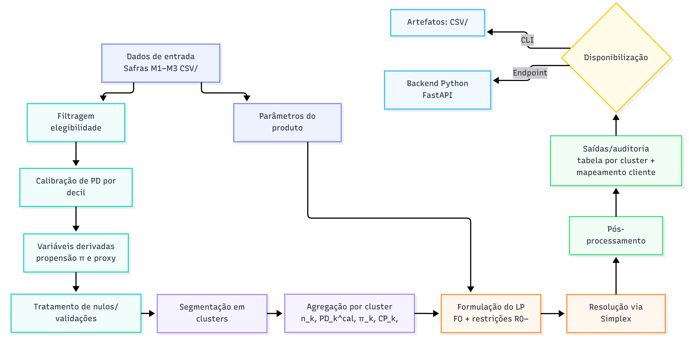

# Alocação Ótima de Limites em Carteiras de Crédito Pré-Aprovado: Uma Abordagem por Programação Linear e Clusterização CART

**Autores:** Diego Figueiredo Silva, Lucas Garcia Rodrigues Lopes, Luiz Gustavo Borges Oliveira, Maria Clara Oliveira Santos, Rebeca Namura Sbroglio, Richard Dias Alves e Teodoro Borges de Carvalho Neira

**Instituição:** Inteli

**Curso:** Ciência da Computação

**Professor Orientador:** Tomaz Mikio Sasaki

**Data:** 04/2026

## RESUMO

_(A ser entregue na Sprint 4.)_

**Palavras-chave:** palavra1, palavra2, palavra3.

---

## 1. INTRODUÇÃO

Definir limites de crédito pré-aprovados é uma das decisões mais importantes para instituições financeiras, pois afeta, ao mesmo tempo, o quanto o cliente consegue usar o produto, o retorno esperado e a exposição ao risco. Quando essa decisão precisa ser tomada para milhões de clientes, ela deixa de ser apenas uma escolha pontual e passa a exigir um processo consistente, rastreável e alinhado a regras prudenciais e operacionais, como teto de risco agregado, limite máximo ofertado e alavancagem em relação à capacidade de pagamento.

No contexto brasileiro, indicadores públicos mostram que a inadimplência segue sendo um tema relevante no mercado de crédito, o que reforça a necessidade de métodos quantitativos para apoiar políticas de concessão. Por exemplo, a inadimplência da carteira de crédito do Sistema Financeiro Nacional (medida como o percentual de operações com atraso superior a 90 dias) foi de 4,33% em março de 2026 (BANCO CENTRAL DO BRASIL, 2026). Esse cenário sustenta a motivação para abordagens que conectem, de forma objetiva, retorno e risco, evitando que a definição de limites dependa apenas de regras fixas ou decisões pouco padronizadas.

Este trabalho propõe um pipeline reprodutível para definição de limites de crédito pré-aprovados a partir de dados históricos. Nele, clientes elegíveis são segmentados em perfis relativamente homogêneos e, em seguida, formula-se um problema de Programação Linear para maximizar o retorno líquido esperado, sujeito a restrições de risco, capacidade de pagamento e limites operacionais. O problema é resolvido por uma implementação própria do método Simplex, e os resultados são disponibilizados em formato executável e integrável, viabilizando a incorporação em rotinas internas de parametrização e monitoramento.

A escolha dessa abordagem é motivada diretamente pelo contexto operacional do parceiro, que precisa definir limites pré-aprovados em larga escala com (i) restrições prudenciais explícitas (teto de risco agregado e alavancagem por capacidade de pagamento), (ii) limites operacionais por oferta e (iii) rastreabilidade/auditabilidade das decisões. Além disso, o parceiro já possui uma política vigente de oferta, o que permite avaliar ganhos de retorno e controle de risco comparando as recomendações do modelo com o baseline observado (campo limite_ofertado).

## 2. MATERIAIS E MÉTODOS

O pipeline proposto articula quatro etapas: preparação e validação dos dados de entrada, segmentação dos clientes em perfis homogêneos, formulação e resolução do problema de Programação Linear e pós-processamento dos limites para aderência às regras operacionais. A Figura 1 ilustra esse fluxo, com ênfase nas restrições de risco e capacidade de pagamento que delimitam o espaço de soluções factíveis.

**Figura 1 - Fluxo do pipeline metodológico**

_Fonte: Elaboração própria (2026)._

### 2.1 Dados utilizados

Os dados foram fornecidos pelo parceiro de projeto em três tabelas correspondentes a safras temporais (M1, M2, e M3), contendo clientes correntistas com variáveis de perfil, risco, capacidade de pagamento e comportamento. A base total tem cerca de 15 milhões de clientes por safra, das quais uma fração é elegível ao produto e segue para a etapa de otimização. A Tabela 1 resume as variáveis utilizadas diretamente no modelo e seu papel na formulação; as demais colunas são usadas apenas para controle e análises descritivas. As restrições e o papel na função objetivo associados a essas variáveis são detalhadas na Seção 2.3.

**Tabela 1 - Variáveis fornecidas pelo parceiro (estatísticas da safra M1)**

| Variável                     | Descrição                                     | Estatísticas (M1)                                              | Papel no modelo                                         |
| :--------------------------- | :-------------------------------------------- | :------------------------------------------------------------- | :------------------------------------------------------ |
| `token`                      | Identificador anônimo por safra               | 0 a 14.569.141                                                 | Chave de identificação                                  |
| `safra_ref_uso`              | Safra de referência                           | M1, M2, M3                                                     | Permite backtesting entre safras                        |
| `score_interno`              | Score de crédito interno                      | min=54, med=292, max=975                                       | Não usado diretamente; gera `pd_produto`                |
| `pd_produto`                 | Probabilidade de default no produto           | min=0,025, med=0,71, max=0,946                                 | Parâmetro de risco na função objetivo e na restrição R1 |
| `score_generico_1`           | Score de bureau (bureau 1)                    | min=49, med=409, max=995. Nulls: 0,1%                          | Variável de segmentação para clusterização              |
| `score_generico_2`           | Score de bureau (bureau 2)                    | min=1, med=713, max=942. Nulls: <0,01%                         | Variável de segmentação para clusterização              |
| `capacidade_pagamento`       | Estimativa interna de capacidade de pagamento | min=0, med=548, max=25.000. Nulls: 0,3% M1; 42,2% M2; 43,5% M3 | Restrição R2 (alavancagem)                              |
| `delta_capacidade_pagamento` | Capacidade deduzida dos saldos a vencer       | min=−25.000, med=55, max=25.000. Nulls: idem                   | Variante conservadora (apoio à análise)                 |
| `renda_estimada`             | Estimativa interna de renda                   | min=1.275, med=1.908, max=17.950. Nulls: 0,3%                  | Proxy para R2 quando `capacidade_pagamento` é nula      |
| `fx_idade`                   | Faixa etária                                  | 9 faixas: 21–30 (35,5%), 31–40 (31,1%), 41–50 (18,8%)          | Segmentação e análise de resultados                     |
| `flag_filtros`               | Indicador de perfil restrito                  | 0 = elegível (1,84M), 1 = restrito (12,73M)                    | Filtro de elegibilidade                                 |
| `score_propensao_contrato`   | Score de propensão à conversão                | min=3, med=315, max=846                                        | Parâmetro de conversão na função objetivo               |
| `score_credito_cross`        | Score de crédito multiproduto                 | min=103, med=706, max=954                                      | Define a faixa de alavancagem do cluster (mₖ)           |
| `limite_ofertado`            | Limite ofertado na política atual             | min=200, med=806, max=20.000. 99,2% null                       | Baseline para backtesting                               |
| `flag_contrato`              | Indicadora de contratação (1 = contratou)     | 6.506 (0,04%)                                                  | Backtesting (conversão)                                 |
| `flag_ativacao`              | Indicadora de ativação (1 = ativou)           | 5.704 (87,7% dos que contrataram)                              | Backtesting (ativação)                                  |
| `over30mob3`                 | Atraso >30 dias nas 3 primeiras parcelas      | 4.966 válidos, 377 eventos (7,6%). 99,97% null                 | Inadimplência observada (viés de seleção)               |

Além das variáveis das três safras, alguns parâmetros necessários à formulação do modelo foram informados diretamente pelo parceiro (por exemplo, taxa de _interchange_, LGD e horizonte de receita). Esses valores são tratados como constantes na formulação e são apresentados explicitamente na Seção 2.3, junto com a função objetivo e as restrições.

### 2.2 Pré-processamento

O pré-processamento tem como objetivo transformar as variáveis de entrada em parâmetros consistentes e robustos para as etapas subsequentes de segmentação e otimização. Em particular, esta etapa: (i) restringe a população à base elegível ao produto, (ii) calibra a probabilidade de inadimplência para corrigir vieses observados nos dados históricos, (iii) constrói variáveis derivadas diretamente consumidas pelo modelo (propensão à contratação e proxy de capacidade de pagamento) e (iv) trata valores ausentes de forma a permitir a execução reprodutível do pipeline.

**Filtragem de elegibilidade e validações.** Antes de qualquer transformação, a base é filtrada para incluir apenas clientes elegíveis, conforme o indicador `flag_filtros = 0`. Essa decisão reflete o escopo operacional do problema: a otimização define limites apenas para a população passível de receber oferta. Variáveis essenciais ao pipeline (por exemplo, `pd_produto`, `score_propensao_contrato`, `score_credito_cross`, `capacidade_pagamento` e `renda_estimada`) são então verificadas quanto a tipo e presença, e as regras de _fallback_ descritas a seguir são aplicadas quando há ausência de informação.

**Calibração da probabilidade de inadimplência.** Observou-se que a razão entre inadimplência observada e inadimplência esperada não é constante ao longo do espectro de risco, o que pode levar a subestimação de risco em faixas mais arriscadas. Para mitigar esse efeito, a probabilidade bruta de inadimplência do produto (`pd_produto`) é calibrada por decis de risco.

A calibração segue o procedimento:

1. Define-se o decil $d(i)\in\{1,\dots,10\}$ de cada cliente $i$ a partir da distribuição de `pd_produto` na população elegível (cortes percentílicos de 10%).
2. Para cada decil $d$, estima-se um fator multiplicativo $\gamma_d$ comparando inadimplência observada e esperada no histórico, usando `over30mob3` como proxy de evento de default (considerando apenas registros com observação válida de `over30mob3`). Uma forma equivalente de escrever essa calibração é:
   $$
   \gamma_d \;=\; \frac{\sum_{i\in d} y_i}{\sum_{i\in d} PD_i},
   $$
   onde $y_i \in \{0,1\}$ indica evento observado e $PD_i$ é a `pd_produto` do cliente.
3. Em decis com baixa amostra de observações (tipicamente os decis de maior risco, devido a viés de seleção na aprovação histórica), $\gamma_d$ é obtido por extrapolação conservadora a partir do padrão estimado nos decis com evidência empírica suficiente, com truncamento para evitar valores extremos.

Por fim, a PD calibrada no nível do cliente é definida por:

$$
PD_i^{cal} \;=\; PD_i \cdot \gamma_{d(i)},
$$

e armazenada como `pd_calibrada`. Essa variável é utilizada como parâmetro de risco tanto na função objetivo quanto nas restrições de risco do modelo.

**Propensão à contratação.** A propensão à contratação é derivada de `score_propensao_contrato` e normalizada para o intervalo $[0,1]$, gerando a variável $\pi_i$. Foi aplicada normalização do tipo min–max com truncamento:

$$
\pi_i \;=\; \mathrm{clip}\!\left(\frac{s_i - s_{\min}}{s_{\max}-s_{\min}},\,0,\,1\right),
$$

onde $s_i$ é o score do cliente e $s_{\min}$ e $s_{\max}$ são limites observados/assumidos para o score na base. A normalização garante comparabilidade entre safras e evita que valores fora do intervalo dominem a etapa de segmentação.

**Proxy de capacidade de pagamento.** A capacidade de pagamento é utilizada para impor restrições prudenciais de alavancagem. Como a variável `capacidade_pagamento` apresenta proporção elevada de valores ausentes em determinadas safras, foi construída uma proxy no nível do cliente:

$$
CP_i \;=\;
\begin{cases}
\texttt{capacidade\_pagamento}_i, & \text{se não nula} \\
0{,}30 \cdot \texttt{renda\_estimada}_i, & \text{caso contrário.}
\end{cases}
$$

A constante 0,30 reflete uma regra conservadora de comprometimento de renda (fração da renda destinada ao pagamento), permitindo que a restrição de capacidade permaneça ativa mesmo quando a medida direta é ausente. A constante 0,30 é uma **premissa do grupo** (regra conservadora de comprometimento de renda) adotada para manter a restrição de capacidade ativa quando `capacidade_pagamento` é ausente.

**Tratamento de valores ausentes e preparação para segmentação.** Após a criação de `pd_calibrada`, $\pi_i$ e $CP_i$, valores ausentes residuais nas variáveis numéricas de segmentação são imputados por estatísticas robustas (por exemplo, mediana), reduzindo sensibilidade a caudas e outliers. Como a etapa de segmentação foi desenhada para produzir clusters homogêneos nas variáveis consumidas pelo PL, o pré-processamento evita transformações que distorçam interpretação econômica. Em particular, quando a segmentação utiliza modelos baseados em árvore (CART), não é necessária padronização das variáveis; já em abordagens baseadas em distância (como K-Means, usadas em protótipos anteriores), aplica-se padronização (z-score) e codificação apropriada de variáveis categóricas (por exemplo, `fx_idade`).

Como resultado do pré-processamento, a base elegível passa a conter as variáveis derivadas necessárias para as etapas seguintes (`pd_calibrada`, $\pi_i$ e $CP_i$), além das variáveis de controle utilizadas para mapeamentos de política (por exemplo, `score_credito_cross` para definição do fator de alavancagem por cluster).

### 2.3 Modelagem matemática

Esta seção apresenta a formulação matemática do problema de definição de limites de crédito pré-aprovados. Dado um conjunto de clientes elegíveis, agrupados por $K$ _clusters_ relativamente homogêneos, busca-se determinar o limite $L_k$ a ser ofertado a cada cluster $k$ de modo a maximizar o retorno líquido esperado da carteira. Opta-se por uma formulação de Programação Linear (LP) por sua interpretabilidade em larga escala, uma vez que a decisão deve ser tomada simultaneamente para múltiplos perfis de clientes, além de ser um requisito mapeado pelo parceiro.

Para preservar a linearidade do modelo, grandezas de risco e comportamento (como probabilidade de inadimplência ($PD_k$), propensão à contratação ($\pi_k$) e parâmetros operacionais do produto) são tratadas como parâmetros estimados na etapa de pré-processamento, enquanto os limites $L_k$ constituem as variáveis de decisão. A função objetivo considera a receita esperada de _interchange_ descontada da perda esperada por inadimplência, e as restrições incorporam políticas prudenciais e operacionais, como teto de risco agregado, alavancagem em relação à capacidade de pagamento e limites máximos por oferta.

A Tabela 2 resume os principais parâmetros utilizados na formulação, incluindo grandezas estimadas a partir dos dados (por exemplo, $PD_k$, $\pi_k$, $CP_k$) e constantes operacionais fornecidas pelo parceiro (por exemplo, taxa de _interchange_ $t$, horizonte de receita $T$ e $\mathrm{LGD}$). Esses parâmetros são calculados na etapa de pré-processamento e, em seguida, tratados como constantes no problema de otimização, garantindo que a função objetivo e as restrições permaneçam lineares nas variáveis de decisão $L_k$.

**Tabela 2 - Parâmetros do modelo de otimização**

| Símbolo                       | Descrição                                                      | Unidade / Domínio      | Como é obtido (no pipeline)                                                                                                                 | Fonte                         |
| ----------------------------- | -------------------------------------------------------------- | ---------------------- | ------------------------------------------------------------------------------------------------------------------------------------------- | ----------------------------- |
| $K$                           | Número de clusters de clientes elegíveis                       | inteiro, $K \ge 100$   | Definido pelos hiperparâmetros do CART                                                                                                      | Pré-processamento             |
| $k$                           | Índice do cluster                                              | $k \in \{1,\dots,K\}$  | -                                                                                                                                           | -                             |
| $n_k$                         | Número de clientes no cluster $k$                              | inteiro positivo       | Contagem de observações no cluster                                                                                                          | Dados + clusterização         |
| $PD_k$                        | Probabilidade de default representativa do cluster $k$         | $[0,1]$                | Média de `pd_calibrada` dentro do cluster $k$                                                                                               | Dados (scoring interno)       |
| $\pi_k$                       | Propensão à contratação (normalizada) do cluster $k$           | $[0,1]$                | Normaliza `score_propensao_contrato` via min–max e tira média no cluster                                                                    | Dados + normalização          |
| $CP_k$                        | Capacidade de pagamento representativa do cluster $k$          | R\$                    | Percentil 5 de `cp_proxy` no cluster, onde `cp_proxy = capacidade_pagamento` (quando disponível) e, caso contrário, `0,30 * renda estimada` | Dados + regra de proxy        |
| $m_k$                         | Multiplicador de alavancagem permitido no cluster $k$          | ex.: $[0{,}3,\,1{,}8]$ | Interpolação linear a partir do `score_credito_cross` médio do cluster                                                                      | Política/heurística calibrada |
| $t$                           | Taxa de interchange mensal                                     | adimensional           | Constante                                                                                                                                   | Parceiro / premissa           |
| $T$                           | Horizonte de receita considerado                               | meses                  | Constante (ex.: $T=22$)                                                                                                                     | Parceiro / premissa           |
| $\bar{u}$                     | Utilização média esperada do limite                            | $[0,1]$                | Constante (ex.: $\bar{u}=0{,}75$)                                                                                                           | Parceiro / premissa           |
| $\mathrm{LGD}$                | Loss Given Default                                             | $[0,1]$                | Constante (ex.: $\mathrm{LGD}=0{,}80$)                                                                                                      | Parceiro / premissa           |
| $\gamma_d$                    | Fator de calibração da PD no decil $d$                         | $>0$                   | Razão empírica (ex.: baseada em `over30mob3` vs `pd_produto`) por decil                                                                     | Estimado em análise histórica |
| $\overline{PD}_{fin}^{atual}$ | Teto de risco financeiro da carteira (ponderado por exposição) | $[0,1]$                | Média de `pd_calibrada` na base elegível (`flag_filtros == 0`)                                                                              | Calculado nos dados           |
| $L^{max}$                     | Limite máximo permitido por oferta                             | R\$                    | Constante (ex.: $25.000$)                                                                                                                   | Política operacional          |
| $\alpha$                      | Concentração máxima de exposição em um único cluster           | $[0,1]$                | Constante (ex.: 5%) para as restrições                                                                                                      | Política/prudencial           |

#### Função objetivo

O objetivo do modelo é maximizar o retorno líquido esperado da carteira no horizonte $T$, definido como a diferença entre (i) a receita esperada de _interchange_ gerada pelo uso do cartão e (ii) a perda esperada por inadimplência, ambas condicionadas à contratação do produto. Considerando a modelagem por _clusters_, em que todos os $n_k$ clientes do cluster $k$ recebem o mesmo limite $L_k$, a função objetivo é dada por:

$$
\max \sum_{k=1}^{K} n_k \cdot
\left[
\underbrace{\pi_k \cdot T \cdot \bar{u} \cdot t \cdot L_k}_{\text{Receita esperada em }T\text{ meses}}
\;-\;
\underbrace{\pi_k \cdot PD_k \cdot \mathrm{LGD} \cdot L_k}_{\text{Perda esperada por inadimplência}}
\right].
$$

No primeiro termo, $\pi_k$ representa a probabilidade de contratação (ou propensão à conversão) do cluster $k$; $\bar{u}$ é a fração média esperada do limite efetivamente utilizada; $t$ é a taxa de _interchange_ aplicada sobre o volume transacionado; e $T$ acumula a receita ao longo do horizonte considerado. Assim, $T\cdot\bar{u}\cdot t\cdot L_k$ aproxima a receita total de _interchange_ por cliente (condicional ao cliente utilizar o produto), enquanto o fator $\pi_k$ pondera essa receita pela chance de contratação.

No segundo termo, $PD_k$ é a probabilidade calibrada de inadimplência do cluster $k$ - corresponde à média de `pd_calibrada` dentro do cluster, onde `pd_calibrada` foi obtida na Seção 2.2 multiplicando a PD bruta pelo fator $\gamma_{d(k)}$; e $\mathrm{LGD}$ é a perda dada a inadimplência. A expressão $PD_k\cdot \mathrm{LGD}\cdot L_k$ representa a perda esperada por cliente, e novamente é ponderada por $\pi_k$, refletindo que a perda só se materializa no subconjunto que efetivamente contrata o produto.

Agrupando os termos constantes, pode-se reescrever a função objetivo como:

$$
\max \sum_{k=1}^{K} n_k \cdot c_k \cdot L_k,
\quad \text{onde}\quad
c_k = \pi_k\cdot\left(T\cdot \bar{u}\cdot t - PD_k\cdot \mathrm{LGD}\right).
$$

O coeficiente $c_k$ pode ser interpretado como o retorno líquido marginal esperado por unidade monetária de limite ofertado ao cluster $k$. Como todos os fatores em $c_k$ são parâmetros, a função objetivo é linear em $L_k$, caracterizando um problema de Programação Linear (LP).

#### Restrições

As restrições do modelo traduzem regras prudenciais e operacionais do produto em limites matemáticos para o conjunto de soluções factíveis. Em todas elas, assume-se que o volume total de exposição é proporcional ao somatório dos limites ofertados ponderados pelo tamanho dos clusters, isto é, $E = \sum_{k=1}^{K} n_k L_k$.

**(R0) Não negatividade (domínio).** Como o limite é uma quantia monetária ofertada, impõe-se:

$$
L_k \ge 0,\quad \forall k \in \{1,\dots,K\}.
$$

**(R1) Teto de inadimplência financeira (risco ponderado por exposição).** Para controlar o risco agregado da carteira em termos financeiros, limita-se a inadimplência média ponderada pela exposição. Na forma de razão, tem-se:

$$
\frac{\sum_{k=1}^{K} n_k \cdot PD_k \cdot L_k}{\sum_{k=1}^{K} n_k \cdot L_k}
\le \overline{PD}_{fin}^{atual}.
$$

Para manter o modelo linear, a restrição é escrita na forma equivalente (multiplicando ambos os lados por $\sum_{k} n_k L_k$, que é não negativa e estritamente positiva em qualquer solução não-trivial):

$$
\sum_{k=1}^{K} n_k \cdot PD_k \cdot L_k
\le
\overline{PD}_{fin}^{atual}\cdot \sum_{k=1}^{K} n_k \cdot L_k.
$$

Essa formulação garante que, mesmo que o otimizador aumente limites em clusters rentáveis, a carteira resultante não ultrapasse o patamar de risco financeiro observado/aceito na política vigente.

**(R2) Restrição de capacidade de pagamento (alavancagem por cluster).** Para evitar concessões desproporcionais à capacidade de pagamento do perfil, o limite do cluster $k$ é limitado por uma fração $m_k$ da capacidade representativa $CP_k$:

$$
L_k \le m_k \cdot CP_k,\quad \forall k.
$$

O multiplicador $m_k$ reflete faixas de política (por exemplo, derivadas do `score_credito_cross`), enquanto $CP_k$ consolida a informação de renda/capacidade em nível de cluster (por exemplo, via percentil inferior para robustez).

**(R3) Teto operacional de limite por oferta.** Por diretriz operacional, cada oferta possui limite máximo:

$$
L_k \le L^{max},\quad \forall k.
$$

**(R4) Verificação de concentração por cluster (pós-otimização).** Além das restrições formais do PL, após a resolução aplica-se uma verificação de diversificação de portfólio: nenhum cluster deve concentrar mais do que uma fração $\alpha$ da exposição total resultante $E = \sum_{j=1}^{K} n_j \cdot L_j^{final}$, ou seja,

$$
n_k \cdot L_k^{final} \le \alpha \cdot E,\quad \forall k.
$$

Como essa verificação incide sobre os limites discretizados no pós-processamento (e não sobre as variáveis contínuas $L_k$), ela é conduzida fora do PL e descrita em detalhes na Seção 2.4.

### 2.4 Implementação do algoritmo

A implementação foi desenvolvida em Python e organizada como um _pipeline_ executável para: (i) ler uma base de clientes e parâmetros do produto, (ii) segmentar clientes elegíveis em grupos relativamente homogêneos, (iii) montar um Problema de Programação Linear (PL) para definição de limites por grupo e (iv) resolver o PL via algoritmo Simplex. Os resultados são persistidos em formato tabular para auditoria e reprodutibilidade.

**Entrada e parâmetros.** O pipeline recebe (i) um arquivo Parquet com registros de clientes e (ii) um arquivo JSON contendo constantes operacionais do produto (por exemplo, taxa de _interchange_ $t$, horizonte $T$, utilização média $\bar{u}$, $\mathrm{LGD}$ e teto $L^{max}$). A partir da base elegível, calcula-se também o benchmark de risco agregado $\overline{PD}_{fin}^{atual}$, utilizado na restrição de risco da carteira.

**Etapa 1 - Preparação dos dados (visão geral).** As etapas de limpeza, transformação e criação de variáveis derivadas (como a propensão normalizada $\pi$ e a proxy de capacidade de pagamento) seguem o pré-processamento descrito na Seção 2.2. Nesta subseção, o foco é a integração dessas saídas na etapa prescritiva (otimização).

**Etapa 2 - Segmentação em clusters (CART).** Os clientes elegíveis são particionados em $K$ clusters por meio de uma árvore de decisão do tipo CART, de forma a produzir grupos homogêneos nas variáveis relevantes ao PL. Em termos operacionais:

1. Filtram-se apenas clientes elegíveis.
2. Constrói-se a variável de propensão $\pi$ a partir de normalização min–max do score de propensão (com truncamento para $[0,1]$).
3. Constrói-se uma proxy de capacidade de pagamento (por exemplo, usando a capacidade observada quando disponível e uma regra de proxy quando ausente).
4. Treina-se o CART com limite de folhas configurado para gerar aproximadamente $K$ clusters (adotado no projeto como $K=800$, definido por varredura empírica de ganho marginal).
5. Para cada cluster $k$, agregam-se os parâmetros necessários ao PL: tamanho $n_k$, risco $PD_k$ (média de PD calibrada), propensão $\pi_k$ (média), capacidade $CP_k$ (percentil 5 da proxy) e fator de alavancagem $m_k$ (derivado por faixas do score de crédito).

Como saída, obtém-se uma tabela agregada por cluster que concentra todos os parâmetros usados na formulação do PL.

**Etapa 3 - Montagem do problema de Programação Linear.** Com os parâmetros por cluster, monta-se o PL na forma padrão (matriz de restrições e vetor de coeficientes), em que cada variável de decisão $L_k$ representa o limite ofertado ao cluster $k$. O vetor de coeficientes da função objetivo é montado como $n_k \cdot c_k$ para cada cluster $k$, onde $c_k$ é o coeficiente marginal definido na Seção 2.3:

$$
c_k = \pi_k \cdot \left(\bar{u}\cdot t \cdot T - PD_k \cdot \mathrm{LGD}\right),
$$

com $PD_k$ sendo a média de `pd_calibrada` no cluster (PD já incorpora o fator $\gamma_{d(k)}$ da calibração). As restrições incluem, em particular: (i) teto de risco financeiro agregado (comparado ao benchmark $\overline{PD}_{fin}^{atual}$, calculado como a média de `pd_calibrada` na base elegível), (ii) limite por capacidade de pagamento com alavancagem $L_k \le m_k\cdot CP_k$ e (iii) teto operacional $L_k \le L^{max}$.

**Etapa 4 - Resolução via Simplex.** O PL é resolvido por uma implementação própria do método Simplex. O algoritmo constrói o tableau inicial com variáveis de folga, itera selecionando variável entrante e variável saínte (com regra de Bland para evitar ciclagem), realiza pivoteamentos e encerra quando não há melhoria na função objetivo ou quando identifica casos especiais (como problema ilimitado). Ao final, retorna o vetor ótimo $L_k^*$, o valor ótimo $Z^*$ e o status da solução. A regra de Bland (1977) é adotada por ser a referência teórica original que prova a finitude do Simplex sob essa regra de pivoteamento, não havendo substituto mais recente que altere esse resultado clássico.

**Validação numérica com solver externo.** Para verificar a correção da implementação própria do Simplex, o mesmo problema de Programação Linear foi resolvido também com um solver consolidado via biblioteca PuLP (solver CBC como padrão). A validação consistiu em executar ambos os resolvedores sobre as mesmas instâncias e comparar (i) o status da solução, (ii) o valor da função objetivo e (iii) o vetor de decisão $L_k$, aceitando apenas discrepâncias residuais compatíveis com tolerâncias numéricas. Essa checagem funciona como teste de sanidade durante o desenvolvimento e aumenta a confiabilidade da solução antes do uso operacional do pipeline.

**Pós-otimização e saída.** Para aderência operacional, os limites contínuos retornados pelo Simplex são pós-processados antes da comunicação do resultado. Em particular, aplica-se um critério de “oferta ativa” e uma discretização simples, compatível com a prática de limites em faixas: para cada cluster $k$, define-se o limite final $L_k^{final}$ como

$$
L_k^{final} \;=\;
\begin{cases}
50 \cdot \mathrm{round}\!\left(\dfrac{L_k^*}{50}\right), & \text{se } L_k^* \ge 200 \\[6pt]
0, & \text{se } L_k^* < 200,
\end{cases}
$$

isto é, limites abaixo de R\$ 200 são interpretados como “sem oferta”, e os demais são arredondados ao múltiplo de R\$ 50 mais próximo. O resultado final é então reportado por cluster e pode ser propagado ao nível individual via mapeamento do cliente ao seu respectivo `cluster_id`.

Além do ajuste operacional, realiza-se a **verificação em pós-otimização** da diretriz de diversificação (R4), usando o parâmetro $\alpha$. Define-se a exposição total resultante como $E = \sum_{j=1}^{K} n_j \cdot L_j^{final}$ e checa-se, para cada cluster, se sua participação respeita

$$
n_k \cdot L_k^{final} \le \alpha \cdot E,\quad \forall k.
$$

Caso a condição seja violada para algum cluster, a violação é sinalizada para revisão de parâmetros (por exemplo, ajuste de $\alpha$ e/ou de regras operacionais) e reexecução do pipeline, mantendo a etapa de otimização como um PL estritamente linear.

**Acesso operacional (CLI e endpoint).** Além da execução via linha de comando para fins de reprodutibilidade, o mesmo pipeline pode ser encapsulado em um serviço de backend e disponibilizado por meio de um endpoint HTTP. Nesse formato, uma requisição informa a referência aos dados e os parâmetros do produto, e a resposta retorna o status da otimização, métricas-resumo (por exemplo, $Z^*$ e restrições ativas) e a recomendação de limites por cluster (ou por cliente, após o mapeamento), viabilizando integração com sistemas internos e automação do processo decisório.

### 2.5 Ferramentas e Tecnologias

A solução foi desenvolvida com foco em reprodutibilidade e execução em ambiente local, utilizando uma implementação própria do algoritmo Simplex e bibliotecas consolidadas do ecossistema Python para manipulação de dados e segmentação de clientes.

**Linguagem e ambiente.** A implementação é inteiramente em Python, executável via linha de comando. A configuração de parâmetros operacionais do produto (por exemplo, $t$, $\bar{u}$, $T$, $\mathrm{LGD}$ e $L^{max}$) é externalizada em arquivo JSON, permitindo reproduzir cenários sem alteração de código.

**Bibliotecas principais (pipeline de otimização).**

- **pandas:** leitura/escrita de dados tabulares (Parquet) e agregações por cluster para obtenção de $n_k$, $PD_k$, $\pi_k$ e $CP_k$.
- **NumPy:** operações numéricas e estatísticas (por exemplo, percentis e truncamentos) usadas em variáveis derivadas e agregações.
- **scikit-learn:** modelos e rotinas de pré-processamento utilizados na etapa de segmentação (por exemplo, clusterização e transformações como imputação, padronização e codificação _one-hot_ quando aplicável).
- **PuLP (CBC):** utilizado como solver externo para validação cruzada das soluções do PL, permitindo comparar resultados com a implementação própria do Simplex.

**Implementação do Simplex.** O resolvedor do PL foi implementado do zero em Python (sem bibliotecas externas de otimização), permitindo maior transparência sobre as regras de entrada/saída da base, pivoteamento e critérios de parada, além de facilitar auditoria do processo de decisão.

**Ferramentas auxiliares (análises e preparação de dados).**

- **PyArrow:** leitura eficiente de dados em formato Parquet em scripts de análise e preparação.
- **Matplotlib:** geração de gráficos e figuras utilizadas na etapa exploratória e na documentação de resultados.

**Formatos de dados e artefatos.** Para interoperabilidade e auditoria, as entradas e saídas operacionais do pipeline são mantidas em formatos abertos (CSV para bases processadas e tabelas intermediárias; JSON para parametrização). Os dados brutos podem ser fornecidos em Parquet e convertidos no processo de preparação.

**Integração operacional.** Além da execução local via CLI, foi implementado um serviço de backend em **Python** utilizando **FastAPI** para disponibilizar o pipeline por meio de um endpoint HTTP. Nesse formato, a requisição recebe os parâmetros do produto e a referência aos dados de entrada, e a resposta retorna o status da execução, métricas-resumo (por exemplo, $Z^*$ e restrições ativas) e a recomendação de limites por cluster (ou por cliente, após o mapeamento), viabilizando integração com sistemas internos e automação do processo decisório.

## 3. TRABALHOS RELACIONADOS

Esta seção apresenta e analisa os trabalhos identificados na revisão de literatura, posicionando-os em relação ao problema proposto. A busca sistemática descrita em 3.1 resultou na seleção de três estudos que cobrem os dois componentes técnicos centrais do projeto - programação linear aplicada a decisões de crédito e clusterização para identificação de risco financeiro -, analisados individualmente nas seções 3.2 a 3.4, comparados sistematicamente em 3.5 e sintetizados em termos de lacuna em 3.6.

### 3.1 Protocolo de Busca e Seleção

A busca foi conduzida nas bases SciELO, Google Scholar, BDTD/NDLTD, Scopus/Web of Science, Dimensions e BASE. As consultas foram realizadas em português e inglês, combinando termos de domínio como _credit portfolio_, _credit limit_ e _bank loan_ com termos metodológicos como _linear programming_, _simplex_, _optimization_, _clustering_ e _risk identification_. ScienceDirect, IEEE Xplore e arXiv.org também foram consultados, mas não retornaram resultados aderentes aos critérios de inclusão definidos. As queries são documentadas em inglês para fins de padronização e reprodutibilidade; buscas equivalentes foram realizadas em português nas bases que suportam indexação no idioma. As principais queries utilizadas foram:

| #   | Query                                                                    |
| --- | ------------------------------------------------------------------------ |
| 1   | `"credit limit optimization" AND "linear programming" AND "bank"`        |
| 2   | `"optimal credit portfolio" AND "linear programming"`                    |
| 3   | `"credit portfolio" AND "linear programming" AND "risk"`                 |
| 4   | `"loan allocation" AND "linear programming" AND "financial institution"` |
| 5   | `"linear programming" AND "bank loan" AND "optimal revenue"`             |
| 6   | `"credit line assignment" AND "customer segmentation"`                   |
| 7   | `"enterprise financial risk" AND "clustering algorithm"`                 |
| 8   | `"clustering" AND "financial risk" AND "bank"`                           |
| 9   | `"credit risk" AND "cluster analysis" AND "bank"`                        |

As queries foram adaptadas e aplicadas às bases listadas, respeitando as particularidades de indexação de cada uma.

**Critérios de inclusão:** aderência ao problema de definição, ajuste ou otimização de decisões de crédito; tratamento explícito de otimização, modelagem prescritiva ou formulação matemática aplicável ao contexto financeiro; e contribuição para a discussão de risco, retorno e alocação de crédito em instituições financeiras. Foram priorizadas publicações dos últimos cinco anos, preferencialmente. Trabalhos fora desse recorte temporal ou temático estrito também foram considerados quando apresentavam relevância metodológica consolidada e contribuição direta para a formulação do modelo adotado.

**Critérios de exclusão:** materiais sem densidade técnica; textos promocionais ou instrucionais voltados ao consumidor final; referências sem conexão com modelagem analítica, otimização ou apoio quantitativo à decisão de crédito; e trabalhos cujo foco principal não permitisse estabelecer relação com o problema de alocação, aprovação ou gestão de crédito.

Após a etapa de triagem, foram selecionados três trabalhos para análise comparativa. O critério de seleção priorizou cobertura dos componentes técnicos centrais do projeto: programação linear aplicada a decisões de crédito (AL-MUSBAHU et al., 2025; KWAPONG, 2013) e clusterização para identificação de risco financeiro (LI; TAO; LI, 2022). Um trabalho adicional identificado na busca - Scarpel e Milioni (2002) - aborda a integração entre modelagem preditiva e otimização prescritiva em decisões de crédito, o que o aproxima conceitualmente do pipeline adotado neste projeto. Contudo, sua formulação emprega Programação Inteira sobre uma variável de decisão binária aplicada a crédito corporativo, contexto e natureza de decisão suficientemente distintos para que uma análise comparativa direta fosse de profundidade limitada. Por essa razão, o trabalho é referenciado como validação metodológica do paradigma de duas etapas na seção de lacuna identificada, sem integrar o conjunto de análises comparativas detalhadas.

Ressalta-se que esta revisão de literatura constitui uma base inicial, compatível com a fase de desenvolvimento em que o projeto se encontra. O conjunto de três trabalhos foi escolhido por oferecer uma fundação sólida para cada componente técnico do modelo, sem pretensão de exaustividade. Trabalhos adicionais poderão ser incorporados em versões futuras do artigo à medida que o escopo da análise for ampliado.

---

### 3.2 Application of Linear Programming for Optimal Net Revenue on Bank Loan - AL-MUSBAHU et al. (2025)

O trabalho aborda a aplicação da Programação Linear no contexto de otimizar a receita total no quesito de empréstimos bancários. A otimização de portfólios se trata de um pilar importante no setor de finanças e da Teoria de Investimentos, tendo implicações tanto para investidores quanto gestores, que precisam alocar recursos para múltiplas categorias de ativos (AL-MUSBAHU et al., 2025). Embora publicado em um periódico de circulação recente, o trabalho foi selecionado por ser o estudo mais atual identificado que aplica programação linear diretamente a portfólios de empréstimos bancários com dados reais de 2025, tornando-o relevante para a validação da abordagem adotada neste projeto.

Dessa forma, a Programação Linear apresenta-se como uma maneira para otimizar a alocação de empréstimos bancários em diferentes áreas (como empréstimos de crédito e para o financiamento de carros, por exemplo), considerando que as relações entre as variáveis mantenham-se lineares. Por esse caminho, uma função matemática linear pode ser mapeada, levando em consideração as relações da concessão de risco-retorno, segundo Konno e Yamazaki (1991, _apud_ AL-MUSBAHU et al., 2025).

Com informações de Janeiro de 2025, coletadas do **Access Bank**, localizado na região Ogun, na Nigéria, o modelo definido leva em consideração informações reais relacionadas a taxas e parâmetros para a modelagem, como juros e risco. Assim, o programa foi capaz de retornar uma alocação ótima para um caso de teste, seguindo todas as restrições mapeadas para o cenário (como o fato de que 45% dos empréstimos totais precisavam ser destinados para o financiamento de carros e empréstimos para organizações) (AL-MUSBAHU et al., 2025).

No caso de teste, era desejado alocar ₦300.000.000. A alocação ótima mapeou que 20% do valor deveria ser destinado para o financiamento de residências, 50% para cartões de crédito e 30% para empréstimos para organizações, trazendo um retorno anual de ₦24.615.000. Categorias como empréstimos pessoais receberam uma alocação de zero, demonstrando como, em comparação com outras categorias, elas mostram-se como opções menos lucrativas para o banco (AL-MUSBAHU et al., 2025).

O artigo aborda pontos importantes que estão diretamente relacionados com o contexto do trabalho elaborado. O principal deles é em relação à metodologia utilizada para a resolução do problema de alocação de empréstimos. Tanto o artigo de Al-Musbahu (2025) quanto este trabalho empregam a Programação Linear, que se trata de uma técnica matemática de otimização que busca determinar o melhor resultado possível (tanto de maximização quanto de minimização).

O artigo, além de mapear a função objetivo, também traz as restrições do problema, aspecto extremamente importante para o funcionamento da solução. Um ponto explicitado é sobre a influência dessas restrições no resultado. Por exemplo, uma restrição pode exigir percentuais mínimos para certos tipos de empréstimos (como no caso de teste apresentado na introdução), forçando a inclusão de categorias que, quando analisadas por um escopo individual, não se apresentam como ideais (tendo um retorno financeiro menor). Com isso, o trabalho destaca que a solução ótima não deve contemplar apenas as taxas de retorno, mas sim levar em consideração as regras de negócio específicas. Aspectos como a taxa de inadimplência permitem a abordagem de cenários mais realistas e completos para a solução.

Além disso, um aspecto que ambos também compartilham é a aplicação direta da Programação Linear para problemas do mundo financeiro. Apesar de não abordarem o mesmo tema diretamente (empréstimos versus limite de crédito), tanto o artigo de Al-Musbahu (2025) quanto este trabalho buscam trazer a computação e a utilização de algoritmos para ambientes financeiros especializados. Como forma de validação, os dois empregam dados reais de instituições financeiras, trabalhando sobre informações condizentes com os cenários existentes, o que traz maior confiabilidade para os resultados encontrados.

Em termos de limitações, uma restrição do trabalho de Al-Musbahu (2025) em relação a este projeto está no nível de análise adotado: apesar de ambos estarem no ambiente financeiro, o artigo trabalha com alocação entre categorias de empréstimos, enquanto aqui o foco é a definição de limite de crédito. Essa diferença afeta não apenas o objetivo da formulação, mas também os parâmetros considerados, o que reduz a comparabilidade direta entre os dois modelos.

Outro ponto a considerar é a amostragem de dados. O artigo de Al-Musbahu utiliza informações de uma única instituição/filial em um recorte temporal específico, o que pode limitar a robustez do modelo e a generalização dos resultados, já que os parâmetros de juros, risco e restrições refletem um contexto particular.

A diferença central em relação ao presente trabalho está na variável de decisão e na granularidade operacional. Enquanto o artigo de Al-Musbahu (2025) investiga a definição ótima de alocação entre categorias de empréstimos bancários, este trabalho trata da oferta de limite de crédito para clientes, organizada por clusters/perfis.

Além disso, o artigo comparado opera com um conjunto menor de variáveis agregadas por tipo de empréstimo (por exemplo, taxa de juros e inadimplência por categoria), ao passo que este trabalho utiliza um número maior de variáveis e parâmetros por cluster de clientes, incluindo aspectos como capacidade de pagamento e propensão à contratação. Essa diferença também aparece na base de dados: o artigo trabalha com uma amostra mais limitada, enquanto este projeto considera um volume maior de clientes, aumentando a complexidade do modelo e da definição da solução ótima.

---

### 3.3 Application of Linear Programming to Optimal Credit Portfolio: The Case of Akuapem Rural Bank Ltd. - KWAPONG (2013)

Kwapong (2013) formula e resolve um modelo de programação linear para maximizar o retorno líquido da carteira de crédito do Akuapem Rural Bank Ltd., banco rural de Gana com portfólio total de GH¢ 15 milhões. O banco opera com cinco modalidades de empréstimo (Indústria Artesanal, Transporte, Agricultura, Salário e Microfinanças), cada uma com taxa de juros e probabilidade de inadimplência distintas: o empréstimo de Transporte, por exemplo, opera a 32% com 5% de inadimplência, enquanto o Salário apresenta 30% de taxa e apenas 1% de inadimplência. A função objetivo maximiza a receita líquida de cada modalidade, descontando a perda esperada por inadimplência, formulada como $Z = \sum_j I_j(1 - P_j)x_j$. O modelo é resolvido sob quatro restrições principais: teto total de fundos, alocação mínima de 40% para Salário e Microfinanças, mínimo de 60% para os demais segmentos e teto de inadimplência agregada de 3% (KWAPONG, 2013).

Para testar a robustez da solução, o autor analisa sete cenários variando o número de restrições e as taxas de juros. No cenário base, a solução ótima aloca GH¢ 7 milhões a Transporte, GH¢ 2 milhões a Agricultura e GH¢ 6 milhões a Salário, com retorno de GH¢ 4,48 milhões, descartando Indústria Artesanal e Microfinanças por baixa atratividade líquida. O trabalho conclui que há relação positiva entre risco e retorno e que o aumento das taxas de juros melhora o resultado, desde que o risco seja controlado (KWAPONG, 2013). Apesar de publicado em 2013 e tratar-se de uma dissertação de mestrado - e não de artigo em periódico ou conferência -, é o antecedente metodológico mais próximo identificado para a função objetivo adotada neste projeto. Nenhum trabalho equivalente com essa estrutura de formulação (LP para maximização de receita líquida ajustada por risco em carteira de crédito bancário) foi encontrado em revista ou anais nas bases consultadas, razão pela qual foi incluído na análise comparativa.

A estrutura da função objetivo de Kwapong (2013) guarda relação estrutural direta com o presente trabalho: ambas maximizam a receita líquida descontando a perda esperada por inadimplência, com a forma $Z = \sum_j I_j(1 - P_j)x_j$ mapeando explicitamente o trade-off risco-retorno de cada categoria de crédito. Essa equivalência valida que a programação linear é um instrumento adequado para problemas de portfólio de crédito com controle simultâneo de risco. Vale destacar também a análise de sensibilidade conduzida nos sete cenários: ao variar o número de restrições e as taxas de juros, o autor identifica quais restrições são de fato limitantes por meio dos preços duais, como o valor negativo de -0,013 associado à restrição de alocação setorial, que sinaliza um efeito desfavorável sobre o retorno. Essa prática de análise de sensibilidade é metodologicamente sólida e diretamente replicável no pipeline do presente projeto.

Como limitação, o trabalho trata todos os tomadores dentro de uma mesma categoria como homogêneos. Ao definir apenas uma taxa de juros e uma probabilidade de inadimplência por modalidade, o modelo ignora a variação de perfil entre clientes de um mesmo segmento. Na prática, dois clientes de Salário com capacidade de pagamento muito diferente recebem o mesmo tratamento na formulação, o que reduz a precisão da estimativa de retorno. Outra limitação é a ausência de variável de decisão por cliente: a formulação define quanto alocar em cada categoria, não quanto conceder a cada indivíduo. Esse design é adequado para o problema de Kwapong (2013), mas não resolve diretamente problemas onde o limite individual é a variável central.

A diferença fundamental em relação ao presente trabalho está no nível de análise. Kwapong (2013) trabalha com cinco categorias de empréstimo, cada uma tratada como uma variável única no modelo LP. O presente trabalho opera no nível do cliente individual, agrupado por perfil via CART, com a programação linear sendo aplicada para definir o limite de crédito de cada cluster. Enquanto Kwapong (2013) responde "quanto alocar para Transporte versus Salário", o presente projeto responde "qual limite conceder ao cliente do cluster X dado seu perfil de risco e capacidade de pagamento". A segmentação em Kwapong (2013) é predefinida e fixa (modalidades institucionais do banco), enquanto aqui ela é endógena ao modelo, determinada pelos dados via CART.

De forma geral, Kwapong (2013) é o antecedente mais próximo do presente trabalho em termos de formulação matemática, confirmando que a estrutura LP com função objetivo de receita líquida ajustada por risco é aplicável ao crédito bancário. A diferença principal está na granularidade: o salto do nível de portfólio para o nível de cliente segmentado é o que este projeto propõe acrescentar.

---

### 3.4 Identification of Enterprise Financial Risk Based on Clustering Algorithm - LI; TAO; LI (2022)

O trabalho aborda a identificação de risco financeiro em empresas listadas na China, com o objetivo de selecionar um conjunto pequeno de empresas de alto risco que concentre uma proporção elevada de companhias que viriam a receber tratamento especial (ST – "special treatment") nos anos seguintes (LI; TAO; LI, 2022). A metodologia parte de 27 indicadores financeiros alternativos, dos quais são selecionadas 4 variáveis financeiras finais: razão de ativos tangíveis, razão de caixa sobre ativos, razão de endividamento de curto prazo e razão de endividamento de longo prazo. Os autores aplicam PCA para reduzir essas 4 variáveis a 2 dimensões e, em seguida, utilizam o algoritmo K-means (com K = 3 na primeira etapa e K = 4 na segunda etapa, aplicando K-means novamente apenas no cluster com mais empresas ST) para formar grupos e identificar o cluster de alto risco (LI; TAO; LI, 2022). O resultado principal mostra que o cluster de alto risco representa apenas 9% da amostra, mas concentra cerca de 36% das novas empresas ST já no ano corrente, proporção que aumenta ao estender o horizonte para 5 anos. Os autores concluem que o K-means, mesmo selecionando um grupo pequeno, é eficaz para filtrar empresas que merecem atenção cuidadosa de investidores (LI; TAO; LI, 2022).

Li, Tao e Li (2022) mostram que dados financeiros conseguem separar perfis de risco de forma objetiva, sem depender de regras empíricas. Isso reforça uma premissa central do nosso projeto: que é possível agrupar clientes em perfis homogêneos a partir de dados antes de tomar uma decisão de crédito. A contribuição conceitual vale mesmo que o algoritmo de segmentação seja diferente, pois o artigo valida a ideia de que reduzir heterogeneidade é uma etapa legítima e necessária antes da decisão final. Também é relevante que o trabalho trate a segmentação como parte estrutural da solução, não como um pré-processamento acessório, o que conversa diretamente com a forma como usamos o CART no nosso pipeline.

Como limitação, o artigo identifica grupos de risco, mas não transforma essa informação em uma decisão operacional. Não há função objetivo, não há restrições de negócio e não há valor atribuído a cada grupo: a clusterização é o produto final. Para o nosso problema, isso é uma limitação relevante, pois precisamos ir além da segmentação e definir qual limite conceder a cada perfil. Outra limitação é que a escolha das variáveis finais (4 de 27) e a configuração do K-means em dois níveis introduzem decisões metodológicas que o artigo não generaliza, o que reduz a replicabilidade direta da abordagem.

Em termos de diferença em relação ao presente trabalho, o artigo de Li, Tao e Li (2022) resolve um problema de classificação: dado um conjunto de empresas, identificar quais têm maior risco. O presente projeto resolve um problema de otimização: dado um conjunto de grupos de clientes, definir qual limite maximiza o retorno líquido respeitando restrições de inadimplência, capacidade de pagamento e teto por cliente. Além disso, o contexto é fundamentalmente diferente, pois o artigo trabalha com empresas listadas em bolsa, enquanto este projeto lida com pessoas físicas titulares de cartão de crédito. No pipeline proposto, a segmentação via CART é uma etapa intermediária que viabiliza a otimização; no artigo, ela é o fim em si mesma.

De forma geral, Li, Tao e Li (2022) contribuem como referência para a etapa de segmentação do nosso projeto, validando conceitualmente o uso de agrupamento baseado em dados para apoiar decisões de crédito. O trabalho se diferencia o suficiente do nosso para evitar redundância, justamente por não abordar a etapa de otimização que é central neste artigo.

---

### 3.5 Tabela Comparativa dos Trabalhos Analisados

Examinados individualmente nas seções anteriores, os três trabalhos revelam padrões que se tornam mais nítidos numa comparação direta. A tabela a seguir sistematiza as dimensões mais relevantes para esse confronto, com ênfase em dois eixos que a análise anterior colocou em evidência: o nível em que a decisão é tomada, distinguindo portfólio agregado de cluster de clientes; e o papel que a segmentação ocupa no pipeline de cada trabalho, como produto final ou como etapa de entrada para uma decisão operacional.

A distribuição dos trabalhos nesses dois eixos é reveladora. Al-Musbahu et al. (2025) e Kwapong (2013) empregam programação linear sobre categorias de crédito predefinidas pelo banco, sem qualquer etapa de segmentação baseada em dados. Li, Tao e Li (2022) seguem o caminho inverso: demonstram que dados financeiros conseguem separar perfis de risco com objetividade, mas encerram o trabalho nessa etapa, sem traduzir os grupos em nenhuma decisão operacional. O presente trabalho parte da combinação das duas abordagens.

| Dimensão                      | AL-MUSBAHU et al. (2025)                             | KWAPONG (2013)                                               | LI; TAO; LI (2022)                                   | Este trabalho                                                                                                       |
| ----------------------------- | ---------------------------------------------------- | ------------------------------------------------------------ | ---------------------------------------------------- | ------------------------------------------------------------------------------------------------------------------- |
| **Problema central**          | Alocação ótima de portfólio de empréstimos bancários | Maximização de receita líquida de portfólio de crédito rural | Identificação de empresas de alto risco financeiro   | Otimização de limites de crédito pré-aprovados por cluster de clientes                                              |
| **Técnica principal**         | Programação Linear                                   | Programação Linear + análise de sensibilidade (7 cenários)   | K-Means em dois níveis + PCA                         | CART + Programação Linear (Simplex próprio, validado com CBC via PuLP)                                              |
| **Nível de análise**          | Portfólio agregado por tipo de produto               | Portfólio agregado por modalidade                            | Grupo de empresas (sem decisão operacional)          | Cluster de clientes individuais (~800 grupos)                                                                       |
| **Segmentação dos tomadores** | Ausente - categorias predefinidas institucionalmente | Ausente - modalidades predefinidas institucionalmente        | Endógena via K-Means - **produto final** do pipeline | Endógena via CART - **etapa intermediária** do pipeline                                                             |
| **Variável de decisão**       | Volume alocado por tipo de empréstimo (R$)           | Volume alocado por modalidade de crédito (R$)                | Não há                                               | Limite contínuo $L_k \in \mathbb{R}^+$ por cluster                                                                  |
| **Controle de risco**         | Taxa de inadimplência por categoria de empréstimo    | Teto de PD agregada (3%) + PD por modalidade                 | Concentração de eventos ST no cluster de risco       | PD financeira ponderada (R1), alavancagem diferenciada por score (R2), verificação de concentração por cluster (R4) |
| **Domínio de aplicação**      | Empréstimos bancários - Nigéria                      | Crédito rural - Gana                                         | Risco corporativo - China                            | Cartão de crédito PF - Brasil (~1,8M elegíveis/safra)                                                               |

A tabela confirma uma observação que emerge das análises anteriores: o trabalho que mais se aproxima estruturalmente deste é Kwapong (2013), não pelo contexto geográfico nem pela escala, mas pela forma da função objetivo. A expressão utilizada por Kwapong,

$$Z = \sum_j I_j(1 - P_j)x_j$$

corresponde diretamente ao coeficiente adotado aqui:

$$c_k = \pi_k \cdot (T\bar{u}t - PD_k \cdot \mathrm{LGD})$$

Nos dois casos, o retorno por unidade alocada é calculado como a diferença entre a receita esperada e a perda esperada por inadimplência. A distinção está no nível de operação: Kwapong (2013) resolve o problema para cinco modalidades predefinidas pelo banco; este trabalho resolve para aproximadamente 800 clusters derivados dos próprios dados via CART.

Já a contribuição de Li, Tao e Li (2022) é de outra natureza: o artigo não propõe uma formulação de otimização, mas demonstra que variáveis financeiras conseguem separar perfis de risco com objetividade, o que sustenta a premissa da Etapa 1 do pipeline proposto. O que essa leitura implica em termos de lacuna de pesquisa é o tema da seção seguinte.

---

### 3.6 Lacuna Identificada

A comparação sistematizada na seção anterior permite precisar três dimensões de lacuna relevantes para o presente projeto.

A primeira diz respeito à granularidade da variável de decisão. Kwapong (2013) e Al-Musbahu et al. (2025) formulam problemas de programação linear sobre categorias de empréstimo predefinidas, tratando todos os tomadores de um mesmo segmento como homogêneos. Nenhum dos dois realiza segmentação baseada em dados: as categorias são definidas institucionalmente, não derivadas do comportamento observado da base. Essa homogeneidade limita a capacidade do modelo de capturar a variação real entre perfis de clientes e de calibrar limites proporcionais a cada tomador.

A segunda lacuna está na desconexão entre segmentação e decisão. Li, Tao e Li (2022) demonstram que variáveis financeiras permitem separar perfis de risco de forma objetiva e reprodutível, mas encerram o trabalho nessa etapa: os grupos identificados não alimentam nenhuma decisão operacional. A clusterização é o produto final, não uma entrada para um problema de otimização.

A terceira lacuna está na ausência de um pipeline que integre as duas etapas em decisões de crédito ao consumidor em escala real. Scarpel e Milioni (2002) avançam nessa direção ao combinar um modelo Logit com Programação Inteira para decisões de concessão de crédito no contexto brasileiro, validando o paradigma de estimar e depois otimizar. Trata-se de uma referência metodologicamente consolidada que, apesar de sua data de publicação, representa o único trabalho identificado que integra modelagem preditiva e otimização prescritiva em concessão de crédito no contexto brasileiro. O trabalho, contudo, trata a concessão como uma decisão binária sobre crédito corporativo, sem atribuição contínua de limite a pessoas físicas em escala de portfólio. Por essa razão, optou-se por não incluí-lo nas análises comparativas detalhadas: o contexto e a natureza da variável de decisão diferem o suficiente para que uma comparação direta fosse de profundidade limitada. O trabalho é referenciado, ainda assim, como validação metodológica do pipeline adotado.

Reconhece-se que a abordagem proposta tem limitações próprias: a qualidade da otimização depende da estabilidade dos clusters gerados, e o modelo requer revalidação periódica conforme o comportamento de crédito da base evolui, aspectos que ficam fora do escopo deste trabalho e apontam para direções de pesquisa futura. O presente trabalho busca endereçar as três dimensões identificadas ao propor um pipeline que combina segmentação via CART com otimização contínua de limite via programação linear, aplicado a um portfólio de crédito ao consumidor em escala real.

---

## 4. RESULTADOS

_(A ser entregue na Sprint 4.)_

---

## 5. ANÁLISE E DISCUSSÃO

_(A ser entregue na Sprint 4.)_

---

## 6. CONCLUSÃO

_(A ser entregue na Sprint 4.)_

---

## REFERÊNCIAS BIBLIOGRÁFICAS

AL-MUSBAHU, Abdulrahim; TETE, Ahmed Rufai; MANYISA, Yisa Emmanuel; MOHAMMED, Jibrin. Application of Linear Programming for Optimal Net Revenue on Bank Loan. **Kontagora Journal of Mathematics**, v. 1, n. 1, p. 214-230, 2025. DOI: 10.5281/zenodo.17401383. Disponível em: <https://doi.org/10.5281/zenodo.17401383>. Acesso em: 28 maio 2026.

BANCO CENTRAL DO BRASIL. Inadimplência da carteira de crédito – Total (SGS 21082). Sistema Gerenciador de Séries Temporais (SGS). Disponível em: <https://www3.bcb.gov.br/sgspub/consultarvalores/consultarValoresSeries.do?method=consultarGraficoPorId&hdOidSeriesSelecionadas=21082>. Acesso em: 26 maio 2026.

BLAND, Robert G. New finite pivoting rules for the simplex method. **Mathematics of Operations Research**, v. 2, n. 2, p. 103-107, 1977. DOI: 10.1287/moor.2.2.103. Disponível em: <https://www.cs.bu.edu/faculty/gacs/courses/cs530/lectures/BlandRule.pdf>. Acesso em: 28 maio 2026.

KWAPONG, Samuel Darkwa. **Application of Linear Programming to Optimal Credit Portfolio: The Case of Akuapem Rural Bank Ltd.** 2013. 84 f. Dissertação (MSc in Industrial Mathematics) - Kwame Nkrumah University of Science and Technology, Institute of Distance Learning, Kumasi, 2013. Disponível em: <https://ir.knust.edu.gh/handle/123456789/5841>. Acesso em: 20 maio 2026.

LI, Bingxiang; TAO, Rui; LI, Meng. Identification of Enterprise Financial Risk Based on Clustering Algorithm. **Computational Intelligence and Neuroscience**, v. 2022, art. 1086945, 2022. DOI: 10.1155/2022/1086945. Disponível em: <https://doi.org/10.1155/2022/1086945>. Acesso em: 28 maio 2026.

SCARPEL, R. A.; MILIONI, A. Z. Utilização conjunta de modelagem econométrica e otimização em decisões de concessão de crédito. **Pesquisa Operacional**, v. 22, n. 1, p. 61-72, 2002. DOI: 10.1590/S0101-74382002000100004. Disponível em: <https://doi.org/10.1590/S0101-74382002000100004>. Acesso em: 28 maio 2026.
