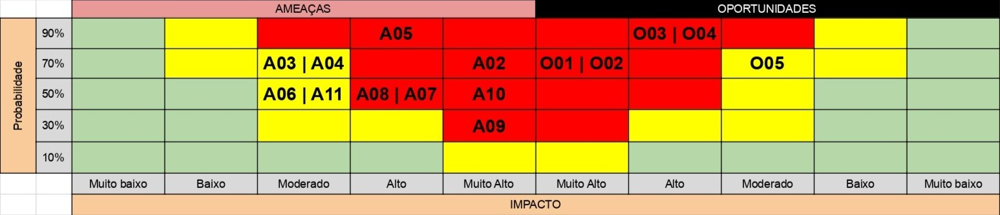

# Entendimento do Negócio

## 1. Matriz de Avaliação de Valor (Oceano Azul)

A Estratégia do Oceano Azul, desenvolvida por Kim e Mauborgne (2005), parte da premissa de que o crescimento competitivo mais relevante não vem da disputa por participação em mercados saturados (oceanos vermelhos), mas da criação de espaços de mercado inexplorados onde a concorrência se torna irrelevante. Para operacionalizar essa lógica, os autores propõem a Matriz de Avaliação de Valor (Strategy Canvas), ferramenta que permite mapear visualmente como diferentes soluções se posicionam em relação a um conjunto de atributos relevantes para o cliente, revelando eixos de diferenciação.

No contexto deste projeto, a aplicação da matriz serve a dois propósitos complementares: mapear o posicionamento relativo da solução proposta frente às alternativas hoje disponíveis no mercado brasileiro para definição de limites pré-aprovados de crédito, e identificar onde a proposta gera valor diferenciado o suficiente para justificar sua adoção pelo Banco PAN em um setor no qual a concorrência por clientes de cartão é intensa. A análise se organiza em torno de oito atributos estratégicos selecionados pela equipe e comparados entre três abordagens representativas do espectro competitivo.

### 1.1 Abordagens Comparadas

A comparação envolve três abordagens distintas que representam o espectro real de soluções adotadas no mercado para definição de limites de crédito pré-aprovado. A escolha deliberada desse trio, em vez de comparar apenas prática tradicional versus solução proposta, permite mostrar que a diferenciação da proposta não se resume a "ser mais moderna", mas a ocupar um ponto ótimo entre sofisticação analítica e transparência.

**Abordagem A: Prática tradicional do setor.** Corresponde ao modelo dominante em instituições financeiras brasileiras de médio porte: definição de limites a partir de regras fixas por faixa de score de crédito, complementadas por calibragem manual de parâmetros realizada empiricamente pelo time de estratégia de crédito. A decisão costuma ser operacionalmente escalável, mas pouco granular e metodologicamente opaca.

**Abordagem B: Modelos de Machine Learning Black-Box.** Corresponde a abordagens mais sofisticadas adotadas por fintechs e bancos digitais, tipicamente baseadas em modelos de aprendizado supervisionado (XGBoost, redes neurais) que preveem diretamente o "limite ótimo" a partir de features do cliente. Essa abordagem é consistente com práticas internacionais consolidadas em Credit Limit Optimization (THOMAS, 2009), mas apresenta limitações estruturais em explicabilidade e em incorporação de restrições agregadas de carteira. Segundo o briefing do parceiro, o Banco PAN utiliza atualmente um sistema de scoring com regras fixas, mais próximo da Abordagem A. A inclusão da Abordagem B como comparador tem por objetivo demonstrar como a solução proposta se compara com outras alternativas de mercado.

**Abordagem C: Otimização Matemática (solução proposta).** Corresponde à proposta do grupo: um modelo de otimização linear que determina limites pré-aprovados por cliente ou cluster (mínimo de 100 clusters), maximizando o retorno esperado da carteira a partir da receita de interchange a taxa fixa, sujeito a restrições explícitas de apetite de risco (tetos de inadimplência física e financeira), capacidade de pagamento individual com alavancagem diferenciada por perfil de risco, metas de produção configuráveis e regras operacionais (limite mínimo de R$ 200, discretização em múltiplos de R$ 50).

### 1.2 Atributos de Valor Selecionados

Os oito atributos a seguir foram selecionados com base em três critérios: relevância direta para o usuário interno do modelo (analista de estratégia de crédito do Banco PAN), impacto observável sobre o cliente final (correntista elegível) e aderência ao contexto regulatório brasileiro. A seleção prioriza atributos onde há diferenciação efetiva entre as três abordagens, evitando itens genéricos como "qualidade" ou "eficiência" que não discriminam.

Tabela 1: Matriz de Atributos

| # | Atributo | Descrição |
|---|----------|-----------|
| 1 | Automação do retrabalho analítico | Grau de automação na recalibragem da política de limites a cada mudança de cenário |
| 2 | Independência de decisão empírica | Grau em que a decisão dispensa julgamento individual por cliente ou cluster |
| 3 | Explicabilidade e rastreabilidade da decisão | Capacidade de justificar, de forma quantitativa e auditável, por que cada limite foi atribuído |
| 4 | Personalização por perfil do cliente | Granularidade na diferenciação de limites entre clientes distintos, mesmo dentro da mesma faixa de score |
| 5 | Controle do risco agregado da carteira | Capacidade de impor tetos agregados de exposição, com monitoramento simultâneo de inadimplência física e financeira, conforme exigido pelo parceiro |
| 6 | Aderência ao conceito de perda esperada (PD × exposição) | Grau em que a solução incorpora estruturalmente PD e exposição na decisão de limite, em linha com a Resolução CMN nº 4.966/2021 (BRASIL, 2021) |
| 7 | Aderência à capacidade de pagamento (alavancagem diferenciada) | Garantia formal de compatibilidade entre limite e renda, com multiplicador diferenciado por perfil de risco, conforme diretriz do parceiro |
| 8 | Arbitragem quantitativa entre apetite comercial e de risco | Capacidade de mediar objetivamente o conflito entre conversão (comercial) e proteção (risco) via função objetivo |

Fonte: Material produzido pelos autores

### 1.3 Matriz de Avaliação e Curva de Valor

A tabela a seguir apresenta as pontuações atribuídas a cada abordagem nos oito atributos, em escala de 0 a 10. Os valores refletem avaliação comparativa qualitativa fundamentada no funcionamento estrutural de cada abordagem. As justificativas acompanham cada linha para explicitar o raciocínio.

Tabela 2: Matriz de Avaliação de Valor

| # | Atributo | Tradicional (A) | ML Black-Box (B) | Otimização (C) | Justificativa das Notas |
|---|----------|:---:|:---:|:---:|---|
| 1 | Automação do retrabalho analítico | 1 | 5 | 8 | Na prática tradicional, a recalibragem é quase inteiramente manual (1). O ML automatiza parcialmente via retraining (5). A otimização exige apenas alterar parâmetros e rerodar (8). |
| 2 | Independência de decisão empírica | 2 | 7 | 10 | A prática tradicional depende fortemente de julgamento humano em casos de borda (2). O ML automatiza, mas ainda exige intervenção em retraining (7). A otimização substitui completamente a decisão empírica por solução matemática (10). |
| 3 | Explicabilidade e rastreabilidade da decisão | 5 | 2 | 9 | Regras fixas são superficialmente explicáveis, mas a calibragem é opaca (5). Modelos ML são os piores em explicabilidade (2). Na otimização, cada limite rastreia-se até a função objetivo e às restrições ativas (9). |
| 4 | Personalização por perfil do cliente | 3 | 9 | 7 | Regras por faixa de score ignoram heterogeneidade intra-faixa (3). ML captura padrões não lineares complexos e personaliza profundamente (9). Otimização personaliza por cluster, capturando parte dessa heterogeneidade (7). |
| 5 | Controle do risco agregado da carteira | 5 | 3 | 9 | A prática tradicional controla via apetite fixo por faixa (5). ML otimiza cliente por cliente sem visão agregada estrutural (3). A otimização inclui como restrições formais tanto a inadimplência física quanto a financeira, conforme exigido pelo parceiro (9). |
| 6 | Aderência ao conceito de perda esperada (PD × exposição) | 5 | 3 | 9 | Instituições tradicionais possuem infraestrutura regulatória madura, mas desacoplada da decisão de limite (5). ML dificulta mapear aderência por opacidade (3). A otimização formaliza PD × exposição diretamente na função objetivo e nas restrições, conforme diretriz do parceiro e em linha com a Resolução CMN nº 4.966/2021 (BRASIL, 2021) (9). |
| 7 | Aderência à capacidade de pagamento (alavancagem diferenciada) | 2 | 4 | 9 | A prática tradicional usa renda declarada de forma superficial (2). ML pode capturar via features, mas não garante aderência formal (4). A otimização impõe capacidade de pagamento como restrição rígida, com multiplicador diferenciado por perfil de risco conforme diretriz do parceiro (9). |
| 8 | Arbitragem quantitativa entre comercial e risco | 1 | 3 | 9 | No modelo tradicional, a arbitragem é política e subjetiva (1). ML oferece um número, mas não formaliza o trade-off (3). Otimização formaliza na função objetivo a maximização sujeita a restrições, tornando o trade-off matematicamente explícito (9). |

Fonte: Material produzido pelos autores

A matriz foi construída no Google Sheets, onde a tabela acima foi convertida em um gráfico de linhas que materializa a curva de valor comparativa entre as três abordagens analisadas. A planilha completa, contendo os dados, o gráfico e o ERRC Grid em aba complementar, está disponível em: [Canvas Estratégico do Oceano Azul, Banco PAN](https://docs.google.com/spreadsheets/d/16oclIvccqD7WkzTtpc5Tf-_E_1N4REQIbCu5e-1wRwY/edit?usp=sharing).

Figura 1: Curva de Valor (Strategy Canvas)

  

Fonte: Material produzido pelos autores

A visualização da curva de valor revela uma característica fundamental da solução proposta: ela não busca dominar em todos os atributos, mas adota um perfil estrategicamente seletivo. Nos atributos onde importa (explicabilidade, controle agregado, capacidade de pagamento, arbitragem), a curva se destaca acentuadamente; nos atributos menos críticos, como granularidade máxima de personalização, a solução abdica conscientemente de competir com o ML, reconhecendo que a diferença marginal não compensa a perda de transparência.

### 1.4 Aplicação das Quatro Ações (ERRC Grid)

O framework ERRC (Eliminate-Reduce-Raise-Create) do Oceano Azul propõe que uma estratégia diferenciadora não se constrói apenas somando atributos, mas também reduzindo e eliminando atributos que o mercado atual aceita como necessários, embora gerem pouco valor para o cliente final. A análise a seguir distribui os oito atributos selecionados nas quatro ações.

#### Reduzir

A solução reduz drasticamente a necessidade de retrabalho manual, elevando a "Automação do retrabalho analítico" (atributo 1). O modelo automatiza o ciclo completo de calibragem da política, exigindo apenas ajuste de parâmetros para rerodar toda a base elegível. Isso libera o time de estratégia de crédito para atividades de maior valor agregado, como interpretação de cenários e desenho de novas políticas.

#### Eliminar

A "Independência de decisão empírica" (atributo 2) é levada ao máximo, eliminando completamente a dependência de julgamento individual. Ao rodar sobre toda a base elegível com função objetivo e restrições explícitas, o modelo substitui a intervenção humana pontual por uma política estruturada, aplicada uniformemente. Essa eliminação remove uma fonte estrutural de subjetividade e vieses que comprometia a defensabilidade do processo em auditorias.

#### Aumentar

Quatro atributos são estruturalmente elevados em relação ao estado da arte atual: explicabilidade e rastreabilidade da decisão (atributo 3), controle do risco agregado da carteira com distinção entre inadimplência física e financeira conforme exigido pelo parceiro (atributo 5), aderência ao conceito de perda esperada (atributo 6) e, em relação à prática tradicional, personalização por perfil do cliente (atributo 4). Essas elevações respondem diretamente a pressões que o setor bancário brasileiro enfrenta: maior rigor na gestão de carteiras, maior exigência de rastreabilidade perante auditorias e maior necessidade de calibragem fina para sustentar rentabilidade.

#### Criar

Três elementos são estruturalmente criados pela solução, no sentido de que nenhuma das abordagens alternativas os entrega de forma sistemática. O primeiro é a aderência estrutural à capacidade de pagamento com alavancagem diferenciada por perfil de risco (atributo 7), operacionalizada como restrição rígida do modelo (limite ≤ multiplicador × capacidade de pagamento, onde o multiplicador é maior para clientes de melhor perfil e menor para clientes mais arriscados, conforme diretriz do parceiro), que transforma uma diretriz genérica em mecanismo formal de proteção do correntista. O segundo é a arbitragem quantitativa entre apetite comercial e apetite de risco (atributo 8), tradicionalmente resolvida por negociação política entre áreas. Ao incorporar essa tensão diretamente na função objetivo, com retorno definido pela receita de interchange a taxa fixa e perda esperada derivada da PD e da exposição, o modelo cria uma linguagem quantitativa comum que desarma o conflito e o converte em decisão auditável. O terceiro é a explicitação de restrições operacionais como parâmetros configuráveis do modelo: limite mínimo de R$ 200, discretização em múltiplos de R$ 50, tetos simultâneos de inadimplência física e financeira, e metas flexíveis de produção (quantidade de clientes aprovados e volume financeiro de limite ofertado), todas requisitadas pelo parceiro e que saem do "conhecimento tácito" para se tornarem elementos formais da otimização.

### 1.5 Diferenciação Estratégica

O oceano azul identificado não é o da "melhor previsão possível" (espaço já saturado por abordagens de ML), mas o da decisão otimizada, explicável e operacionalmente aderente. A solução captura parte dos ganhos analíticos típicos do ML sem incorrer em sua opacidade, e supera a prática tradicional nos atributos que mais importam para adoção institucional: rastreabilidade, governança agregada e aderência formal às especificações fornecidas pelo parceiro.

No contexto do Banco PAN, essa combinação é particularmente valiosa porque a adoção depende simultaneamente de precisão técnica, defensabilidade em comitê e aderência a requisitos operacionais concretos. A concorrência nesse espaço ainda é escassa, e o valor percebido pelo cliente interno é elevado.

### 1.6 Teste das Três Características de uma Boa Estratégia

Além da construção da matriz, Kim e Mauborgne (2005) propõem um teste adicional para validar a robustez de uma estratégia de Oceano Azul: toda curva de valor genuinamente diferenciadora deve apresentar três características simultâneas: foco, divergência e slogan cativante. A aplicação desse teste à solução proposta funciona como verificação de consistência estratégica complementar à análise da matriz.

**Foco.** Uma boa estratégia concentra-se em poucos atributos decisivos em vez de tentar desempenho médio em todos. A curva de valor da solução proposta satisfaz esse critério. Em vez de competir com o ML em personalização máxima ou com o modelo tradicional em simplicidade operacional, a proposta concentra esforço em quatro eixos (explicabilidade, controle agregado, capacidade de pagamento e arbitragem quantitativa) que são precisamente os mais valorizados pelo cliente direto (analista de estratégia de crédito) e pelo cliente final (correntista elegível).

**Divergência.** A curva deve destacar-se visualmente das curvas concorrentes. A análise da matriz evidencia essa divergência: nos atributos 3, 5, 6, 7 e 8, a distância entre a solução proposta e as alternativas é significativa, indicando que não se trata de melhoria incremental, mas de reposicionamento estratégico.

**Slogan Cativante.** Uma estratégia robusta deve caber em uma frase clara que comunique seu diferencial. A proposta do grupo pode ser resumida como: "Decisões de crédito matematicamente ótimas, estruturalmente explicáveis e regulatoriamente aderentes." Essa formulação captura o essencial da proposta em três adjetivos, cada um correspondendo a um dos grupos de atributos destacados na matriz.

A aplicação desse teste reforça que a diferenciação identificada não é fortuita nem puramente incremental, mas corresponde a um reposicionamento estratégico sustentável da solução no mercado de ferramentas de decisão de crédito. Essa verificação, embora não exigida no barema, eleva o rigor da análise ao conectar a construção quantitativa da matriz com o arcabouço teórico completo da Estratégia do Oceano Azul.

---

## 2. Matriz de Risco

Este projeto envolve modelagem quantitativa aplicada a decisões de crédito em ambiente regulado, o que exige mapeamento formal de riscos e oportunidades desde as primeiras etapas. O mapeamento a seguir cobre sete dimensões: técnica, operacional, de negócio, de dados, de implementação, de governança e de interpretação econômica, com planos de resposta associados a cada evento identificado.

### 2.1 Critérios de Classificação

As tabelas utilizam duas dimensões de classificação: probabilidade de ocorrência e magnitude do impacto. As escalas abaixo definem o significado de cada faixa e garantem rastreabilidade das classificações atribuídas.

**Probabilidade**

| Faixa | Classificação | Descrição |
|:---:|---|---|
| 10% | Muito Baixa | Evento improvável dado o contexto atual do projeto |
| 30% | Baixa | Evento possível, mas com condições desfavoráveis à ocorrência |
| 50% | Média | Evento com chances equilibradas de ocorrer ou não |
| 70% | Alta | Evento provável dado o contexto da equipe e dependências externas |
| 90% | Muito Alta | Evento quase certo, independente de ações preventivas |

**Impacto**

| Classificação | Descrição |
|---|---|
| Muito Baixo | Efeito negligenciável sobre qualidade, prazo ou adotabilidade |
| Baixo | Efeito localizado, corrigível sem comprometer a entrega |
| Moderado | Efeito relevante, exige retrabalho mas não compromete o MVP |
| Alto | Efeito significativo sobre qualidade técnica ou credibilidade do modelo |
| Muito Alto | Efeito crítico, compromete a adotabilidade ou validade da solução |

**Posição na Matriz**

A posição na matriz combina as duas dimensões e determina a prioridade de atenção: células vermelhas exigem monitoramento constante e ação preventiva imediata; células amarelas exigem plano de contingência; células verdes podem ser monitoradas com menor frequência.

### 2.2 Visualização da Matriz de Risco

*Figura 2: Matriz de Riscos e Oportunidades do Projeto. Fonte: Material produzido pelos autores (2026).*

### 2.3 Tabela de Ameaças

| ID | Descrição | Probabilidade | Impacto | Posição | Justificativa | Plano de Mitigação |
|----|-----------|:---:|:---:|:---:|---|---|
| A01 | Função objetivo desalinhada com o apetite de risco real do PAN | 50% | Muito Alto | Vermelho | Formulação incorreta produz soluções tecnicamente ótimas, mas economicamente inadequadas, comprometendo toda a proposta. | Validação formal em Sprint Review específica de modelagem (Sprint 2), com sign-off documentado do líder técnico do PAN. Trade-offs da função objetivo registrados em ata interna do grupo. Discrepância entre o limite ótimo do modelo e o limite atual em mais de 30% nas safras M1, M2 e M3 dispara revisão da formulação. |
| A02 | Baixa qualidade dos dados para calibração | 70% | Muito Alto | Vermelho | A exploração da base identificou problemas concretos: 42% de nulos em `capacidade_pagamento` e 99,97% em `over30mob3`. A probabilidade permanece alta pois variáveis críticas seguem com cobertura insuficiente para calibração confiável. | Relatório de cobertura por variável entregue no Sprint 2. Variáveis com mais de 30% de nulos recebem proxy documentada ou são excluídas com justificativa formal. Solicitação de imputação ao parceiro formalizada via pauta de Sprint Review. Caso nenhuma proxy viável seja encontrada para `capacidade_pagamento` em M2 e M3, escopo do backtesting é restrito à safra M1. |
| A03 | Viés amostral e uso inadequado de variáveis | 70% | Alto | Vermelho | Dados restritos a clientes já aprovados induzem o modelo a replicar vieses da política atual em vez de otimizá-la. | Análise de survivorship bias documentada no Sprint 2 (comparação entre distribuição da base elegível e distribuição da base aprovada). Variáveis de entrada validadas com especialista de crédito do PAN antes da clusterização. Teste de robustez com holdout por safra (treino em M1, validação em M2 e M3). |
| A04 | Premissas de modelagem não documentadas ou injustificadas | 70% | Moderado | Amarelo | Sem registro formal das premissas (taxas, multiplicadores de alavancagem, tetos de PD por faixa), o modelo perde auditabilidade e a política de limites torna-se não replicável após qualquer mudança de contexto econômico ou regulatório, comprometendo o uso continuado da ferramenta. | Manter "caderno de hipóteses" com todas as premissas. Realizar análise de sensibilidade e validar premissas-chave com o parceiro. |
| A05 | Deriva de escopo do modelo, comprometendo a calibragem do MVP de cartões pré-aprovados | 70% | Alto | Vermelho | Em projetos de modelagem em ambiente regulado, a tentação de generalizar a função objetivo para outros produtos antes da validação do modelo-base é um padrão recorrente que compromete a defensabilidade técnica em comitê. | Manter MVP rígido conforme escopo definido pelo parceiro (cartões pré-aprovados, mínimo de 100 clusters, restrições explícitas listadas). Adições à formulação só após validação de baseline com safras M1, M2 e M3 e sign-off do líder técnico do PAN. |
| A06 | Dificuldade de implementação no ambiente do parceiro | 50% | Moderado | Amarelo | Restrições de infraestrutura ou sistemas legados podem dificultar a adoção, mas, em um contexto de MVP acadêmico, a inviabilização total é menos provável. | Mapear requisitos de infraestrutura no Sprint 1. Adotar arquitetura modular com stack simples e dependências claras. |
| A07 | Baixa explicabilidade e defensabilidade em comitê | 50% | Alto | Amarelo | Otimização linear é inerentemente explicável, mas a ausência de documentação das restrições ativas pode comprometer a defesa em comitê de crédito ou auditoria. | Gerar relatório de restrições ativas por decisão. Construir dashboard de transparência rastreando cada limite até a função objetivo. |
| A08 | Calibragem incorreta dos limites recomendados | 50% | Alto | Amarelo | Limites excessivos amplificam inadimplência; limites conservadores demais reduzem receita. Na dúvida, errar para o lado conservador é preferível enquanto o modelo amadurece. | Backtesting contra safras históricas, hard caps por faixa de PD e comparação sistemática contra a política atual como baseline. |
| A09 | Não aderência ao framework regulatório (CMN nº 4.966/2021) | 30% | Muito Alto | Vermelho | A Resolução CMN nº 4.966/2021 não foi explicitamente exigida pelo parceiro, mas é referência complementar adotada pelo grupo. Não incorporar a lógica de perda esperada (PD × exposição) pode limitar a adotabilidade da solução no ambiente real do PAN. | Mapeamento das exigências da Resolução CMN nº 4.966/2021 entregue como anexo metodológico até Sprint 3. Restrições do modelo nomeadas em aderência ao vocabulário regulatório (PD, exposição, ECL). Aderência regulatória explicitada no artefato como contribuição do grupo, e não como exigência do briefing. |
| A10 | Descasamento entre inadimplência física e financeira | 50% | Muito Alto | Vermelho | Otimizar apenas uma métrica pode violar a outra: limites altos a poucos clientes arriscados estouram a inadimplência financeira mesmo respeitando a física. | Implementar inadimplência física e financeira como restrições independentes no LP (R1 financeira já formalizada; física a ser adicionada no Sprint 2). Backtesting por safra deve reportar ambas as métricas lado a lado. Violação de qualquer uma das duas em backtesting dispara revisão da parametrização do teto. |
| A11 | Modelo ignora propensão à conversão dos clientes | 50% | Moderado | Amarelo | Desconsiderar que parte dos clientes não converterá superestima o retorno esperado, mas não compromete a estrutura do modelo. Trata-se de ajuste de calibragem, não de arquitetura. | Incorporar score de propensão à conversão na função objetivo ou como variável de segmentação. |

*Tabela 3: Tabela de Ameaças do Projeto. Fonte: Material produzido pelos autores (2026).*

### 2.4 Tabela de Oportunidades

| ID | Descrição | Probabilidade | Impacto | Posição | Justificativa | Plano de Potencialização |
|----|-----------|:---:|:---:|:---:|---|---|
| O01 | Alinhamento com a Resolução CMN nº 4.966/2021 e Basel | 70% | Muito Alto | Vermelho | Incorporar o framework de perda esperada (PD × LGD × EAD) desde o início transforma uma referência regulatória em diferencial competitivo da solução frente a abordagens mais simples. | Estruturar restrições com nomenclatura aderente ao framework. Explicitar a conformidade no artefato final como contribuição do grupo. |
| O02 | Acesso a dados reais de safras históricas do PAN | 90% | Muito Alto | Vermelho | A base já foi disponibilizada pelo parceiro, com variáveis de performance observada. Dados reais permitem calibração com nível de realismo inatingível por dados sintéticos. | Priorizar variáveis com boa cobertura identificadas na exploração. Estruturar dicionário de dados e validar qualidade continuamente ao longo dos sprints. |
| O03 | Feedback contínuo do parceiro em Sprint Reviews | 90% | Alto | Vermelho | Checkpoints quinzenais permitem validar decisões cedo, evitando retrabalho custoso. É a oportunidade de maior frequência e menor custo de captura do projeto. | Preparar pautas objetivas e levar protótipos a cada review. Registrar decisões, pendências e responsáveis após cada encontro. |
| O04 | Benchmark com literatura consolidada de Credit Limit Optimization | 90% | Alto | Vermelho | Literatura madura em Credit Limit Optimization (Experian, Moody's Analytics, publicações acadêmicas recentes) ancora decisões de modelagem em práticas de mercado e evita reinvenção. | Revisão bibliográfica antes de fechar a função objetivo. Citar referências no artefato para fortalecer credibilidade junto ao parceiro. |
| O05 | Reuso da formulação em outros produtos do PAN (consignado, veículos) | 70% | Moderado | Amarelo | A estrutura do LP (função objetivo e restrições parametrizáveis) é genérica o suficiente para ser adaptada a outros produtos de crédito do portfólio do PAN, ampliando o retorno sobre o investimento de modelagem. | Documentar a formulação de forma modular, separando a lógica genérica (solver, estrutura de restrições) dos parâmetros específicos do cartão pré-aprovado. Avaliar viabilidade de generalização após validação do MVP com o parceiro. |

*Tabela 4: Tabela de Oportunidades do Projeto. Fonte: Material produzido pelos autores (2026).*

### 2.5 Conclusão

A análise conjunta das ameaças e oportunidades revela que o maior desafio deste projeto não é técnico, mas de aderência: entre o modelo matemático e a realidade de negócio do Banco PAN, entre as premissas assumidas e os dados disponíveis, e entre a solução entregue e o arcabouço regulatório vigente.

Entre as seis ameaças vermelhas, três concentram criticidade máxima e exigem monitoramento contínuo desde o Sprint 2: (i) A02, por afetar diretamente a viabilidade técnica do modelo, já que sem dados confiáveis não há calibragem possível; (ii) A01, por afetar a aderência da função objetivo ao apetite real do PAN, dado que um modelo tecnicamente correto, mas economicamente inadequado, é tão problemático quanto um modelo errado; (iii) A10, por capturar uma tensão metodológica intrínseca ao problema definido pelo parceiro, na qual otimizar inadimplência física pode violar a financeira e vice-versa. As demais ameaças vermelhas (A03, A05, A09) são relevantes, mas têm mitigação mais direta ou impacto mais localizado.

Do lado das oportunidades, o projeto dispõe de cinco alavancas: ancoragem regulatória (O01), dados reais já disponíveis com performance observada (O02), validação contínua com o parceiro (O03), benchmark com literatura especializada (O04) e potencial de reuso da formulação em outros produtos (O05). Nenhuma se realizará automaticamente: todas exigem ação deliberada a partir das primeiras semanas.

Vale notar que algumas ameaças têm oportunidades simétricas que funcionam como antídoto ativo. A04 (premissas não documentadas) é diretamente contrarrestada por O01 (aderência ao framework CMN nº 4.966/2021), que impõe estruturalmente a documentação metodológica exigida para mitigá-la. Da mesma forma, A02 (qualidade dos dados) impõe limite efetivo ao ganho potencial de O02 (acesso a dados reais de safras): capturar O02 sem mitigar A02 reduziria significativamente o retorno da oportunidade. Capturar O01 e O02, portanto, não é apenas oportunidade de mercado, é mecanismo de mitigação embutida das ameaças correspondentes.

Em síntese, o sucesso da entrega depende menos da sofisticação algorítmica e mais da disciplina de processo: validar premissas, documentar decisões, respeitar o escopo e capturar ativamente as condições favoráveis mapeadas.

---

## 3. Canvas da Proposta de Valor

O Value Proposition Canvas é um framework estratégico desenvolvido pelo Dr. Alexander Osterwalder, que permite posicionar produtos e serviços de acordo com as necessidades e valores reais do cliente. No contexto deste projeto, a ferramenta é utilizada para modelar a relação entre o perfil do usuário operacional da solução e a oferta tecnológica proposta, buscando o fit ideal entre a engenharia do modelo de otimização e o valor de negócio gerado para o Banco PAN. Esta análise atua como ponte entre a modelagem matemática dos limites pré-aprovados e a realidade operacional de quem decide política de crédito, garantindo que as funcionalidades não sejam apenas tecnicamente viáveis, mas essencialmente úteis para a rotina do time de crédito. Ao mapear essa conexão, asseguramos que o projeto foque na resolução de problemas prioritários e na entrega de benefícios tangíveis, validando cada recurso desenvolvido diante da realidade da organização.

O desafio do Banco PAN envolve dois níveis de cliente claramente distintos: o usuário direto da solução, representado pelos times internos que operam o modelo no dia a dia, e o cliente final impactado, representado pelos correntistas elegíveis à concessão de cartão pré-aprovado. O canvas principal é construído com foco no usuário direto, uma vez que é ele quem adota, parametriza e defende a ferramenta internamente. O cliente final é tratado em seção complementar, reconhecendo que é nele que o valor do modelo se materializa no mundo real. Entre os candidatos a usuário direto, temos os times de Estratégia de Crédito e Data Science. O canvas foca no Analista/Gerente de Estratégia de Crédito, pois é quem efetivamente opera a ferramenta no ciclo semanal de calibragem da política, roda cenários, leva resultados ao comitê e arbitra trade-offs entre risco e atratividade comercial.

### 3.1 Segmento de Cliente

O projeto atende dois níveis de cliente. O **cliente direto** é composto pelos times internos do Banco PAN: o time de Estratégia de Crédito (usuário operacional, que parametriza, roda cenários e leva decisões ao comitê) e o time de Data Science (usuário técnico, que desenvolve, calibra e monitora o modelo). O **cliente final impactado** são os correntistas elegíveis à concessão de cartão pré-aprovado (~14,5 milhões de clientes, ~1,8 milhão elegíveis na safra M1).

O canvas foca no Analista/Gerente de Estratégia de Crédito como persona primária, pois é quem opera a ferramenta no ciclo de calibragem da política, arbitra trade-offs entre risco e retorno e defende decisões em comitê. O time de Data Science é tratado nas personas do projeto; o cliente final é abordado na seção 3.4.

### 3.2 Perfil do Cliente (lado direito do Canvas)

**Tarefas do Cliente (Customer Jobs)**

- Definir política de limites pré-aprovados para a base elegível.
- Calibrar apetite de PDD e teto de comprometimento de renda.
- Rodar simulações de cenários para responder a demandas da diretoria.
- Levar decisões ao comitê de crédito com racional auditável.
- Mediar tensão entre a área comercial e a área de risco.

**Dores (Pains)**

- Calibragem manual em planilhas consome dias de trabalho, mesmo com modelo preditivo já disponível.
- Regras fixas por faixa de score ignoram a heterogeneidade real entre clientes.
- Subjetividade nas decisões compromete a explicabilidade no comitê.
- Simulações lentas atrasam respostas estratégicas à diretoria.

**Ganhos (Gains)**

- Execução automatizada da política completa, sem intermediação técnica.
- Racional rastreável para cada limite, fortalecendo a defesa no comitê.
- Simulação de cenários em minutos, não em semanas.
- Mediação objetiva entre áreas comercial e de risco via critério quantitativo.
- Consistência metodológica entre ciclos de revisão, eliminando retrabalho.

**Síntese.** O perfil evidencia um ambiente onde processos manuais, subjetividade decisória e simulações lentas criam fricção constante. A necessidade central é uma ferramenta que transforme o output do modelo preditivo existente em política de limites de forma estruturada, autônoma e defensável.

### 3.3 Mapa de Valor (lado esquerdo do Canvas)

**Produtos e Serviços (Products and Services)**

- Modelo de otimização linear que define limites pré-aprovados por cluster.
- Função objetivo: maximizar retorno esperado (interchange líquido de perda esperada).
- Simulador paramétrico de cenários, permitindo recalibragem em minutos.
- Restrições explícitas de risco e capacidade de pagamento.

**Aliviadores de Dor (Pain Relievers)**

- Elimina calibragem manual em planilhas ao automatizar a execução da política.
- Limite rastreável à função objetivo e às restrições ativas, reduzindo subjetividade.
- Destrava simulação rápida ao rerodar o modelo com novos parâmetros.
- Critério matemático objetivo para arbitrar comercial e risco.
- Captura heterogeneidade entre clientes via variáveis por cluster.

**Criadores de Ganho (Gain Creators)**

- Automação do ciclo de calibragem, liberando o analista para atividades estratégicas.
- Rastreabilidade eleva a governança e a defensabilidade das decisões no comitê.
- Linguagem comum entre as áreas comercial e de risco via critério quantitativo.
- Proteção diferenciada por perfil de risco, com multiplicadores de alavancagem.

**Síntese.** A proposta integra otimização matemática à rotina do analista de crédito, substituindo processos manuais e regras fixas por um fluxo automatizado, rastreável e orientado por função objetivo. O modelo se posiciona como núcleo analítico que eleva a qualidade da política de crédito, garantindo agilidade, consistência e alinhamento entre risco e retorno.

### 3.4 Cliente Final Impactado (Correntista Elegível)

Embora o canvas foque no usuário direto, é no correntista elegível ao cartão pré-aprovado que o valor da solução se materializa. Suas tarefas incluem acessar crédito quando necessário, gerenciar o orçamento e realizar compras com previsibilidade. As principais dores estão em limites mal calibrados: quando baixos, reduzem a utilidade do produto; quando altos, aumentam o risco de sobre-endividamento, além da fricção para ajustes posteriores.

Os ganhos esperados são acesso a crédito no momento certo, com limite compatível à renda e ao perfil de consumo, sem burocracia. Nesse contexto, a otimização matemática atua ao incorporar explicitamente a restrição de capacidade de pagamento, com multiplicadores de alavancagem diferenciados por perfil de risco, fazendo com que clientes mais arriscados recebam limites proporcionalmente menores.

Essa diretriz, alinhada à orientação do parceiro, garante que o limite respeite a capacidade financeira do cliente e sustente uma relação de crédito mais equilibrada e sustentável no longo prazo.

### 3.5 Matriz de Validação da Proposta de Valor

Uma proposta de valor só se consolida quando pode ser medida em produção. Esta análise estende o canvas de Osterwalder ao conectar diretamente cada dor mapeada ao elemento matemático da solução e ao KPI que validará, após a implementação, se o alívio proposto se concretiza. Esse encadeamento cumpre três funções: (i) conecta o canvas à modelagem matemática, garantindo o fit técnico-conceitual; (ii) sustenta a análise financeira (seção 4), ao traduzir benefícios qualitativos em métricas que embasam o ROI; (iii) antecipa a mitigação de riscos como baixa explicabilidade e dificuldade de implementação (seção 2). Ao definir previamente como o valor será medido, a proposta deixa de ser apenas qualitativa e se torna um compromisso auditável.

| # | Dor mapeada no canvas | Elemento do modelo que ataca | KPI de validação | Baseline → Target esperado |
|---|----------------------|------------------------------|------------------|----------------------------|
| 1 | Calibragem manual em planilhas | Modelo paramétrico executável em solver de otimização | Tempo médio de recalibragem completa | Dias → Minutos |
| 2 | Regras fixas ignoram heterogeneidade | Variáveis de decisão por cluster | Variância intra-cluster dos limites | Zero → Diferenciação significativa |
| 3 | Subjetividade e baixa explicabilidade | Restrições ativas identificáveis | % de decisões com restrição documentada | Não rastreável → 100% |
| 4 | Tensão entre áreas comercial e risco | Função objetivo com restrição explícita de apetite (PDD ≤ teto) | Aderência entre PDD realizada e tolerada | PDD de referência: ~8,3% (NPL >90 dias, BANCO PAN, 2025)¹ → Target: ≤ 8,3% após implementação |
| 5 | Limites incompatíveis com capacidade de pagamento | Restrição de limite baseada em renda com multiplicador por risco | % de clientes acima do teto de comprometimento | Não monitorado → ~0% |
| 6 | Simulações lentas | Parametrização do apetite como input do modelo | Nº de cenários testados por ciclo | 1 a 2 → 10+ |
| 7 | Descasamento entre risco individual e carteira | Restrições de inadimplência física e financeira + tetos por PD | Inadimplência e concentração por risco | Não controlada → Dentro dos limites |

¹ Métrica de referência da carteira total. A métrica específica da carteira de cartões ainda será obtida com o parceiro nas próximas sprints.

**KPIs mais relevantes**

Três KPIs concentram maior relevância analítica:

- **KPI #5 (% de clientes acima do teto de comprometimento):** mede diretamente o impacto no cliente final, evidenciando que a solução não apenas otimiza retorno, mas reduz risco de sobre-endividamento.
- **KPI #3 (% de decisões com restrição documentada):** materializa a rastreabilidade e a defensabilidade no comitê, sendo essencial para adoção institucional.
- **KPI #4 (aderência entre PDD realizada e tolerada):** sustenta a análise financeira, pois dele deriva a estimativa de redução de perdas que compõe o ROI.

Essa estrutura garante continuidade lógica entre proposta de valor, modelagem e avaliação econômica, ao associar cada benefício a uma métrica observável.

### 3.6 Síntese

A análise valida a viabilidade estratégica do projeto ao conectar diretamente as dores do analista de crédito à lógica de otimização que fundamenta a solução. A convergência entre rastreabilidade decisória, proteção do correntista e maximização do retorno da carteira reforça a relevância do sistema.

Embora baseado em premissas simplificadas, o modelo se apresenta como um ativo mensurável que substitui processos manuais por decisão estruturada, transformando o output do score em política de limites auditável e defensável. A próxima sprint deve validar com o parceiro os baselines numéricos dos KPIs identificados como mais relevantes (seção 3.5), consolidando a transição de proposta qualitativa para compromisso quantificável.

---

## 4. Análise Financeira do Projeto

Esta seção apresenta a análise financeira preliminar da solução de otimização de limites pré-aprovados de cartão de crédito, considerando um horizonte de 1 ano. O objetivo é demonstrar a viabilidade econômica da proposta por meio do cálculo do ROI (Return on Investment), com premissas justificadas.

O parceiro não disponibilizou orçamento fechado para a implementação. Os valores apresentados são estimativas baseadas em premissas justificadas e fontes públicas. Quando uma estimativa é assumida pelo grupo, isso é explicitado.

> **Nota sobre simplificações didáticas.** Para fins didáticos, esta análise adota três simplificações que, em um estudo de viabilidade corporativo, seriam tratadas de forma mais granular: (i) o CAPEX é amortizado integralmente no Ano 1, sem distribuição plurianual; (ii) assume-se LGD = 100% (perda total em caso de inadimplência), dispensando estimativa de taxa de recuperação além da já declarada em A3; (iii) não se aplica taxa de desconto (WACC) ao fluxo de caixa do período, dado o horizonte de apenas 12 meses. Essas escolhas tornam o modelo mais transparente na leitura do resultado, sem comprometer a validade da conclusão qualitativa.

### 4.1 Contexto Financeiro do Banco PAN

O Banco PAN opera uma carteira de crédito total de R$ 57,8 bi (BANCO PAN, 2025), concentrada em veículos (~57%) e consignado (~36%). O cartão de crédito representa ~5% da carteira (~R$ 2,9 bi em 3T25), sendo o produto de maior risco do portfólio. O NPL >90 dias atingiu 8,3% em Q2 2025, tendência de alta que pressiona a provisão para perdas (PCLD), que chegou a R$ 2,33 bi em 2024, equivalente a ~4,5× o lucro líquido IFRS do mesmo ano (R$ 528 mi). Esse dado é relevante porque mostra que qualquer melhoria marginal na qualidade da concessão de crédito tem impacto amplificado na linha final do resultado do banco. Em janeiro de 2026, o PAN foi incorporado ao BTG Pactual (BANCO PAN, 2025; CVM, 2025; NORD INVESTIMENTOS, 2025; ADVFN, 2025).

### 4.2 Premissas Declaradas

Toda estimativa repousa em premissas. A coluna **Confiança** indica o grau de certeza: **Alta** = dado público verificável; **Média** = estimativa com fonte indireta ou média de mercado; **Baixa** = premissa do grupo sem benchmark específico para o PAN.

#### A. Operação do parceiro

| # | Premissa | Valor | Conf. | Fonte / Justificativa |
|:---:|:---|:---|:---:|:---|
| A1 | Carteira de cartão de crédito | ~R$ 2,9 bi | Média | BANCO PAN (2025), 3T25. ~5% da carteira total. |
| A2 | NPL >90 dias (carteira total) | 8,3% | Alta | BANCO PAN (2025), Q2 2025 |
| A3 | Taxa de recuperação (crédito sem garantia) | 30% | Média | BCB (2024), Relatório de Estabilidade Financeira. Média do sistema bancário. |
| A4 | Perda líquida anual (carteira de cartões) | ~R$ 168 mi | Média | Derivada: A1 × A2 × (1 − A3) = R$ 2,9 bi × 8,3% × 70% |

#### B. Modelo de receita

| # | Premissa | Valor | Conf. | Fonte / Justificativa |
|:---:|:---|:---|:---:|:---|
| B1 | Receita do cartão = interchange a taxa fixa | Sim | Alta | Conforme orientação do parceiro, para manter a linearidade do modelo. |
| B2 | Taxa de interchange do emissor | ~1,6% | Média | Média ponderada do mercado brasileiro (ABECS, 2024; BCB, 2024). Faixa: 1,5 a 1,7%. |
| B3 | Utilização média do limite | ~30% | Média | Benchmark da ABECS (2024) para cartões sem garantia em perfil renda baixa. |
| B4 | Receita anual de interchange (baseline) | ~R$ 167 mi | N/A | Derivada: A1 × B3 × B2 × 12 = R$ 2,9 bi × 30% × 1,6% × 12 |

#### C. Benefício esperado do modelo

| # | Premissa | Valor | Conf. | Fonte / Justificativa |
|:---:|:---|:---|:---:|:---|
| C1 | Melhoria esperada pelo modelo sobre o resultado econômico combinado | 1,0% (cenário base) | Baixa | Thomas (2009) e Trench et al. (2003) reportam ganhos de 1 a 5% em carteiras já geridas por scoring. Adotamos o piso da faixa como cenário base, por ser a estimativa mais defensável na ausência de backtesting com dados do parceiro. |
| C2 | Percentual de captura dos benefícios no Ano 1 | 25% (cenário base) | Baixa | Premissa conservadora que incorpora rampagem lenta da adoção interna, ciclo de validação com a área de crédito, atrasos de integração com sistemas legados e resistência organizacional à mudança de processo. Em projetos de otimização de carteira, o primeiro ano raramente captura mais de 30% do benefício potencial. |

#### D. Custos de implementação

| # | Premissa | Valor | Conf. | Fonte / Justificativa |
|:---:|:---|:---|:---:|:---|
| D1 | Cientista de dados sênior (líder técnico) | R$ 30.000/mês (com encargos CLT ~35%) | Média | GLASSDOOR (2025); ROBERT HALF (2025). Faixa: R$ 18.000 a R$ 30.000/mês. |
| D2 | Cientista de dados pleno | R$ 17.500/mês (com encargos) | Média | GLASSDOOR (2025). Faixa: R$ 10.000 a R$ 18.000/mês. |
| D3 | Engenheiro de dados pleno | R$ 20.000/mês (com encargos) | Média | GLASSDOOR (2025). Faixa: R$ 12.000 a R$ 20.000/mês. |
| D4 | Tech Lead / Gerente de Projeto | R$ 38.000/mês (com encargos) | Média | GLASSDOOR (2025). Faixa: R$ 22.000 a R$ 38.000/mês. |
| D5 | Prazo total de desenvolvimento e integração | 6 meses | Média | Estimativa do grupo |
| D6 | Infraestrutura cloud (dev/staging) | R$ 5.000/mês | Média | Pricing AWS para workloads analíticos (AWS, 2026) |
| D7 | Infraestrutura de produção (cloud enterprise) | R$ 10.000/mês | Média | Pricing AWS com SLA bancário (AWS, 2026) |

### 4.3 Investimento Inicial

O investimento estima o custo que o Banco PAN incorreria para implementar a solução em produção, e não o custo do projeto acadêmico do Inteli. A estimativa está organizada por fase do projeto e reflete o ciclo de vida de uma solução de analytics em crédito.

| Fase | Escopo | Duração | Custo (R$) |
|:---|:---|:---:|---:|
| **1. Desenvolvimento e modelagem** | Formulação matemática, implementação do solver, análise exploratória, definição de clusters | 3 meses | 230.000 |
| **2. Backtesting e validação** | Testes com safras históricas (M1 a M3), análise de sensibilidade, validação independente pelo time de risco do banco | 1 mês | 130.000 |
| **3. Integração e homologação** | Conexão ao motor de crédito existente do PAN, construção dos pipelines de dados, deploy em ambiente segregado | 2 meses | 200.000 |
| **4. Conformidade regulatória** | Revisão de compliance e proteção de dados, controles de acesso à base sigilosa, documentação de modelo, aprovação em comitê de crédito | Paralelo às Fases 2 e 3 (meses 4 a 6), ~0,5 FTE | 65.000 |
| **Investimento inicial total** | | **~6 meses** | **R$ 625.000** |

**Composição dos custos por fase.** O time técnico core (D1, D2 e D3) custa ~R$ 67.500/mês. Ao longo dos 6 meses de desenvolvimento, esse time responde por ~R$ 405.000 do investimento total. Os R$ 220.000 restantes se distribuem em:

- Infraestrutura de desenvolvimento (D6): R$ 5.000/mês × 6 = R$ 30.000.
- Gestão de projeto (D4, dedicação parcial ~18%): R$ 38.000 × 18% × 6 ≈ R$ 41.000.
- Validação independente pelo time de risco do banco (~300h de analista sênior): ~R$ 60.000 (embutido na Fase 2).
- Integração com motor de crédito (especialistas do banco, ~4 semanas): ~R$ 24.000 (embutido na Fase 3).
- Conformidade e governança (Fase 4: revisão de compliance, controle de acesso, model card, aprovação em comitê): R$ 65.000.

Total detalhado: R$ 405k + R$ 30k + R$ 41k + R$ 60k + R$ 24k + R$ 65k = **R$ 625.000**.

### 4.4 Custos Operacionais Anuais

Após a entrada em produção, o modelo requer manutenção contínua para manter performance e aderência regulatória.

| Item | Anual (R$) | Premissa |
|:---|---:|:---|
| Infraestrutura de produção (cloud) | 120.000 | D7: R$ 10.000/mês |
| Monitoramento do modelo (cientista de dados pleno, 30% dedicação) | 63.000 | D2: R$ 17.500 × 30% |
| Ajustes periódicos (recalibração trimestral, ~40h/ciclo) | 30.000 | D1: R$ 30.000 ÷ 160h × 40h × 4 ciclos |
| Suporte analítico e reportes ao comitê de crédito (~20h/mês) | 26.000 | D2: R$ 17.500 ÷ 160h × 20h × 12 |
| **Total custos anuais** | **R$ 239.000** | |

### 4.5 Benefícios Econômicos Estimados

O benefício vem da redistribuição mais eficiente dos limites de crédito: clientes de baixo risco recebem limites mais aderentes ao seu perfil (aumentando utilização e receita de interchange), enquanto clientes de alto risco têm limites reduzidos (diminuindo perdas por inadimplência). Trata-se de uma única ação de otimização que gera impacto simultâneo nos dois lados (receita e risco) da função objetivo definida pelo parceiro.

Por essa razão, tratamos o benefício como uma melhoria única sobre o resultado econômico combinado da carteira, e não como duas melhorias independentes somadas. O baseline econômico combinado é:

$$
\text{Baseline combinado} = \text{Receita de interchange (B4)} + \text{Perda evitável (A4)} = R\$\ 167\ mi + R\$\ 168\ mi = R\$\ 335\ mi
$$

Aplicando a premissa C1 (melhoria de 1,0% no cenário base, piso da faixa reportada na literatura):

$$
\text{Ganho potencial (regime permanente)} = R\$\ 335\ mi \times 1,0\% = R\$\ 3.350.000
$$

Esse ganho se materializa como combinação de mais receita de interchange (clientes bons usando mais o cartão) e menos perda por inadimplência (clientes arriscados com limites menores). A proporção exata entre os dois depende de como o modelo redistribui os limites, o que só será conhecido após o backtesting.

Contudo, o primeiro ano de operação não captura a totalidade do benefício potencial. A rampagem da adoção interna (integração com motor de crédito, validação pelo comitê, treinamento do time de estratégia) limita a captura efetiva. Aplicando a premissa C2 (captura de 25% no Ano 1):

$$
\text{Ganho efetivo no Ano 1} = R\$\ 3.350.000 \times 25\% = R\$\ 837.500
$$

> **Nota metodológica.** (i) O ganho de R$ 3,35 mi já é líquido de inadimplência: o baseline combinado inclui A4 (R$ 168 mi, descontada recuperação de 30%), e a melhoria C1 incide sobre esse saldo, consistente com os benchmarks da literatura. (ii) Ao somar interchange e perda evitada no baseline, tratamos ambas como equivalentes em primeira ordem; na prática há assimetria, já que perda evitada vai integralmente ao lucro enquanto interchange carrega custos da bandeira, mas o impacto é marginal frente à incerteza capturada na sensibilidade (seção 4.6). (iii) Se a taxa de recuperação (A3) for 20% em vez de 30%, o ganho sobe ~7% (R$ 3,35 mi para R$ 3,60 mi), sem alterar a conclusão de viabilidade.

### 4.6 Cálculo do ROI

$$
ROI = \frac{\text{Benefício líquido}}{\text{Investimento inicial}} \times 100
$$

Onde:

$$
\text{Benefício líquido} = \text{Ganhos estimados (1 ano)} - \text{Custos operacionais anuais}
$$

**Cenário base: passo a passo**

1. **Investimento inicial:** R$ 625.000 (seção 4.3).
2. **Custos operacionais anuais:** R$ 239.000 (seção 4.4).
3. **Ganhos efetivos no Ano 1:** R$ 837.500 (seção 4.5, C1 = 1,0%, C2 = 25%).
4. **Benefício líquido:** R$ 837.500 − R$ 239.000 = R$ 598.500.
5. **ROI:** R$ 598.500 ÷ R$ 625.000 × 100 ≈ **95,8%**.
6. **Payback:** R$ 625.000 ÷ (R$ 598.500 ÷ 12) ≈ **12,5 meses**.

**Análise de sensibilidade: cenários para C1 e C2**

As premissas C1 (melhoria) e C2 (captura no Ano 1) são os principais drivers de incerteza da análise (ambas com confiança Baixa). Para avaliar a robustez do resultado, recalculamos o ROI em três cenários que variam ambos os parâmetros simultaneamente:

| Cenário | C1 (melhoria) | C2 (captura Y1) | Ganho efetivo Y1 | Custos anuais | Benefício líquido | **ROI** | **Payback** |
|:---|:---:|:---:|---:|---:|---:|---:|---:|
| Pessimista | 0,5% | 15% | R$ 251 mil | R$ 239 mil | R$ 12 mil | **2%** | **não paga em 1 ano** |
| **Base** | **1,0%** | **25%** | **R$ 838 mil** | **R$ 239 mil** | **R$ 599 mil** | **96%** | **12,5 meses** |
| Otimista | 2,0% | 40% | R$ 2.680 mil | R$ 239 mil | R$ 2.441 mil | **391%** | **3,1 meses** |

No cenário pessimista (C1 = 0,5% e captura de apenas 15%), o projeto gera valor marginalmente positivo, mas não se paga no horizonte de 1 ano, exigindo justificativa estratégica complementar (ganhos regulatórios, maturidade analítica) para aprovação em comitê. No cenário base, o ROI de ~96% indica que o projeto praticamente se paga no primeiro ano, com payback de ~12,5 meses.

### 4.7 Interpretação dos Resultados

**Viabilidade financeira.** O ROI base de ~96% indica que o projeto é financeiramente viável: o ganho gerado no primeiro ano praticamente recupera o investimento total. O investimento de R$ 625 mil equivale a apenas 0,07% do lucro ajustado anual do PAN (~R$ 855 mi em 2024, BANCO PAN, 2025), o que mostra que se trata de um projeto de baixo risco financeiro para o banco. Pelo lado do ganho, os R$ 599 mil de benefício líquido no cenário base representam ~0,07% do lucro ajustado, um impacto marginal mas positivo para um projeto de otimização mono-produto. A modéstia do número é esperada e desejável: trata-se de calibragem cirúrgica em um produto específico, e não de transformação estrutural da carteira.

**Por que o ROI não é mais alto.** O ROI de ~96% reflete a captura de apenas 25% do benefício potencial no Ano 1 (premissa C2), devido à rampagem de adoção. Em regime permanente, o ROI anualizado seria significativamente mais alto, mas apresentá-lo como resultado do Ano 1 seria desonesto.

**Ponto de equilíbrio (break-even).** O projeto atinge break-even com captura de apenas ~7% do ganho potencial (R$ 239 mil de custos operacionais sobre R$ 3,35 mi de ganho em regime permanente), patamar que só se materializaria em cenário de adoção quase nula.

**Benefício operacional para o usuário.** Além do ganho financeiro, a solução gera valor operacional direto para o analista de crédito e o time de estratégia (conforme detalhado no Canvas, seção 3). Estimativa preliminar: cada ciclo de revisão manual de política de limites consome ~40 a 60 horas de analista sênior (levantamento de dados, simulação de cenários, validação com comitê). Com a solução automatizando a geração de cenários, estimamos redução de ~50% desse tempo, equivalente a ~20 a 30 horas por ciclo. Em 4 ciclos anuais (recalibração trimestral), isso representa ~80 a 120 horas/ano de analista sênior, ou ~R$ 15.000 a R$ 22.500/ano (a custo D1). Esse benefício não foi monetizado no cálculo do ROI para manter a análise conservadora.

**Limitações da análise**

- **Premissa C1 não validada com dados do parceiro.** A melhoria de 1,0% (cenário base) é extraída da literatura acadêmica, e não de backtesting com dados do Banco PAN. O ROI real só será conhecido após a implementação do modelo com dados históricos das safras M1, M2 e M3. Por essa razão, adotamos o piso da faixa reportada (1%) como cenário base, e não o ponto médio.
- **Custos dependem da infraestrutura interna do banco.** Os valores estimados para integração (Fase 3) e conformidade (Fase 4) pressupõem que o PAN já dispõe de motor de crédito e processos de governança estruturados. Se a infraestrutura for menos madura, esses custos podem ser significativamente maiores.
- **Investimento 100% amortizado no primeiro ano.** Para fins didáticos, o ROI apresentado trata o investimento de R$ 625 mil como integralmente consumido no Ano 1. Em uma análise corporativa real, esse investimento seria amortizado ao longo do ciclo de vida do modelo, tipicamente 3 anos, compatível com o ciclo de revisão e recalibração de modelos de risco em bancos regulados. Nesse caso, o custo anualizado do investimento seria ~R$ 208 mil/ano (R$ 625k ÷ 3), e o ROI do Ano 1 seria calculado contra essa parcela em vez do total, resultando em ROI mais alto. A conclusão de viabilidade, portanto, não é afetada pela simplificação; ao contrário, a abordagem adotada é a mais conservadora possível.
- **Captura de 25% no Ano 1 é premissa do grupo.** A taxa de captura (C2) é a segunda maior fonte de incerteza da análise, depois de C1. O valor de 25% reflete a experiência típica de projetos de analytics em bancos (rampagem lenta, resistência organizacional), mas pode ser otimista ou pessimista dependendo da maturidade da infraestrutura de crédito do PAN.

---

## Referências

ASSOCIAÇÃO BRASILEIRA DAS EMPRESAS DE CARTÕES DE CRÉDITO E SERVIÇOS (ABECS). **Indicadores de mercado**. São Paulo: ABECS, 2024. Disponível em: https://www.abecs.org.br/indicadores-de-mercado. Acesso em: 20 abr. 2026.

ADVFN. **Banco Pan registra queda de 9% no lucro do 2T25 com aumento da inadimplência**. ADVFN Brasil, ago. 2025. Disponível em: https://br.advfn.com/jornal/2025/08/banco-pan-registra-queda-de-9-no-lucro-do-2t25-com-aumento-da-inadimplencia. Acesso em: 20 abr. 2026.

AMAZON WEB SERVICES (AWS). **Pricing: Amazon EC2**. Seattle: AWS, 2026. Disponível em: https://aws.amazon.com/ec2/pricing/. Acesso em: 20 abr. 2026.

BANCO CENTRAL DO BRASIL (BCB). **Relatório de Estabilidade Financeira**, 2º semestre de 2024. Brasília: BCB, 2024. Disponível em: https://www.bcb.gov.br/publicacoes/ref. Acesso em: 20 abr. 2026.

BANCO PAN. **Relações com Investidores: demonstrações financeiras e resultados trimestrais (2T25 e 3T25)**. São Paulo: Banco PAN, 2025. Disponível em: https://ri.bancopan.com.br/. Acesso em: 20 abr. 2026.

BANCO PAN; INTELI. **Termo de Abertura do Projeto Integrador (TAPI): otimização de limites pré-aprovados de cartão de crédito**. São Paulo, 2026.

BRASIL. Conselho Monetário Nacional. **Resolução CMN nº 4.966, de 25 de novembro de 2021**. Dispõe sobre os conceitos e os critérios contábeis aplicáveis a instrumentos financeiros e sobre a mensuração das provisões para perdas esperadas associadas ao risco de crédito. Brasília: Banco Central do Brasil, 2021. Disponível em: https://www.bcb.gov.br/estabilidadefinanceira/exibenormativo?tipo=Resolu%C3%A7%C3%A3o%20CMN&numero=4966. Acesso em: 20 abr. 2026.

COMISSÃO DE VALORES MOBILIÁRIOS (CVM). **Sistema RAD: DFP e ITR Banco Pan S.A.** Rio de Janeiro: CVM, 2025. Disponível em: https://www.rad.cvm.gov.br/. Acesso em: 20 abr. 2026.

GLASSDOOR. **Pesquisa salarial Brasil 2025: cientista de dados, engenheiro de dados, tech lead**. 2025. Disponível em: https://www.glassdoor.com.br/. Acesso em: 20 abr. 2026.

KIM, W. C.; MAUBORGNE, R. **A estratégia do oceano azul: como criar novos mercados e tornar a concorrência irrelevante**. Boston: Harvard Business Review Press, 2005.

NORD INVESTIMENTOS. **Banco Pan (BPAN4): resultados 4T24**. 2025. Disponível em: https://www.nordinvestimentos.com.br/blog/banco-pan-bpan4-resultados-4t24/. Acesso em: 20 abr. 2026.

ROBERT HALF. **Guia salarial 2025**. São Paulo: Robert Half, 2025. Disponível em: https://www.roberthalf.com.br/guia-salarial. Acesso em: 20 abr. 2026.

THOMAS, L. C. **Consumer credit models: pricing, profit and portfolios**. Oxford: Oxford University Press, 2009.

TRENCH, M. S. *et al.* Managing credit lines and prices for Bank One credit cards. **Interfaces**, v. 33, n. 5, p. 4–21, 2003.