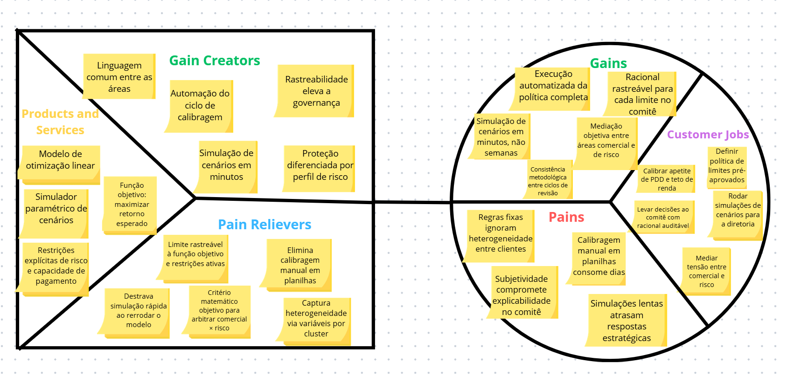

# Entendimento do Negócio
---
## 1. Matriz de Avaliação de Valor - Oceano Azul (Peso 2,5)

&emsp; A Estratégia do Oceano Azul, desenvolvida por W. Chan Kim e Renée Mauborgne [1], baseia-se de que o crescimento competitivo mais relevante não vem da disputa por participação em mercados saturados (oceanos vermelhos), mas da criação de espaços de mercado inexplorados onde a concorrência torna-se irrelevante. Para operacionalizar essa lógica, os autores propõem a Matriz de Avaliação de Valor (Strategy Canvas), ferramenta que permite mapear visualmente como diferentes soluções se posicionam em relação a um conjunto de atributos relevantes para o cliente, revelando eixos de diferenciação.
No contexto deste projeto, a aplicação da matriz serve a dois propósitos complementares: mapear o posicionamento relativo da solução proposta frente às alternativas hoje disponíveis no mercado brasileiro para definição de limites pré-aprovados de crédito e identificar onde a proposta gera valor diferenciado o suficiente para justificar sua adoção pelo Banco PAN em um setor no qual a concorrência por clientes de cartão é intensa. A análise se organiza em torno de oito atributos estratégicos selecionados pela equipe e comparados entre três abordagens representativas do espectro competitivo.

### 1.1 Abordagens Comparadas

A comparação envolve três abordagens distintas que representam o espectro real de soluções adotadas no mercado para definição de limites de crédito pré-aprovado. A escolha deliberada desse trio - em vez de comparar apenas prática tradicional versus solução proposta - permite mostrar que a diferenciação da proposta não se resume a "ser mais moderna", mas a ocupar um ponto ótimo entre sofisticação analítica e transparência.

**Abordagem A** - Prática tradicional do setor. Corresponde ao modelo dominante em instituições financeiras brasileiras de médio porte: definição de limites a partir de regras fixas por faixa de score de crédito, complementadas por calibragem manual de parâmetros realizada empiricamente pelo time de estratégia de crédito. A decisão costuma ser operacionalmente escalável, mas pouco granular e metodologicamente opaca.

**Abordagem B** - Modelos de Machine Learning Black-Box. Corresponde a abordagens mais sofisticadas adotadas por fintechs e bancos digitais, tipicamente baseadas em modelos de aprendizado supervisionado (XGBoost, redes neurais) que preveem diretamente o "limite ótimo" a partir de features do cliente. Essa abordagem é consistente com práticas internacionais consolidadas em Credit Limit Optimization [2], mas apresenta limitações estruturais em explicabilidade e em incorporação de restrições agregadas de carteira.
Segundo a TAPI<, o Banco PAN utiliza um sistema de scoring + regras fixas (mais próxima da Abordagem A), não como ML black-box. A inclusão da Abordagem B como comparador tem como objetivo demonstrar como a solução proposta se compara com outras alternativas de mercado.

**Abordagem C** - Nossa Solução (Otimização Matemática). Corresponde à proposta do grupo: um modelo de otimização linear que determina limites pré-aprovados por cliente ou cluster (mínimo 100 clusters), maximizando o retorno esperado da carteira, definido a partir da receita de interchange a taxa fixa (conforme orientação do TAPI),sujeito a restrições explícitas de apetite de risco (tetos de inadimplência física e financeira), capacidade de pagamento individual com alavancagem diferenciada por perfil de risco, metas de produção configuráveis e regras operacionais (limite mínimo de R\$200, discretização em múltiplos de R\$50). 

### 1.2 Atributos de Valor Selecionados

Os oito atributos a seguir foram selecionados com base em três critérios: **relevância direta para o usuário interno do modelo** (analista de estratégia de crédito do Banco PAN), **impacto observável sobre o cliente final** (correntista elegível) e **aderência ao contexto regulatório brasileiro**. A seleção prioriza atributos onde há diferenciação efetiva entre as três abordagens, evitando itens genéricos como "qualidade" ou "eficiência" que não discriminam.

Tabela X: Matriz de Atributos

| # | Atributo| Descrição|
| - | ----------------------------------------------------------------------------- | --------------------------------------------------------------------------------------------------------------------------------------------------------------------------------------------------------------------------------------------------------------------------------------------------------------------------------------------------------------------------------------------------------------- |
| 1 | Retrabalho analítico manual                                                   | Volume de esforço humano exigido para recalibragem da política de limites a cada mudança de cenário                                                                                                                                                                                                                                                                                                             |
| 2 | Dependência de decisão empírica caso a caso                                   | Grau em que a decisão final sobre cada cliente ou cluster depende de julgamento individual                                                                                                                                                                                                                                                                                                                      |
| 3 | Explicabilidade e rastreabilidade da decisão                                  | Capacidade de justificar, em termos quantitativos e auditáveis, por que cada limite foi atribuído                                                                                                                                                                                                                                                                                                              |
| 4 | Personalização por perfil do cliente                                          | Granularidade com que a solução diferencia limites entre clientes com características distintas, mesmo dentro da mesma faixa de score                                                                                                                                                                                                                                                                           |
| 5 | Controle do risco agregado da carteira (inadimplência física e financeira)    | Capacidade de impor limites formais de exposição agregada que transcendem o risco individual do cliente. Conforme o TAPI, o monitoramento exige duas métricas distintas: inadimplência física (média simples da PD) e inadimplência financeira (média ponderada da PD pelo limite concedido), ambas com teto não superior ao nível atual da carteira                                                            |
| 6 | Aderência ao conceito de perda esperada (PD × exposição)                      | Grau em que a solução incorpora estruturalmente os elementos de perda esperada na decisão de limite. O TAPI orienta que a perda esperada seja considerada a partir da PD (derivada do score interno) e da exposição a risco do cliente. A Resolução CMN nº 4.966/2021 \[3] - referência complementar do grupo - formaliza esse conceito no arcabouço regulatório                                                |
| 7 | Aderência estrutural à capacidade de pagamento (com alavancagem diferenciada) | Garantia formal de que o limite ofertado é compatível com a renda comprometida do correntista, com multiplicador de alavancagem diferenciado por perfil de risco: clientes de melhor perfil podem estar mais alavancados, enquanto clientes mais arriscados têm alavancagem limitada - conforme diretriz explícita do TAPI                                                                                      |
| 8 | Arbitragem quantitativa entre apetite comercial e apetite de risco            | Capacidade de mediar objetivamente o conflito de interesses entre áreas comercial (que busca conversão e volume) e de risco (que busca proteção da carteira). No modelo proposto, o retorno é definido a partir da receita de interchange a taxa fixa - conforme orientação do TAPI para manter a linearidade - e a perda esperada é derivada da PD e da exposição, formalizando o trade-off na função objetivo |

Fonte: Material produzido pelos autores

### 1.3 Matriz de avaliação e Curva de Valor

A tabela a seguir apresenta as pontuações atribuídas a cada abordagem nos oito atributos, em escala de 0 a 10. Os valores refletem avaliação comparativa qualitativa fundamentada no funcionamento estrutural de cada abordagem. As justificativas acompanham cada linha para explicitar o raciocínio.

Tabela X: Matriz de Avaliação de Valor

| # | Atributo | Tradicional (A) |  ML Black-Box (B) | Otimização (C) | Justificativa das Notas|
| - | ----------------------------------------------------------------------------- | --------------- | -------------- | ---------------- | ----------------------------------------------------------------------------------------------------------------------------------------------------------------------------------------------------------------------------------------------------------------------------------------------------------------------------------------------------------------------------------------------------------------------------------------------------------------- |
| 1 | Retrabalho analítico manual                                                   | 9               | 5              | 2                | Na prática tradicional, cada revisão de política exige recalibragem manual extensa (9). O ML exige retraining mas é parcialmente automatizável (5). A otimização exige apenas alterar parâmetros e rerodar (2). **Neste atributo, valor menor indica melhor desempenho.**                                                                                                                                                                                         |
| 2 | Dependência de decisão empírica caso a caso                                   | 8               | 3              | 0                | A prática tradicional depende fortemente de julgamento humano em casos de borda (8). O ML automatiza mas ainda exige intervenção em retraining (3). A otimização substitui completamente a decisão empírica por solução matemática (0). **Neste atributo, valor menor indica melhor desempenho.**                                                                                                                                                                 |
| 3 | Explicabilidade e rastreabilidade da decisão                                  | 5               | 2              | 9                | Regras fixas são superficialmente explicáveis mas a calibragem é opaca (5). Modelos ML são a pior em explicabilidade (2). Na otimização, cada limite rastreia-se até a função objetivo e às restrições ativas (9).                                                                                                                                                                                                                                                |
| 4 | Personalização por perfil do cliente                                          | 3               | 9              | 7                | Regras por faixa de score ignoram heterogeneidade intra-faixa (3). ML captura padrões não-lineares complexos e personaliza profundamente (9). Otimização personaliza por cluster, capturando parte dessa heterogeneidade (7).                                                                                                                                                                                                                                     |
| 5 | Controle do risco agregado da carteira (inadimplência física e financeira)    | 5               | 3              | 9                | A prática tradicional controla via apetite fixo por faixa (5). ML otimiza cliente por cliente sem visão agregada estrutural (3). A otimização inclui como restrições formais tanto a inadimplência física (média simples da PD ≤ nível atual) quanto a financeira (média ponderada da PD pelo limite ≤ nível atual), conforme exigido pelo TAPI, além de tetos de PDD e exposição por faixa de risco (9).                                                         |
| 6 | Aderência ao conceito de perda esperada (PD × exposição)                      | 5               | 3              | 9                | Instituições tradicionais possuem infraestrutura regulatória madura mas desacoplada da decisão de limite (5). ML dificulta mapear aderência por opacidade (3). A otimização formaliza a perda esperada como PD × exposição diretamente na função objetivo e nas restrições, conforme orientação do TAPI - e em linha com o conceito de ECL da Resolução CMN nº 4.966/2021 \[3], referência complementar do grupo (9).                                             |
| 7 | Aderência estrutural à capacidade de pagamento (com alavancagem diferenciada) | 2               | 4              | 9                | A prática tradicional usa renda declarada de forma superficial, sem garantia estrutural (2). ML pode capturar via features mas não garante aderência formal (4). A otimização impõe a capacidade de pagamento como restrição rígida, com multiplicador de alavancagem diferenciado por perfil de risco - clientes de melhor perfil podem ter maior alavancagem, enquanto clientes mais arriscados têm o multiplicador restringido, conforme diretriz do TAPI (9). |
| 8 | Arbitragem quantitativa entre comercial e risco                               | 1               | 3              | 9                | No modelo tradicional, a arbitragem é política e subjetiva (1). ML oferece um número mas não formaliza o trade-off (3). Otimização formaliza na função objetivo a maximização sujeita a restrições, tornando o trade-off matematicamente explícito (9).|

Fonte: Material produzido pelos autores

A matriz foi construída no Google Sheets, onde a tabela acima foi convertida em um gráfico de linhas que materializa a curva de valor comparativa entre as três abordagens analisadas. A planilha completa, contendo os dados, o gráfico e o ERRC Grid em aba complementar, está disponível em:

Link da planilha: [Canvas Estratégico do Oceano Azul - Banco PAN](https://docs.google.com/spreadsheets/d/16oclIvccqD7WkzTtpc5Tf-_E_1N4REQIbCu5e-1wRwY/edit?gid=262777086#gid=262777086)

---

Figura X: Curva de Valor (Strategy Canvas)

  

Fonte: Material produzido pelos autores

A visualização da curva de valor revela uma característica fundamental da solução proposta: ela não busca dominar em todos os atributos, mas adota um perfil estrategicamente seletivo. Nos atributos onde importa (explicabilidade, controle agregado, capacidade de pagamento, arbitragem), a curva se destaca acentuadamente; nos atributos menos críticos (como granularidade máxima de personalização), a solução abdica conscientemente de competir com o ML, reconhecendo que a diferença marginal não compensa a perda de transparência.

### 1.4 Aplicação das Quatro Ações (ERRC Grid)

O framework ERRC (Eliminate-Reduce-Raise-Create) do Oceano Azul propõe que uma estratégia diferenciadora não se constrói apenas somando atributos, mas também reduzindo e eliminando atributos que o mercado atual aceita como necessários mas que geram pouco valor para o cliente final. A análise a seguir distribui os oito atributos selecionados nas quatro ações.
#### Reduzir
O atributo "Retrabalho analítico manual" (atributo 1) é substancialmente reduzido em relação à prática tradicional: o modelo de otimização automatiza o ciclo completo de calibragem da política, exigindo apenas ajuste de parâmetros para rerodar toda a base elegível. Isso libera o time de estratégia de crédito para atividades analíticas de maior valor agregado, como interpretação de cenários e desenho de novas políticas, em vez de operação manual de planilhas.
#### Eliminar
O atributo "Dependência de decisão empírica caso a caso" (atributo 2) é completamente eliminado na solução proposta. Ao rodar sobre toda a base elegível com função objetivo e restrições explícitas, o modelo substitui a intervenção humana pontual por uma política estruturada, aplicada uniformemente. Essa eliminação não apenas reduz custo operacional, ela remove uma fonte estrutural de subjetividade e vieses que comprometia a defensabilidade do processo em auditorias.
#### Aumentar
Quatro atributos são estruturalmente elevados em relação ao estado da arte atual: explicabilidade e rastreabilidade da decisão (atributo 3), controle do risco agregado da carteira (agora com distinção entre inadimplência física e financeira conforme TAPI (atributo 5)), aderência ao conceito de perda esperada (atributo 6) e, em relação à prática tradicional, personalização por perfil do cliente (atributo 4). Essas elevações respondem diretamente a pressões que o setor bancário brasileiro enfrenta: maior rigor na gestão de carteiras (com monitoramento simultâneo de métricas físicas e financeiras de inadimplência, como exigido pelo parceiro), maior exigência de rastreabilidade perante auditorias e maior necessidade de calibragem fina para sustentar rentabilidade. 
#### Criar
Três elementos são estruturalmente criados pela solução, no sentido de que nenhuma das abordagens alternativas os entrega de forma sistemática. O primeiro é a aderência estrutural à capacidade de pagamento com alavancagem diferenciada por perfil de risco (atributo 7), operacionalizada como restrição rígida do modelo (limite ≤ multiplicador × capacidade de pagamento, onde o multiplicador é maior para clientes de melhor perfil e menor para clientes mais arriscados, conforme diretriz do TAPI), que transforma uma diretriz genérica em mecanismo formal de proteção do correntista. O segundo é a arbitragem quantitativa entre apetite comercial e apetite de risco (atributo 8), tradicionalmente resolvida por negociação política entre áreas: ao incorporar essa tensão diretamente na função objetivo - com retorno definido pela receita de interchange a taxa fixa e perda esperada derivada da PD e exposição - e nas restrições, o modelo cria uma linguagem quantitativa comum que desarma o conflito e o converte em decisão auditável. O terceiro é a explicitação de restrições operacionais como parâmetros configuráveis do modelo: limite mínimo de R\$ 200, discretização em múltiplos de R\$ 50, tetos simultâneos de inadimplência física e financeira, e metas flexíveis de produção (quantidade de clientes aprovados e volume financeiro de limite ofertado) - todas especificações do TAPI que saem do "conhecimento tácito" e se tornam elementos formais da otimização.

### 1.5 Diferenciação Estratégica

A análise consolidada revela que a diferenciação da solução proposta não se apoia em um único eixo, mas em uma combinação deliberada: ela captura parte dos ganhos de sofisticação analítica típicos de abordagens de ML, sem incorrer em sua opacidade; e supera amplamente a prática tradicional nos atributos de rastreabilidade, governança agregada da carteira e aderência às especificações do parceiro. Essa combinação é particularmente valiosa no contexto do Banco PAN, onde a adoção institucional depende simultaneamente de precisão técnica, defensabilidade em comitê e aderência a requisitos operacionais concretos, como controle simultâneo de inadimplência física e financeira, alavancagem diferenciada por perfil de risco, limite mínimo de R\$ 200, discretização em múltiplos de R\$ 50, e metas flexíveis de produção, todos formalizados no TAPI. O oceano azul aqui identificado não é o da "melhor previsão possível" (espaço já saturado por abordagens de ML), mas o da decisão otimizada, explicável e operacionalmente aderente ao briefing do parceiro, no qual a concorrência ainda é escassa e o valor percebido é elevado.

### 1.6. Teste das Três Características de uma Boa Estratégia (Ir Além)

Além da construção da matriz, Kim e Mauborgne [1] propõem um teste adicional para validar a robustez de uma estratégia de Oceano Azul: toda curva de valor genuinamente diferenciadora deve apresentar três características simultâneas: foco, divergência e slogan cativante. A aplicação desse teste à solução proposta funciona como verificação de consistência estratégica complementar à análise da matriz.

**Foco.** Uma boa estratégia concentra-se em poucos atributos decisivos em vez de tentar desempenho médio em todos. A curva de valor da solução proposta satisfaz esse critério: em vez de competir com o ML em personalização máxima ou com o modelo tradicional em simplicidade operacional, a proposta concentra esforço em quatro eixos - explicabilidade, controle agregado, capacidade de pagamento e arbitragem quantitativa - que são precisamente os mais valorizados pelo cliente direto (analista de estratégia de crédito) e pelo cliente final (correntista elegível).

**Divergência.** A curva deve destacar-se visualmente das curvas concorrentes. A análise da matriz evidencia essa divergência: nos atributos 3, 5, 6, 7 e 8, a distância entre a solução proposta e as alternativas é significativa, indicando que não se trata de melhoria incremental, mas de reposicionamento estratégico.

**Slogan Cativante.** Uma estratégia robusta deve caber em uma frase clara que comunique seu diferencial. A proposta do grupo pode ser resumida como: "Decisões de crédito matematicamente ótimas, estruturalmente explicáveis e regulatoriamente aderentes." Essa formulação captura o essencial da proposta em três adjetivos, cada um correspondendo a um dos grupos de atributos destacados na matriz.

A aplicação desse teste reforça que a diferenciação identificada não é fortuita nem puramente incremental, mas corresponde a um reposicionamento estratégico sustentável da solução no mercado de ferramentas de decisão de crédito. Essa verificação, embora não exigida no barema, eleva o rigor da análise ao conectar a construção quantitativa da matriz com o arcabouço teórico completo da Estratégia do Oceano Azul.

---

## 2. Matriz de Risco (Peso 2,5)

### 2.1 Critérios de classificação

*O roteiro pede explicar os critérios usados para classificar impacto e probabilidade.*

| Nível | Probabilidade | Impacto |
|:---:|:---|:---|
| **Muito Baixo (1)** | < 5% de chance | Efeito negligenciável |
| **Baixo (2)** | 5–20% | Impacto menor, contornável sem replanejar |
| **Médio (3)** | 20–50% | Impacto moderado, exige ação corretiva |
| **Alto (4)** | 50–75% | Impacto significativo no escopo, prazo ou resultado |
| **Muito Alto (5)** | > 75% | Impacto crítico - pode inviabilizar o projeto |

### 2.2 Riscos identificados

*O roteiro pede **pelo menos 10 riscos** com: descrição, **causa provável**, impacto esperado, probabilidade, **posição na matriz** e **justificativa da classificação**.*

> **NÃO FAZER (roteiro):**
> - ~~Listar riscos genéricos como "o projeto pode dar errado"~~
> - ~~Citar riscos sem relação com a solução do grupo~~
> - ~~Não justificar a posição do risco na matriz~~
> - ~~Confundir risco do projeto com limitação natural do problema~~
>
> **NÃO FAZER (feedback M5):**
> - ~~Classificar como "baixo impacto" riscos que podem afetar a credibilidade do modelo~~ - calibrar com cuidado

| # | Risco | Causa provável | Impacto esperado | Prob. | Imp. | Posição |
|:---:|:---|:---|:---|:---:|:---:|:---:|
| 1 | Concessão de limites excessivamente altos para clientes arriscados | Calibração inadequada da função objetivo (peso excessivo em receita vs risco) | Aumento de inadimplência, impacto direto em provisão | 3 | 5 | **Crítico** |
| 2 | Concessão de limites muito baixos, reduzindo atratividade | Restrições de risco excessivamente conservadoras | Perda de competitividade, redução de ativação, churn | 3 | 4 | **Alto** |
| 3 | Formulação do modelo sem aderência ao negócio | Falta de entendimento do TAPI ou ausência de validação com parceiro | Solução tecnicamente correta mas irrelevante para o Pan | 3 | 5 | **Crítico** |
| 4 | Uso inadequado das variáveis disponíveis | Dados sem dicionário claro; variáveis correlacionadas; inclusão de variáveis sensíveis como proxy (CEP → raça) | Modelo enviesado ou com baixo poder preditivo; risco LGPD | 4 | 4 | **Crítico** |
| 5 | Simplificações que prejudicam a interpretação econômica | Uso de proxies inadequadas sem justificar; linearização de relações não-lineares | Resultados matematicamente válidos mas economicamente sem sentido | 3 | 4 | **Alto** |
| 6 | Descumprimento de restrições de risco da carteira | Restrições não formalizadas no modelo ou com valores incorretos | Carteira resultante viola políticas internas ou exigências regulatórias | 2 | 5 | **Alto** |
| 7 | Dificuldade de implementação prática no ambiente do parceiro | Stack tecnológico incompatível; dados em formato indisponível | Solução não pode ser integrada - valor apenas teórico | 3 | 4 | **Alto** |
| 8 | Baixa explicabilidade da solução | Modelo complexo demais; documentação insuficiente dos parâmetros | Compliance/auditoria recusa a solução; descumprimento LGPD Art. 20 | 3 | 4 | **Alto** |
| 9 | Qualidade insuficiente dos dados fornecidos | Missing values, outliers, período não representativo, viés de seleção | "Garbage in, garbage out" - modelo gera decisões ruins | 4 | 4 | **Crítico** |
| 10 | Dependência excessiva de premissas não justificadas | Falta de dados reais para calibrar parâmetros (LGD, utilização); valores arbitrários | Resultados são artefato das premissas, sem validade prática | 4 | 4 | **Crítico** |
| 11 | Viés de seleção nos dados de inadimplência | `over30mob3` só existe para os ~5K que ativaram (0,03% da base) - não observamos os demais | Modelo treinado com subconjunto não representativo da população | 4 | 4 | **Crítico** |
| 12 | Atrasos no time devido ao prazo curto da sprint | Sprint 1 com poucos dias de dev efetivo | Entregas incompletas ou com qualidade inferior | 4 | 3 | **Alto** |

> **Nota sobre o Risco 11:** Este risco foi identificado diretamente dos dados (`base_ref_M1_v2.parquet`). Dos 14,5M de clientes, apenas ~5K têm `over30mob3` preenchido. Isso é um viés de seleção clássico em crédito ("reject inference") - não sabemos como os clientes que não receberam oferta se comportariam.

### 2.3 Justificativa do posicionamento

*O roteiro pede justificativa do posicionamento de cada risco.*

**Posição = Probabilidade × Impacto:**
- **Críticos (≥ 15):** Riscos 4, 9, 10 e 11 têm probabilidade alta (4) porque o grupo ainda não recebeu o TAPI nem analisou os dados em profundidade - são riscos inerentes ao estágio atual. Riscos 1 e 3 têm impacto muito alto (5) porque comprometem a razão de existir da solução.
- **Altos (8–14):** Riscos 2, 5, 6, 7, 8 e 12 são significativos mas mais controláveis com ações de mitigação.

### 2.4 Análise dos riscos mais críticos

*O roteiro pede análise dos riscos mais críticos.*

**Riscos 1 e 2 (limites altos/baixos demais)** são faces opostas do mesmo problema: calibração inadequada do trade-off receita × risco. Ambos dependem da correta formulação da função objetivo (Risco 3). Se a formulação errar, ambos se materializam automaticamente.

**Riscos 4, 9, 10 e 11 (dados e premissas)** formam uma cadeia: dados com problemas (9) + viés de seleção (11) → premissas inadequadas (10) → uso errado de variáveis (4). A mitigação mais efetiva é uma EDA rigorosa e documentação explícita de toda premissa.

`[APÓS TAPI: recalibrar probabilidades e impactos com informações reais do parceiro]`

### 2.5 Representação visual da matriz

*Inserir a imagem da matriz 5×5 com os riscos posicionados. Fazer em Figma, Canva ou Miro.*

`[PREENCHER: criar imagem da matriz 5×5 e inserir aqui]`

---

## 3. Canvas da Proposta de Valor 

O Value Proposition Canvas é um framework estratégico desenvolvido pelo Dr. Alexander Osterwalder, que permite posicionar produtos e serviços de acordo com as necessidades e valores reais do cliente. No contexto deste projeto, a ferramenta é utilizada para modelar a relação entre o perfil do usuário operacional da solução e a oferta tecnológica proposta, buscando o fit ideal entre a engenharia do modelo de otimização e o valor de negócio gerado para o Banco PAN. Esta análise atua como uma ponte entre a modelagem matemática dos limites pré-aprovados e a realidade operacional de quem decide política de crédito, garantindo que as funcionalidades não sejam apenas tecnicamente viáveis, mas essencialmente úteis para a rotina do time de crédito. Ao mapear essa conexão, asseguramos que o projeto foque na resolução de problemas prioritários e na entrega de benefícios tangíveis, validando cada recurso desenvolvido diante da realidade da organização.  

O desafio do Banco PAN envolve dois níveis de cliente claramente distintos: o usuário direto da solução, representado pelos times internos que operam o modelo no dia a dia, e o cliente final impactado, representado pelos correntistas elegíveis à concessão de cartão pré-aprovado. O canvas principal é construído com foco no usuário direto, uma vez que é ele quem adota, parametriza e defende a ferramenta internamente. O cliente final é tratado em seção complementar, reconhecendo que é nele que o valor do modelo se materializa no mundo real. Entre os candidatos a usuário direto, temos os times de Estratégia de Crédito e Data Science. O canvas foca no Analista/Gerente de Estratégia de Crédito, pois é quem efetivamente opera a ferramenta no ciclo semanal de calibragem da política, roda cenários, leva resultados ao comitê e arbitra trade-offs entre risco e atratividade comercial.  

### 3.1 Segmento de cliente

O conceito de "cliente", no contexto deste projeto, deve ser analisado em dois níveis complementares, conforme orienta o roteiro metodológico. Essa distinção é fundamental para garantir que a proposta de valor contemple tanto o usuário operacional da solução quanto o público final impactado por suas decisões.

Neste projeto, identificam-se dois segmentos principais:
Cliente direto da solução: composto pelos times internos do Banco PAN que interagem com o modelo, mas com papéis distintos. O time de Estratégia de Crédito é o usuário operacional — é quem parametriza restrições, roda simulações de cenários, interpreta os outputs e incorpora os resultados na política de limites pré-aprovados. O time de Data Science é o usuário técnico — é quem desenvolve, calibra e monitora o modelo, garantindo que ele funcione corretamente e permaneça aderente às regras de negócio ao longo do tempo. Embora ambos interajam diretamente com a solução, fazem isso de formas fundamentalmente diferentes: Estratégia de Crédito decide com o modelo; Data Science constrói e sustenta o modelo.
Cliente final impactado: formado pelos correntistas do Banco PAN elegíveis à concessão de cartão de crédito pré-aprovado. Embora não utilizem diretamente a ferramenta, são impactados pelos resultados do modelo, especialmente no que diz respeito à adequação dos limites concedidos ao seu perfil de risco e capacidade de pagamento. A base analisada conta com aproximadamente 14,5 milhões de clientes, dos quais cerca de 12,7 milhões atendem aos critérios de elegibilidade.

Para fins deste canvas, a análise está centrada no time de Estratégia de Crédito como usuário primário, uma vez que é ele quem opera a solução no ciclo de calibragem da política, leva decisões ao comitê e arbitra trade-offs entre risco e retorno. O time de Data Science é reconhecido como usuário secundário com necessidades próprias — tratadas nas personas do projeto —, mas sua relação com a ferramenta é de construção e manutenção, não de decisão. Ainda assim, o reconhecimento explícito do cliente final garante que a proposta de valor permaneça alinhada ao impacto real gerado na ponta.

### 3.2 Perfil do Cliente (lado direito do Canvas)

**Tarefas do Cliente:**  
O analista de estratégia de crédito é responsável por definir e revisar a política de limites pré-aprovados da base elegível, calibrando parâmetros como apetite de PDD, teto de comprometimento de renda e segmentação por risco. Sua rotina inclui rodar simulações de cenários para responder a demandas da diretoria, além de mediar a tensão entre a área comercial — orientada à conversão — e a área de risco — orientada à proteção da carteira. Também cabe ao analista levar decisões ao comitê de crédito com racional auditável e acompanhar a performance das safras, ajustando a política conforme mudanças nas premissas de risco.  

**Dores:** 
O Banco PAN já dispõe de um modelo preditivo de score, mas a conversão desse output em política de limites ainda depende de calibragem manual em planilhas, consumindo dias de trabalho para simulações simples. Qualquer ajuste que envolva alterações no modelo exige acionamento do time de Data Science, tornando o processo lento e dependente — o analista de estratégia não tem autonomia para rerodar cenários sem intermediação técnica. A ausência de uma ferramenta integrada força decisões baseadas em regras fixas por faixa de score, que ignoram a heterogeneidade real entre clientes dentro de uma mesma faixa. A subjetividade nas decisões compromete a explicabilidade no comitê, e a falta de um critério objetivo para arbitrar o trade-off entre risco e retorno intensifica conflitos entre áreas, frequentemente resolvidos por influência política em vez de dados.  

**Ganhos:**  
O analista busca autonomia para simular cenários, conservador, moderado e agressivo — antes de implementar qualquer mudança, sem depender de intermediação técnica. Espera sentir segurança ao defender decisões de limite com argumentação matemática rastreável, substituindo opiniões por evidências quantitativas nas reuniões com comercial e risco. Também valoriza a redução do tempo gasto em análises manuais e debates subjetivos, e a existência de rastreabilidade das decisões para auditorias e compliance. Por fim, deseja maior consistência metodológica entre ciclos de revisão, evitando retrabalho e reduzindo a carga cognitiva de justificar cada decisão do zero.  

**Síntese:** 
O perfil evidencia um ambiente de alta complexidade analítica em que a dependência de processos manuais, a falta de autonomia operacional e a subjetividade decisória criam fricção constante. A necessidade central é ter uma ferramenta que transforme o output do modelo preditivo existente em política de limites de forma estruturada, autônoma e defensável. 

### 3.3 Mapa de Valor (lado esquerdo do Canvas)

**Produtos e Serviços:**  
O projeto entrega um modelo de otimização linear que define limites pré-aprovados por cliente ou cluster, atuando como núcleo analítico da política de crédito. A função objetivo maximiza o retorno esperado da carteira, calculado pela receita de interchange a taxa fixa menos a perda esperada (PD × exposição). O modelo está sujeito a restrições de: (i) apetite de risco, com tetos simultâneos de inadimplência física (média simples da PD) e financeira (média ponderada pelo limite), ambos não superiores ao nível atual da carteira; (ii) capacidade de pagamento, com multiplicadores de alavancagem diferenciados por perfil de risco; (iii) regras operacionais, como limite mínimo e discretização em múltiplos fixos; e (iv) metas configuráveis de produção e rentabilidade. A modelagem incorpora o arcabouço de perda esperada da Resolução CMN nº 4.966/2021, reforçando aderência regulatória. Como suporte, a solução inclui um simulador paramétrico de cenários e relatórios de sensibilidade, permitindo recalibragem rápida, digital e auditável sem necessidade de intervenção do time de Data Science.

**Aliviadores de Dor (Pain Relievers):**  
A solução elimina a calibragem manual em planilhas ao automatizar a execução da política em uma única rodada. O uso de variáveis por cluster (ou cliente) captura a heterogeneidade ignorada por regras fixas de score. Cada limite torna-se rastreável à função objetivo e às restrições ativas, reduzindo a subjetividade e facilitando a defesa no comitê. O modelo também introduz um critério objetivo para equilibrar risco e retorno, diminuindo conflitos entre áreas comercial e de risco. Por fim, a parametrização permite simulações rápidas, substituindo semanas de trabalho manual por execuções em minutos.  

**Criadores de Ganho (Gain Creators):**  
O valor gerado está na automação do ciclo de calibragem, liberando o analista para atividades mais estratégicas. A simulação ágil de cenários amplia a capacidade de resposta a demandas da diretoria. A rastreabilidade dos resultados eleva a qualidade e a defensabilidade das decisões no comitê. Além disso, o uso de um critério quantitativo comum melhora a comunicação entre áreas e reduz conflitos. A padronização metodológica entre ciclos de revisão elimina retrabalho e aumenta a consistência das decisões.  

**Síntese:**  
A proposta integra otimização matemática à rotina do analista de crédito, substituindo processos manuais e regras fixas por um fluxo automatizado, rastreável e orientado por função objetivo. Com isso, reduz retrabalho, melhora a governança e fortalece a defensabilidade das decisões. O modelo se posiciona como um núcleo analítico que eleva a qualidade da política de crédito, garantindo maior agilidade, consistência e alinhamento entre risco e retorno.  

## 3.4 Cliente Final Impactado (Correntista Elegível)

Embora o canvas foque no usuário direto, é no correntista elegível ao cartão pré-aprovado que o valor da solução se materializa. Suas tarefas incluem acessar crédito quando necessário, gerenciar o orçamento e realizar compras com previsibilidade. As principais dores estão em limites mal calibrados: quando baixos, reduzem a utilidade do produto; quando altos, aumentam o risco de sobre-endividamento, além da fricção para ajustes posteriores.  

Os ganhos esperados são acesso a crédito no momento certo, com limite compatível à renda e ao perfil de consumo, sem burocracia. Nesse contexto, a otimização matemática atua ao incorporar explicitamente a restrição de capacidade de pagamento, com multiplicadores de alavancagem diferenciados por perfil de risco — clientes mais arriscados recebem limites proporcionalmente menores.  

Essa diretriz, alinhada ao TAPI, garante que o limite respeite a capacidade financeira do cliente e sustente uma relação de crédito mais equilibrada e sustentável no longo prazo.  

---

## 4. Análise Financeira do Projeto (Peso 2,5)

*O roteiro pede análise para **horizonte de 1 ano** com **premissas justificadas**. "O mais importante é mostrar lógica econômica, coerência de premissas e capacidade de estimar o ROI."*

> **ATENÇÃO (roteiro):** O TAPI não apresenta orçamento fechado. O grupo deve trabalhar com **premissas justificadas**, não com números inventados. Quando uma estimativa for assumida, explicitar no texto.

### 4.1 Premissas declaradas

| # | Premissa | Valor | Fonte / Justificativa |
|:---:|:---|:---|:---|
| P1 | Carteira de crédito do Pan | R$ 57,8 bi | RI Banco Pan, Q2 2025 |
| P2 | NPL >90 dias | 8,3% | RI Banco Pan, Q2 2025 |
| P3 | Perda estimada associada ao NPL | ~R$ 4,8 bi/ano | P1 × P2 (simplificação - assume perda = carteira × NPL, sem considerar recuperação) |
| P4 | Salário/hora dev júnior | R$ 23,17/h | Glassdoor Brasil, média 2025 |
| P5 | Salário/hora tech lead | R$ 79,55/h | Glassdoor Brasil, média 2025 |
| P6 | Carga horária do projeto | ~100h por pessoa | 10 semanas × 10h/semana |
| P7 | Infraestrutura cloud | AWS EC2 t3.medium | Pricing público AWS, sa-east-1 |
| P8 | Redução de NPL pelo modelo | 0,1pp a 0,5pp | **Premissa assumida** - literatura reporta melhorias nessa faixa para modelos de otimização de crédito. `[APÓS TAPI: validar com parceiro]` |

### 4.2 Investimento inicial

| Item | Detalhamento | Total (R$) |
|:---|:---|---:|
| Equipe de desenvolvimento (7 devs júnior) | 7 × 100h × R$ 23,17/h (P4, P6) | 16.219 |
| Orientação técnica (1 tech lead) | 1 × 100h × R$ 79,55/h (P5, P6) | 7.955 |
| Testes e validação | Incluso nas horas de dev | - |
| Equipamentos (notebooks) | 7 × R$ 4.200 (amortização do período) | 29.400 |
| **Subtotal investimento inicial** | | **53.574** |

### 4.3 Custos operacionais anuais

| Item | Mensal (R$) | Anual (R$) |
|:---|---:|---:|
| Infraestrutura cloud (EC2 t3.medium) | 160 | 1.920 |
| Banco de dados (Supabase Pro) | 130 | 1.560 |
| Armazenamento (S3, 50GB) | 6 | 72 |
| Manutenção e monitoramento | Equipe interna do banco | - |
| **Subtotal operacional** | **296** | **3.552** |

**Investimento total Ano 1:** R$ 53.574 + R$ 3.552 = **R$ 57.126**

> **Nota:** Esses custos refletem o projeto acadêmico. Uma implementação em produção envolveria custos adicionais significativos (integração com sistemas, equipe dedicada de MLOps, infra de produção). Não incluídos por falta de informação do parceiro. `[APÓS TAPI: recalcular se houver dados de investimento real]`

### 4.4 Benefícios econômicos estimados

*Os benefícios são **economias por redução de perdas com inadimplência**, não receitas novas.*

> **NÃO FAZER (roteiro):** ~~Confundir receita com economia~~

Base de cálculo: perda anual estimada de ~R$ 4,8 bi (P3).

| Cenário | Redução de NPL (P8) | Economia anual | Tipo |
|:---|:---:|---:|:---|
| Conservador | 0,1 pp | R$ 57,8 mi | Economia (redução de provisão) |
| Moderado | 0,3 pp | R$ 173,4 mi | Economia |
| Otimista | 0,5 pp | R$ 289,0 mi | Economia |

*Além da redução de perdas, a otimização pode gerar aumento de receita por melhor utilização dos limites (clientes bons recebem limites mais altos). Não quantificado por falta de dados de utilização.*

### 4.5 Cálculo do ROI

*O roteiro pede a fórmula e o cálculo.*

$$
ROI = \frac{\text{Ganhos estimados} - \text{Custos do projeto}}{\text{Investimento total}} \times 100
$$

**Cenário conservador:**

$$
ROI = \frac{R\$\ 57.800.000 - R\$\ 57.126}{R\$\ 57.126} \times 100 \approx 101.080\%
$$

### 4.6 Interpretação do resultado

*O roteiro pede interpretação, não apenas o número.*

O ROI calculado é extraordinariamente alto (~101.000%). Isso **não é um erro** - reflete uma característica estrutural: o investimento é muito baixo (projeto acadêmico, ~R$ 57 mil) enquanto o benefício potencial é muito alto (redução de perdas em carteira de R$ 57,8 bi). Esse tipo de ROI é comum em projetos de otimização aplicados a grandes carteiras financeiras.

**Limitações importantes:**

1. **Os custos refletem apenas o projeto acadêmico.** Uma implementação real exigiria investimento ordens de grandeza maior (equipe, infra enterprise, integração, compliance) - o que reduziria o ROI substancialmente, embora provavelmente se mantivesse positivo.
2. **A premissa de redução de NPL (P8) é assumida.** O ROI real depende da efetividade do modelo, que só será conhecida após backtesting com dados reais.
3. **Não foram considerados** custos de oportunidade, riscos de implementação, nem tempo de maturação do modelo.

> **NÃO FAZER (roteiro):**
> - ~~Apresentar números sem explicar de onde vieram~~ - todas as premissas estão na tabela 4.1
> - ~~Fazer conta sem premissas~~ - cada número tem fonte
> - ~~Produzir análise apenas descritiva, sem cálculo~~ - ROI calculado acima

`[APÓS TAPI: recalcular com custos reais de implementação e metas de NPL do parceiro]`

---

## Checklist pré-entrega

**Oceano Azul:**
- [x] Explicação de quem está sendo comparado (3 abordagens)
- [x] Definição dos 8 atributos com justificativa para o Pan
- [x] Notas atribuídas com justificativa para cada uma
- [x] 4 ações (Reduzir, Eliminar, Aumentar, Criar) aplicadas ao projeto
- [ ] `[APÓS MODELAGEM]` Detalhar tipo de modelo na abordagem do grupo
- [ ] `[APÓS TAPI]` Validar notas do Pan atual com parceiro

**Riscos:**
- [x] Pelo menos 10 riscos apresentados (temos 12)
- [x] Critérios de classificação de impacto e probabilidade
- [x] Cada risco tem: descrição, causa provável, impacto, prob, posição, justificativa
- [x] Análise dos riscos mais críticos
- [ ] `[PREENCHER]` Imagem da matriz 5×5

**Canvas:**
- [x] Dois níveis de cliente identificados (direto + final)
- [x] Dores do cliente direto
- [x] Ganhos do cliente direto (do usuário, não da alta gestão)
- [x] Produtos e serviços da solução
- [x] Aliviadores de dor conectados às dores
- [x] Criadores de ganho
- [ ] `[PREENCHER]` Figura do Canvas (template Strategyzer)
- [ ] `[APÓS UX]` Cruzar com personas

**Financeira:**
- [x] Premissas claramente declaradas com fonte
- [x] Separação entre investimento, custo operacional e benefício
- [x] Distinção entre receita e economia
- [x] Cálculo do ROI com fórmula
- [x] Interpretação do resultado com limitações
- [ ] `[APÓS TAPI]` Recalcular com dados reais

---

## Fontes

[1] KIM, W. Chan; MAUBORGNE, Renée. A Estratégia do Oceano Azul: Como Criar Novos Mercados e Tornar a Concorrência Irrelevante. Rio de Janeiro: Sextante, 2005.
[2] EXPERIAN. Balancing Growth and Risk with Credit Limit Optimization. Experian Insights, 2024. Disponível em: https://www.experian.com/blogs/insights/credit-limit-optimization/. Acesso em: 28 de abril de 2026.
[3] BRASIL. Conselho Monetário Nacional. Resolução CMN nº 4.966, de 25 de novembro de 2021. Dispõe sobre os conceitos e os critérios contábeis aplicáveis a instrumentos financeiros e sobre a mensuração das provisões para perdas esperadas associadas ao risco de crédito. Brasília: Banco Central do Brasil, 2021. Disponível em: https://www.bcb.gov.br/estabilidadefinanceira/exibenormativo?tipo=Resolução%20CMN&numero=4966. Acesso em: 28 de abril de 2026..
