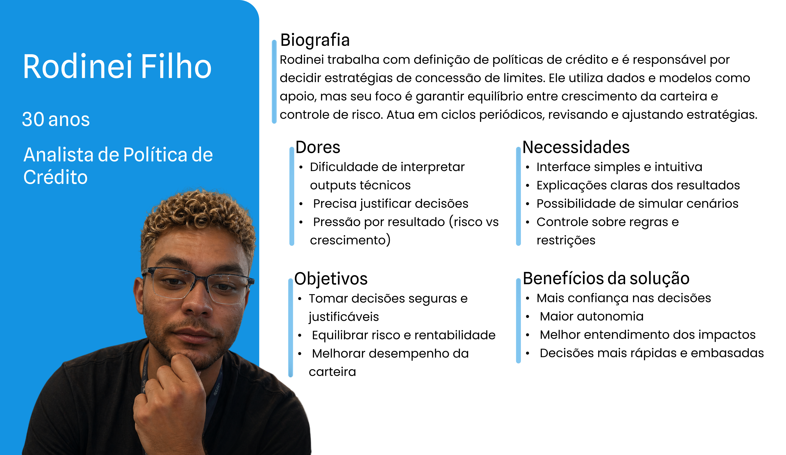
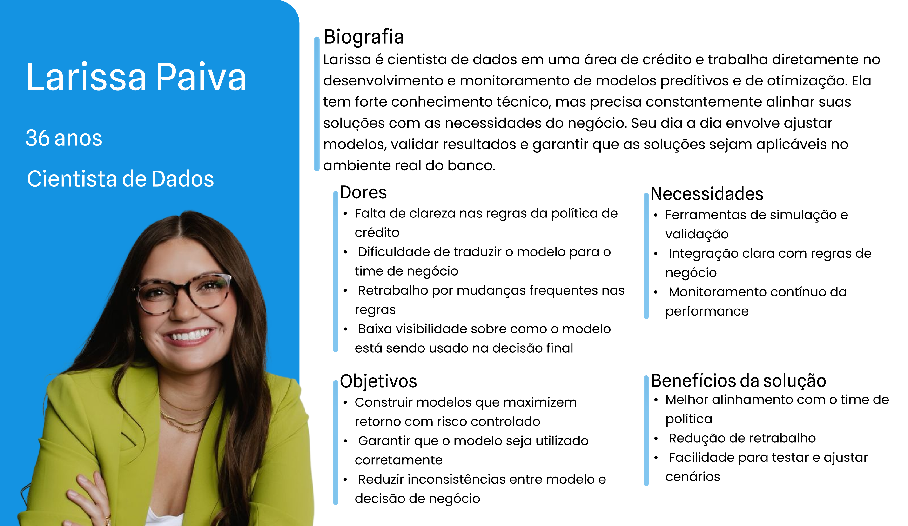
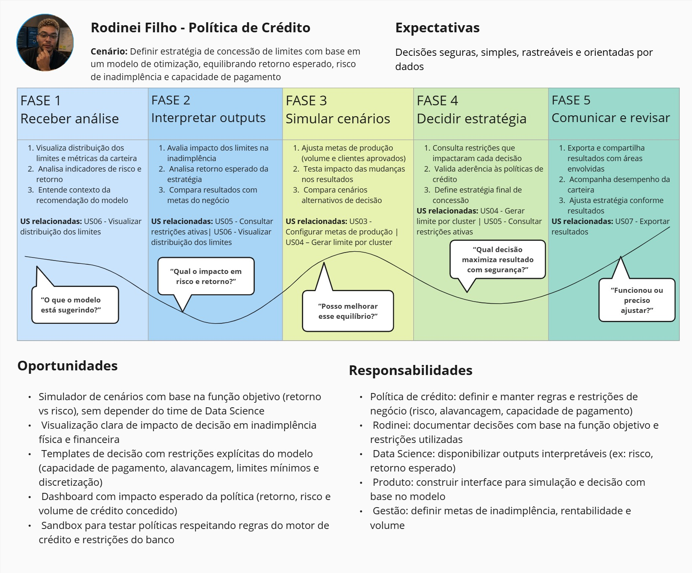
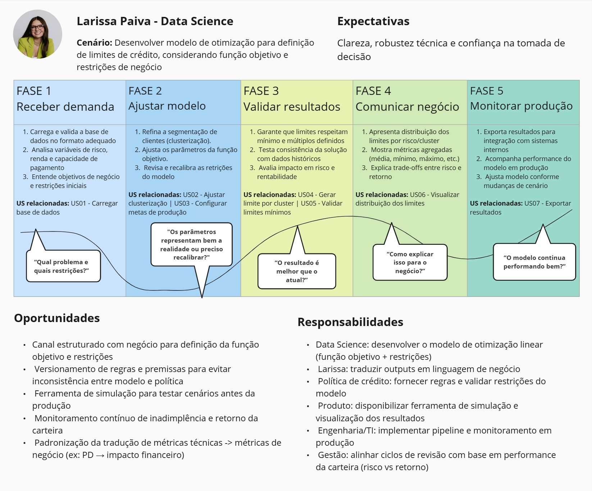

# Entendimento da Experiência do Usuário

---

## 1. Personas

Para este projeto, as _personas_ foram definidas com base nas áreas que efetivamente **utilizarão e sustentarão a solução**, a partir das reuniões com o parceiro.

O usuário principal é o time de **Estratégia de Crédito**, responsável por **configurar parâmetros e restrições**, **avaliar cenários** e **decidir quais políticas de limites serão implementadas**. Como usuário secundário, considera-se o **time de Data Science**, que atua no **desenvolvimento e manutenção da solução**, além de **garantir a qualidade técnica dos resultados** e apoiar a **integração com os motores internos**.

Assim, as duas _personas_ buscam **refletir a dinâmica real do trabalho**: o time de Data Science viabiliza e valida tecnicamente, enquanto o time de Estratégia de Crédito interpreta os resultados, ajusta restrições e define a política a ser aplicada.

O detalhamento das _personas_ definidas pode ser encontrado a seguir:

### Persona 1 - Rodinei Filho (Estratégia de Crédito)

  FIGURA 1 - Persona do Time de Estratégia de Crédito  
   
   
  Fonte: Material produzido pelos autores

   

### Persona 2 - Larissa Paiva (Data Science)

  FIGURA 2 - Persona do Time de Data Science  
   
   
  Fonte: Material produzido pelos autores
  

 

## Conclusões

As _personas_ defindias refletem os dois papéis essenciais para que a solução de otimização de limites seja construída, validada e adotada no processo de definição de políticas.

Com o mapeamento das dores, necessidades, objetivos e benefícios esperados de cada _persona_, os principais aspectos da solução também foram evidenciados. O sucesso do projeto depende tanto da **confiabilidade e reprodutibilidade técnica** (garantidas por Data Science) quanto da **clareza para a tomada de decisão** (necessária para Estratégia de Crédito), assegurando que o modelo não só funcione, mas seja utilizado como suporte real à definição de políticas.

## 2. User Stories (5 pontos)

Segundo Max Rehkopf, gerente de _Marketing_ de Produto na **_Atlassian_** (empresa multinacional de _software_), _User Stories_ se tratam de tarefas de desenvolvimento, composta por descrições concisas e focadas nos usuários. Para o projeto com o _Banco Pan_, as _User Stories_ são derivadas das duas _personas_ mapeadas: **Rodinei Filho** e **Larissa Paiva**. Cada história é desenvolvida levando em consideração as suas dores específicas e ganhos esperados, buscando uma maior robustez e alinhamento da solução.

As _User Stories_ também buscam seguir o _framework_ INVEST. Ele visa garantir que as histórias criadas são independentes umas das outras, negociáveis (podem ser ajustadas futuramente), geram valor para os usuários, estimáveis, concisas e testáveis.

---

### US01 - Carregar base de dados

**Como** cientista de dados,  
**eu quero** carregar a base de dados do banco no formato parquet,  
**para** utilizar informações corretas e completas na segmentação e otimização de limites por cluster.

**Dores relacionadas:**

- Quando a base chega com colunas faltantes/tipos errados, ela perde tempo “descobrindo no braço” o problema e refazendo cargas, atrasando a entrega do cenário para o time de Crédito.

- Quando a carga não é padronizada/reprodutível, o resultado muda entre execuções (ou entre ambientes), reduzindo a confiança no pipeline e dificultando comparar cenários.

- Quando o erro não é explícito, o troubleshooting vira tentativa-e-erro (reprocessar, filtrar, reexportar), gerando retrabalho.

**Critérios de aceitação:**

- Carrega arquivo parquet válido e informa: total de linhas e total de clientes elegíveis (flag_filtros == 0).

- Valida colunas mínimas; se faltar alguma, bloqueia a carga e lista explicitamente as colunas ausentes.

- Para arquivo corrompido/inválido, interrompe o processo e exibe erro claro (sem seguir para clusterização).

- Suporta carga de até ~1,8 milhão de registros elegíveis sem perda de registros (contagem preservada).

- Permite usar base mock com o mesmo esquema mínimo para executar as etapas seguintes.

---

### US02 - Ajustar clusterização

**Como** cientista de dados,  
**eu quero** configurar o número de clusters utilizados na segmentação,  
**para** testar diferentes cenários de agrupamento dos clientes.

**Dores relacionadas:**

- Quando o número de clusters não é configurável, ela não consegue testar hipóteses de segmentação (granularidade vs estabilidade), atrasando iterações com o time de Crédito.

- Quando a clusterização não é reprodutível, os clusters mudam entre execuções e ela não consegue comparar cenários com segurança nem explicar diferenças para Rodinei.

- Quando parâmetros inválidos não são barrados, a execução falha “no meio” e vira retrabalho (rodar novamente, ajustar dados, interpretar erro técnico).

**Critérios de aceitação:**

- Aceita n_clusters inteiro ≥ 2; caso contrário, bloqueia e exibe erro.

- Se n_clusters > nº de clientes elegíveis (flag_filtros == 0), bloqueia e exibe erro.

- Ao executar, gera cluster_id para 100% dos elegíveis, com valores entre 0 e n_clusters-1.

- Com mesma base + mesmos parâmetros (incluindo random_state), gera o mesmo resultado de cluster_id (reprodutibilidade).

- Gera também a tabela agregada por cluster com colunas n_k, PD_k, pi_k, CP_k, m_k (1 linha por cluster_id).

---

### US03 - Configurar metas de produção

**Como** analista de estratégia de crédito,  
**eu quero** configurar metas de clientes aprovados e volume total de limite,  
**para** alinhar a otimização aos objetivos do negócio.

**Dores relacionadas:**

- Quando as metas ficam “na mão” do time técnico, Rodinei perde autonomia para testar cenários e depende de idas e vindas com Data Science.

- Quando as metas não ficam registradas, versões diferentes de parâmetros circulam e a comparação entre cenários fica confusa.

- Quando não há validação, metas incoerentes (ex.: acima do elegível) geram resultados inválidos e retrabalho.\*

**Critérios de aceitação:**

- Permite definir meta de clientes aprovados (inteiro ≥ 0) e meta de volume financeiro (≥ 0); valores inválidos são bloqueados com mensagem clara.

- Bloqueia meta de clientes aprovados maior que a quantidade de clientes elegíveis carregados.

- Salva as metas (persistência) e permite consultar quais metas estão ativas antes de rodar o solver.

- Alterar metas não executa o solver automaticamente (ação de executar é separada).

- Mantém registro do “cenário” (ex.: nome/identificador + data/hora) para rastreabilidade.

---

### US04 - Gerar limite por cluster

**Como** analista de estratégia de crédito,  
**eu quero** gerar limites sugeridos para cada cluster,  
**para** aplicar políticas segmentadas de crédito.

**Dores relacionadas:**

- Rodinei hoje precisa montar políticas manualmente (regras/planilhas), o que gera inconsistência e demora para fechar uma decisão.

- Sem padronização (arredondamento/faixas), os limites viram difíceis de comunicar e de implementar operacionalmente.

- Quando o solver falha ou não há solução útil, ele fica sem explicação e não sabe como ajustar restrições/metas.

**Critérios de aceitação:**

- Retorna um limite sugerido para cada cluster_id existente na base agregada.

- Aplica regra de padronização: limite final é múltiplo de R$50 e é 0 ou ≥ R$200 (se < R$200, retorna 0).

- Respeita o teto máximo (L_max) definido nos parâmetros do modelo.

- Exibe o status da otimização (ex.: ótimo/múltiplas soluções/erro) junto com o resultado.

- Se a execução falhar, não retorna resultado parcial e exibe erro claro.

---

### US05 - Consultar restrições ativas

**Como** analista de estratégia de crédito,  
**eu quero** consultar quais restrições do modelo impactaram cada cluster,  
**para** justificar decisões e facilitar auditorias.

**Dores relacionadas:**

- Rodinei precisa justificar por que um cluster recebeu certo limite; sem transparência das restrições, a decisão perde confiança.

- Em auditorias e alinhamentos internos, ele precisa explicar “o que travou” o resultado (risco x capacidade x teto), sem depender do time técnico.

- Sem busca rápida por cluster, vira um processo manual e demorado para responder perguntas pontuais.

**Critérios de aceitação:**

- Para um cluster_id consultado, retorna: limite sugerido e lista de restrições que ficaram ativas/limitantes.

- Considera como restrições do modelo: teto de inadimplência da carteira (R1) e restrições por cluster (capacidade/alavancagem R2 e teto máximo R3).

- Permite busca por cluster_id e retorna erro claro para cluster inexistente.

- Retorna até 10.000 registros em até 3 segundos (em base mock definida para testes).
- Exibe também o status da otimização associado ao resultado consultado.

---

### US06 - Visualizar distribuição dos limites

**Como** analista de estratégia de crédito,  
**eu quero** visualizar a distribuição dos limites por cluster,  
**para** analisar os resultados e apoiar decisões.

**Dores relacionadas:**

- Rodinei precisa de visão geral para decidir política; uma lista de números sem resumo dificulta entender o “shape” da solução.

- Sem comparação visual entre clusters, fica difícil identificar outliers e revisar restrições/metas com confiança.

- Se só existe “output técnico”, a tomada de decisão fica lenta e dependente de análises adicionais.

**Critérios de aceitação:**

- Exibe a distribuição dos limites entre clusters (mínimo, máximo, média e mediana dos limites sugeridos).

- Permite visualizar em tabela e em gráfico, com os mesmos valores.

- Permite ordenar a tabela por limite e por cluster_id.

- Funciona com dataset mock.

- Indica clusters com limite 0 (abaixo do mínimo operacional) como casos a revisar.

---

### US07 - Exportar resultados

**Como** cientista de dados,  
**eu quero** exportar os resultados finais da otimização,  
**para** integrar a saída com outros sistemas internos.

**Dores relacionadas:**

- Larissa precisa integrar a saída em outros fluxos; sem exportação padronizada vira “copiar/colar” e gera erro.

- Sem um formato consistente, diferentes áreas consomem arquivos incompatíveis e o pipeline quebra.

- Sem confirmação/erro claro, o time perde tempo tentando descobrir se exportou “certo” ou “a versão certa”.

**Critérios de aceitação:**

- Exporta os resultados em CSV e/ou objeto Python (conforme o modo de uso definido).

- O CSV contém, no mínimo: cluster_id, limite_sugerido (final) e status_otimizacao.
  Bloqueia exportação se não existir resultado gerado para o cenário atual e exibe mensagem clara.

- Exporta com sucesso a partir de um resultado já existente (sem reexecutar solver).

- Exibe mensagem de sucesso com o local/nome do arquivo exportado (ou confirmação do objeto retornado).

---

---

## 3. Jornada do Usuário (Opcional - vale 2 pontos extras)

Esta seção apresenta a jornada dos principais usuários envolvidos no processo de definição de limites de crédito: o analista de Política de Crédito e a cientista de dados.
O objetivo é evidenciar como cada perfil interage com o modelo de otimização, destacando suas ações, percepções e principais desafios ao longo do processo. A partir dessa análise, são identificadas oportunidades de melhoria que orientam o desenvolvimento da solução proposta.

### Persona 1 - Rodinei Filho (Política de Crédito)

**Persona:** Rodinei Filho, analista de Política de Crédito do Banco PAN.

**Cenário:** Definir e comunicar uma estratégia de concessão de limites pré-aprovados com base no modelo de otimização linear, equilibrando retorno esperado, risco de inadimplência e capacidade de pagamento dos correntistas.

**Expectativa central:** Decisões seguras, simples, rastreáveis e orientadas por dados.

  FIGURA 3 - Jornada de Usuário do Time de Política de Crédito  
   
  Fonte: Material produzido pelos autores
  

---

### Persona 2 - Larissa Paiva (Data Science)

**Persona:** Larissa Paiva, cientista de dados responsável pelo desenvolvimento e manutenção do modelo de otimização de limites de crédito.

**Cenário:** Desenvolver o modelo de otimização linear para definição de limites pré-aprovados, considerando função objetivo, restrições de negócio e integração com sistemas de produção do banco.

**Expectativa central:** Clareza técnica, robustez matemática e confiança na tomada de decisão.

  FIGURA 4 - Jornada de Usuário do Time de Data Science  
   
  Fonte: Material produzido pelos autores

---

### Conclusão

A análise das jornadas evidencia a necessidade de maior integração entre áreas técnicas e de negócio, além de maior transparência e autonomia no uso do modelo.
As oportunidades identificadas reforçam a importância de soluções que facilitem a interpretação dos resultados, a simulação de cenários e o monitoramento contínuo da estratégia, contribuindo para decisões mais seguras, ágeis e orientadas por dados.

---

## 4. Levantamento e Priorização das User Stories

O backlog do projeto contém 7 User Stories, derivadas das duas personas mapeadas: **Larissa Paiva** (cientista de dados) e **Rodinei Filho** (analista de estratégia de crédito).

| ID | Título | Persona | Depende de |
|---|---|---|---|
| US01 | Carregar base de dados | Larissa | — |
| US02 | Ajustar clusterização | Larissa | US01 |
| US03 | Configurar metas de produção | Rodinei | US01 |
| US04 | Gerar limite por cluster | Rodinei | US02, US03 |
| US05 | Consultar restrições ativas | Rodinei | US04 |
| US06 | Visualizar distribuição dos limites | Rodinei | US04 |
| US07 | Exportar resultados | Larissa | US04 |

Critérios de priorização

Para decidir quais USs entram primeiro, foram aplicados três critérios:

1. **Dependência técnica** — USs que bloqueiam outras têm prioridade máxima. Sem US01 validada, nenhuma outra US roda.
2. **Impacto no fluxo principal** — USs que fazem parte do caminho crítico do MVP (carga → clusterização → metas → geração de limites) são priorizadas antes das periféricas.
3. **Viabilidade sem back-end** — USs que dependem de resultado real do solver (US05, US06, US07) são postergadas, pois a integração com o back-end ainda não está disponível.

Resultado da priorização

| ID | Título | Prioridade | Motivo |
|---|---|---|---|
| US01 | Carregar base de dados | 🔴 Alta | Pré-requisito de todas as outras USs; sem carga validada nada funciona |
| US02 | Ajustar clusterização | 🔴 Alta | Pré-requisito direto de US04; o TAPI exige mínimo de 100 clusters |
| US03 | Configurar metas de produção | 🔴 Alta | Pré-requisito direto de US04; autonomia do analista é dor central da persona Rodinei |
| US04 | Gerar limite por cluster | 🔴 Alta | Núcleo do MVP; define as regras de negócio centrais (R$50, mínimo R$200, L_max) |
| US05 | Consultar restrições ativas | 🟡 Média | Depende de resultado real do solver (US04 integrada) |
| US06 | Visualizar distribuição dos limites | 🟡 Média | Depende de resultado real; gráfico com mock não agrega valor de validação |
| US07 | Exportar resultados | 🟢 Baixa | Depende de US04 integrada; exportar mock não tem utilidade operacional |

## User Stories priorizadas

### US01 — Carregar base de dados

> Como **cientista de dados**, eu quero **carregar a base de dados no formato parquet**, para **utilizar informações corretas e completas na segmentação e otimização de limites por cluster**.

**Dores relacionadas:**
- Base com colunas faltantes ou tipos errados gera retrabalho de carga e atrasa entrega do cenário
- Carga não padronizada faz o resultado mudar entre execuções, reduzindo confiança no pipeline
- Erro não explícito transforma o troubleshooting em tentativa e erro

**Critérios de aceitação:**

| # | Critério |
|---|---|
| CA01 | Carrega arquivo `.parquet` válido e exibe: total de linhas e total de elegíveis (`flag_filtros == 0`) |
| CA02 | Valida colunas mínimas obrigatórias; se faltar alguma, bloqueia a carga e lista explicitamente as colunas ausentes — nunca mensagem genérica |
| CA03 | Para arquivo corrompido ou inválido, interrompe o processo e exibe erro claro, sem avançar para clusterização |
| CA04 | Suporta até ~1,8 milhão de registros elegíveis sem perda de registros |
| CA05 | Permite usar base mock com o mesmo esquema mínimo para executar as etapas seguintes |

### US02 — Ajustar clusterização

> Como **cientista de dados**, eu quero **configurar o número de clusters na segmentação**, para **testar diferentes cenários de agrupamento dos clientes**.

**Dores relacionadas:**
- Número de clusters não configurável impede testar hipóteses de segmentação
- Clusterização não reprodutível impede comparar cenários com segurança
- Parâmetros inválidos não barrados causam falha no meio da execução

**Critérios de aceitação:**

| # | Critério |
|---|---|
| CA01 | Aceita `n_clusters` inteiro ≥ 2; bloqueia com erro inline caso contrário |
| CA02 | Bloqueia se `n_clusters` > número de clientes elegíveis (`flag_filtros == 0`) |
| CA03 | Gera `cluster_id` para 100% dos elegíveis, com valores entre `0` e `n_clusters - 1` |
| CA04 | Com mesma base + mesmos parâmetros (incluindo `random_state`) → mesmo resultado (reprodutibilidade) |
| CA05 | Gera tabela agregada por cluster com colunas: `n_k`, `PD_k`, `pi_k`, `CP_k`, `m_k` |

### US03 — Configurar metas de produção

> Como **analista de estratégia de crédito**, eu quero **configurar metas de clientes aprovados e volume total de limite**, para **alinhar a otimização aos objetivos do negócio**.

**Dores relacionadas:**
- Metas na mão do time técnico tiram autonomia do analista de negócios
- Metas não registradas fazem versões diferentes de parâmetros circularem sem controle
- Ausência de validação permite metas incoerentes que geram resultados inválidos

**Critérios de aceitação:**

| # | Critério |
|---|---|
| CA01 | Permite definir meta de aprovados (inteiro ≥ 0) e meta de volume financeiro (≥ 0); valores inválidos bloqueados com mensagem clara |
| CA02 | Bloqueia meta de aprovados maior que o total de elegíveis carregados em US01 |
| CA03 | Salva as metas com persistência e permite consultar quais estão ativas antes de rodar o solver |
| CA04 | Alterar metas não executa o solver automaticamente — ação de execução é sempre separada e explícita |
| CA05 | Mantém registro do cenário: nome/identificador + data e hora automáticos |

### US04 — Gerar limite por cluster

> Como **analista de estratégia de crédito**, eu quero **gerar limites sugeridos para cada cluster**, para **aplicar políticas segmentadas de crédito**.

**Dores relacionadas:**
- Políticas montadas manualmente em planilhas geram inconsistência e demora
- Sem padronização de arredondamento, os limites são difíceis de comunicar e implementar
- Falha do solver sem explicação impede que o analista saiba como ajustar restrições ou metas

**Critérios de aceitação:**

| # | Critério |
|---|---|
| CA01 | Retorna `limite_sugerido` para cada `cluster_id` da base agregada |
| CA02 | Limite final é múltiplo de R$50 e é 0 ou ≥ R$200 — se < R$200, retorna 0 |
| CA03 | Respeita o teto máximo `L_max` definido nos parâmetros do modelo |
| CA04 | Exibe status da otimização (`ótimo` / `múltiplas soluções` / `erro`) junto ao resultado |
| CA05 | Em caso de falha, não retorna resultado parcial — exibe erro claro e bloqueia a visualização |

---

## Fontes

BONILHA, Dani. Como escrever as melhores User Stories com INVEST. _Blog Adaptworks_, [S. l.], [s. d.]. Disponível em: https://blog.adapt.works/como-escrever-as-melhores-user-stories-com-invest. Acesso em: 30 abr. 2026.

INTERACTION DESIGN FOUNDATION (IxDF). What are Personas? [S. l.]: IxDF, [s. d.]. Disponível em: https://www.interaction-design.org/literature/topics/personas. Acesso em: 30 abr. 2026.

MIRO. Template Jornada do Usuário. [S. l.]: Miro, 2026. Disponível em: https://miro.com/app/board/uXjVOi3EFh4=/. Acesso em: 30 abr. 2026.

NIELSEN NORMAN GROUP (NN/G). Personas make users memorable for stakeholders. [S. l.]: NN/G, [s. d.]. Disponível em: https://www.nngroup.com/articles/persona/. Acesso em: 30 abr. 2026.

REHKOPF, Max. Histórias de usuários: exemplos e template. _Atlassian_, [S. l.], [s. d.]. Disponível em: https://www.atlassian.com/br/agile/project-management/user-stories. Acesso em: 30 abr. 2026.
