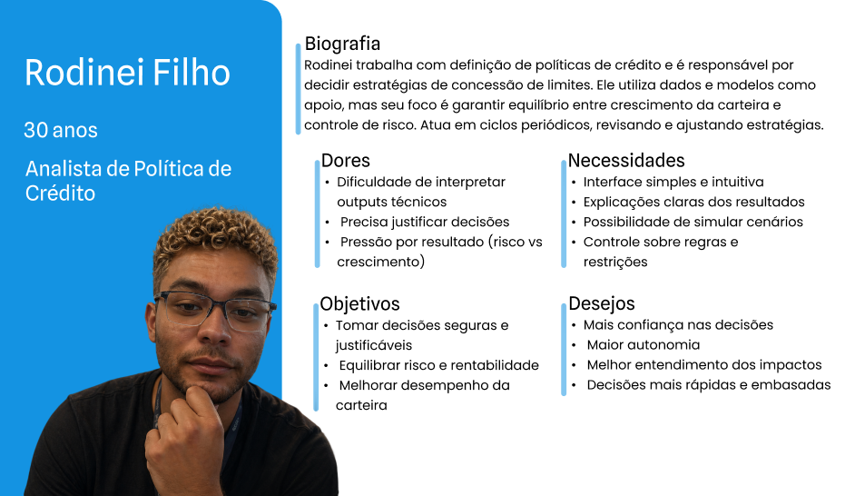

# Entendimento da Experiência do Usuário

> **Guia de uso deste template:**
> - Trechos em *itálico entre colchetes* `[...]` são instruções — substituir pelo conteúdo do grupo
> - Blocos `> TAPI`, `> PARA NOTA 10` e `> NÃO FAZER` são lembretes internos — **remover antes de entregar**
>
> **Feedback do módulo passado (UX, nota 7,5 — nota mais baixa do grupo):**
> - **Não** explicar "o que é persona" — o professor considera desnecessário. Ir direto.
> - **Dores = consequências**, não atividades. "Faz cálculo manual" é atividade; "sente pressão por erro que pode custar milhões" é dor.
> - **"Como a solução ajuda"** deve ser explícito e concreto — não confundir com "desejos" ou "cenários de interação"
> - **Necessidades = outcomes**, não features. "Eliminar achismo" > "ter dashboard"
> - **User Stories: SMALL é o mais cobrado.** Se tem "e" no meio, são duas US.
> - **Critérios de aceite testáveis** — sem termos vagos ("parâmetros definidos", "funciona corretamente", "condições críticas")
> - **Não incluir funcionalidades fora do escopo** — se o TAPI não prevê, a persona não pode precisar disso

---
 

## 1. Personas

Personas são representações fictícias de usuários reais, criadas com base em dados, comportamentos e necessidades observadas. Elas ajudam equipes a entender melhor quem são os usuários de um produto, orientando decisões de design, tecnologia e negócio, alinhando todos os times. Também, elas auxiliam na criação de soluções centradas no usuário, o que priorizar funcionalidades de mais impacto e melhora a experiência e usabilidade do sistema.

> **Quem são os usuários:**
>
> | Área | Papel no projeto | Tipo de usuário |
> |:---|:---|:---|
> | **Time de Políticas de Crédito (Estratégia de Crédito)** | **Usuário final da solução.** Configura parâmetros, avalia cenários, decide qual política de limites implementar. É quem o TAPI chama de "usuário da solução". | **Persona primária** |
> | **Time de Data Science (Crédito)** | Desenvolve e mantém a solução. Integra com motores internos. Valida resultados técnicos. Líderes deste time (Eduardo Schneider, Mateus Gonzalez) são os avaliadores do projeto. | **Persona secundária** |

### Persona 1 — Rodinei Filho (Estratégia de Crédito)

  FIGURA x - Persona do Time de  Políticas de Crédito  
   
  Fonte: Material produzido pelos autores
  

   

  Para aprofundar a compreensão do usuário final da solução, foram detalhados os principais objetivos, dores e necessidades do analista de política de crédito no contexto do projeto. Esse detalhamento permite entender como as decisões estratégicas são tomadas e quais desafios estão envolvidos no equilíbrio entre risco e rentabilidade. A partir dessa análise, é possível orientar o desenvolvimento de uma solução mais intuitiva, transparente e alinhada às demandas do negócio.

**Objetivos**
- Definir políticas de limite que maximizem retorno sem aumentar inadimplência da carteira
- Garantir que as decisões estejam alinhadas com metas do banco (crescimento, risco, volume)
- Conseguir justificar decisões para liderança com base em dados
- Reduzir decisões manuais e subjetivas, tornando o processo mais consistente
- Ajustar rapidamente estratégias conforme mudanças no mercado ou performance

**Dores**
- Recebe outputs do modelo sem clareza de “por que” aquele limite foi sugerido
- Dificuldade de traduzir métricas técnicas (ex: probabilidade de inadimplência) em decisão prática
- Sensação de perda de controle quando o modelo parece “decidir sozinho”
- Processo atual pode ser manual ou pouco padronizado
- Pressão constante para equilibrar risco vs crescimento (trade-off difícil)
- Dificuldade em prever impacto de mudanças antes de aplicá-las (falta de simulação)
- Dependência do time de Data Science para ajustes simples

**Necessidades**
- Interface visual clara que traduza o modelo em informação de negócio
- Explicabilidade: entender quais variáveis impactaram o limite sugerido
- Ferramenta de simulação (ex: “e se eu aumentar o limite médio?”)
- Controle sobre restrições (ex: risco máximo, capacidade de pagamento)
- Visão agregada da carteira (risco, retorno, volume)
- Comparação entre cenário atual vs cenário sugerido
- Agilidade para testar e implementar mudanças

### Persona 2 — Larissa Paiva (Data Science)

  FIGURA x - Persona do Time de Data Science  
   
  Fonte: Material produzido pelos autores
  

 

**Objetivos**
- Construir um modelo de otimização que maximize retorno ajustado ao risco
- Garantir que o modelo respeite todas as restrições de negócio
- Fazer com que o modelo seja utilizado na prática (não só tecnicamente correto)
- Reduzir necessidade de ajustes manuais após entrega
- Monitorar performance e identificar quando o modelo precisa ser recalibrado

**Dores**
- Regras de negócio nem sempre são claras ou formalizadas
- Mudanças frequentes de política geram retrabalho no modelo
- Dificuldade de explicar decisões complexas para stakeholders não técnicos
- Falta de feedback estruturado do time de política
- Output do modelo pode não ser interpretado corretamente
- Tempo gasto ajustando pequenas regras que poderiam ser parametrizadas
- Dificuldade em validar impacto real do modelo após implementação

**Necessidades**
- Estrutura clara de restrições (formalizadas e parametrizáveis)
- Ferramenta para testar diferentes configurações do modelo
- Visibilidade de como o modelo está sendo usado pela política
- Métricas claras de avaliação (retorno, risco, inadimplência)
- Integração com sistemas internos (motor de crédito)
- Padronização de inputs e outputs
-Redução de dependência de ajustes manuais

## Considerações Finais

As personas mostram claramente a relação entre os dois principais perfis do sistema:

- **Larissa (Data Science)** → foca na construção e qualidade do modelo  
- **Rodinei (Política de Crédito)** → foca na decisão e estratégia  

A solução proposta deve garantir transparência, usabilidade e alinhamento entre técnica e negócio. Isso é essencial para que o modelo não apenas funcione bem, mas também seja confiável e utilizado na prática.

## 2. User Stories (5 pontos)

Segundo Max Rehkopf, gerente de _Marketing_ de Produto na **_Atlassian_** (empresa multinacional de _software_), _User Stories_ se tratam de tarefas de desenvolvimento, composta por descrições concisas e focadas nos usuários. Para o projeto com o _Banco Pan_, as _User Stories_ são derivadas das duas _personas_ mapeadas: XXXX e YYYY. Cada história é desenvolvida levando em consideração as suas dores específicas e ganhos esperados, buscando uma maior robustez e alinhamento da solução. 

As _User Stories_ também buscam seguir o _framework_ INVEST. Ele visa garantir que as histórias criadas são independentes umas das outras, negociáveis (podem ser ajustadas futuramente), geram valor para os usuários, estimáveis, concisas e testáveis.

---

### US01 - Carregar base de dados

**Como** cientista de dados,  
**eu quero** carregar a base de dados do banco no formato parquet,  
**para** utilizar informações corretas e completas na segmentação e otimização de limites por cluster.

**Dores relacionadas:**

- Bases inconsistentes.
- Retrabalho técnico.
- Falta de padronização.

**Critérios de aceitação:**

- Aceita arquivos parquet contendo as 17 variáveis do TAPI.
- Carrega bases com até ~1,8 milhões de registros elegíveis.
- Exibe erro claro para arquivo corrompido ou colunas ausentes.
- Permite uso de base mock para testes.

---

### US02 - Ajustar clusterização

**Como** cientista de dados,  
**eu quero** configurar o número de clusters utilizados na segmentação,  
**para** testar diferentes cenários de agrupamento dos clientes.

**Dores relacionadas:**

- Segmentação ruim.
- Pouca flexibilidade.
- Ajustes manuais.

**Critérios de aceitação:**

- Permite definir número inteiro de clusters.
- Aceita mínimo de 100 clusters.
- Exibe erro para valores inválidos.
- Executa clusterização com base mock e base real.

---

### US03 - Configurar metas de produção

**Como** analista de estratégia de crédito,  
**eu quero** configurar metas de clientes aprovados e volume total de limite,  
**para** alinhar a otimização aos objetivos do negócio.

**Dores relacionadas:**

- Falta de controle.
- Metas desalinhadas.
- Dependência técnica.

**Critérios de aceitação:**

- Permite definir meta de clientes aprovados.
- Permite definir meta de volume financeiro.
- Bloqueia valores fora das faixas válidas.
- Salva metas sem executar solver.

---

### US04 - Gerar limite por cluster

**Como** analista de estratégia de crédito,  
**eu quero** gerar limites sugeridos para cada cluster,  
**para** aplicar políticas segmentadas de crédito.

**Dores relacionadas:**

- Processo manual.
- Limites genéricos.
- Decisão lenta.

**Critérios de aceitação:**

- Retorna um limite para cada cluster ativo.
- Nenhum limite é inferior a R$200.
- Todos os limites finais são múltiplos de R$50.
- Exibe clusters sem solução viável.

---

### US05 - Consultar restrições ativas

**Como** analista de estratégia de crédito,  
**eu quero** consultar quais restrições do modelo impactaram cada cluster,  
**para** justificar decisões e facilitar auditorias.

**Dores relacionadas:**

- Falta de clareza.
- Baixa confiança.
- Dificuldade de justificar.

**Critérios de aceitação:**

- Exibe restrições aplicadas por cluster.
- Mostra identificador do cluster e limite sugerido.
- Permite busca por cluster.
- Retorna até 10.000 registros em até 3 segundos.

---

### US06 - Visualizar distribuição dos limites

**Como** analista de estratégia de crédito,  
**eu quero** visualizar a distribuição dos limites por cluster,  
**para** analisar os resultados e apoiar decisões.

**Dores relacionadas:**

- Outputs técnicos.
- Pouca visão geral.
- Insegurança na decisão.

**Critérios de aceitação:**

- Exibe média, mediana, mínimo e máximo por cluster.
- Permite visualização em tabela ou gráfico.
- Permite ordenar resultados.
- Funciona com dataset mock.

---

### US07 - Exportar resultados

**Como** cientista de dados,  
**eu quero** exportar os resultados finais da otimização,  
**para** integrar a saída com outros sistemas internos.

**Dores relacionadas:**

- Retrabalho manual.
- Compartilhamento difícil.
- Integração lenta.

**Critérios de aceitação:**

- Exporta arquivo CSV ou objeto Python.
- Contém identificador do cluster, limite atribuído e métricas principais.
- Funciona a partir de arquivo de resultados existente.
- Exibe mensagem de sucesso ou erro.

---

---

## 3. Jornada do Usuário (Opcional — vale 2 pontos extras)

*Mapear o percurso de **uma persona específica** (a primária) usando a solução.*

> **PARA NOTA MÁXIMA:**
> - Conectar a uma persona específica
> - Cada etapa deve corresponder a uma ou mais User Stories
> - Incluir pensamentos e sentimentos realistas
> - Identificar oportunidades de melhoria

> **Sugestão de jornada para a persona de Estratégia de Crédito:**
>
> | Etapa | Correspondência com US |
> |:---|:---|
> | 1. Receber dados processados do time de DS | US de carregamento de dados |
> | 2. Configurar parâmetros (tetos de inadimplência, alavancagem, metas) | US de configuração |
> | 3. Executar otimização | US de execução |
> | 4. Analisar resultados agregados (receita, inadimplência física/financeira) | US de visualização |
> | 5. Comparar com política atual (`limite_ofertado`) | US de comparação |
> | 6. Investigar clusters específicos (quais restrições foram ativas) | US de explicabilidade |
> | 7. Ajustar parâmetros e re-executar (cenário alternativo) | US de cenários |
> | 8. Exportar resultado final para apresentar no comitê | US de exportação |

| Etapa | Ação | Pensamento | Sentimento | Oportunidade |
|:---|:---|:---|:---|:---|
| *[1]* | *[O que faz]* | *[O que pensa]* | *[Como se sente]* | *[O que melhorar]* |
| *[2]* | | | | |
| *[3]* | | | | |
| *[4]* | | | | |
| *[5]* | | | | |
| *[6]* | | | | |

---

## Checklist pré-entrega

**Personas:**
- [ ] Nenhuma explicação conceitual ("o que é persona")
- [ ] Personas correspondem aos **usuários reais** da solução (Estratégia de Crédito + Data Science, conforme TAPI)
- [ ] Dores são **consequências emocionais/operacionais**, não atividades
- [ ] "Como a solução ajuda" é **concreto** e conectado às dores
- [ ] Necessidades são **outcomes**, não features
- [ ] Nenhuma funcionalidade fora do escopo (TAPI não pede dashboard web, monitoramento real-time, integração direta)
- [ ] Ganhos são do **usuário direto**, não da alta gestão (feedback M5)

**User Stories:**
- [ ] Mínimo 5 US, formato "como [quem], eu quero [o que], para [por que]"
- [ ] Cada US tem **uma única responsabilidade** (SMALL — se tem "e", quebrar)
- [ ] Cada US é **independente** (testável isoladamente, sem depender de outra)
- [ ] Critérios de aceite **inline** (junto da US, não em seção separada)
- [ ] Critérios **testáveis** — sem termos vagos ("parâmetros definidos", "funciona corretamente")
- [ ] Critérios com **valores numéricos** quando aplicável (tempo, quantidade, limites)
- [ ] US conectadas a personas e dores específicas
- [ ] Nenhuma US referencia funcionalidade fora do escopo do TAPI

**Alinhamento TAPI:**
- [ ] Mencionado que o output é Python (não webapp)
- [ ] Mencionado que a solução é usada em conjunto por DS e Estratégia de Crédito
- [ ] Restrições do TAPI aparecem nas US: inadimplência física/financeira, alavancagem diferenciada, R$200 mínimo, múltiplos R$50, metas de produção
- [ ] Backtesting contra `limite_ofertado` presente em alguma US
- [ ] Dados do TAPI (17 variáveis, parquet, ~1,8M elegíveis) refletidos nas US de carregamento

---

## Fontes

(ARRUMAR REFERENCIAS ANTES DA ENTREGA)

2. [Template Jornada do Usuário (Miro)](https://miro.com/app/board/uXjVOi3EFh4=/?share_link_id=503534748467)
3. *[Dados do parceiro — TAPI, bases M1/M2/M3]*
4. *[Referências adicionais]*

BONILHA, D. Como escrever as melhores User Stories com INVEST - Blog Adaptworks. Disponível em: <https://blog.adapt.works/como-escrever-as-melhores-user-stories-com-invest>. Acesso em: 27 abr. 2026. 

REHKOPF, Max. Histórias de usuários | Exemplos e template. Disponível em: <https://www.atlassian.com/br/agile/project-management/user-stories>.  Acesso em: 27 abr. 2026.

5. [What are Personas- IxDF](https://www.interaction-design.org/literature/topics/personas)
6. [Personas Make Users Memorable - NN/Group](https://www.nngroup.com/articles/persona/)
