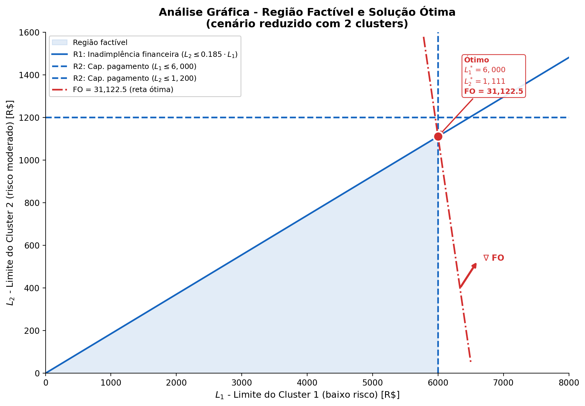

# Modelagem Matemática

Este documento apresenta a modelagem matemática do problema de otimização de limites de crédito pré-aprovado para o Banco Pan. A **Seção 1** corresponde ao item (a) do roteiro: a formulação completa do modelo, incluindo contexto, dados, variáveis, função objetivo e restrições. A **Seção 2** corresponde ao item (b): a análise crítica das limitações e sensibilidade do modelo. A **Seção 3** complementa com uma análise gráfica do problema.

## 1. Modelagem matemática do problema

### 1.1 Contexto do problema

O Banco Pan precisa definir, para cada cliente correntista elegível, qual limite pré-aprovado de cartão de crédito oferecer. Trata-se de um problema mono-produto: o escopo é exclusivamente o cartão de crédito pré-aprovado, sem considerar outros produtos de crédito da instituição. A prática vigente combina modelos de scoring com tabelas fixas de política de crédito, uma abordagem que trata de forma homogênea clientes com perfis de risco e capacidade de pagamento distintos. Isso significa que o risco agregado da carteira não é controlado diretamente pela decisão de limite, e que o potencial de retorno de parte da base elegível não é aproveitado. A validação do modelo desenvolvido neste projeto será feita pelo parceiro comparando a rentabilidade esperada entre o `limite_ofertado` praticado atualmente e o limite sugerido pelo modelo otimizado.

O núcleo do problema é um trade-off entre duas forças opostas. Um limite alto demais aumenta a receita de interchange, mas eleva a exposição à inadimplência e pode comprometer a saúde financeira do cliente. Um limite baixo demais reduz o risco, mas diminui a receita e pode frustrar o cliente a ponto de migrá-lo para um concorrente. A tabela abaixo resume esse trade-off:

| Decisão   | Se o limite for alto demais               | Se o limite for baixo demais           |
| :-------- | :---------------------------------------- | :------------------------------------- |
| _Receita_ | Mais interchange, maior retorno potencial | Menos uso do cartão, menos receita     |
| _Risco_   | Maior exposição, inadimplência sobe       | Menor inadimplência, carteira mais sã  |
| _Cliente_ | Risco de superendividamento               | Frustração, migração para concorrentes |
| _Banco_   | Provisão maior, NPL sobe                  | Perda de competitividade no produto    |

Esse equilíbrio entre retorno esperado e risco é amplamente estudado na literatura de otimização de crédito ao consumidor. Instituições como FICO (2021), Experian (2024) e Moody's Analytics (2020) tratam a definição de limite como um problema de otimização, onde a rentabilidade esperada é maximizada sujeita a restrições de risco da carteira e capacidade de pagamento individual.

Este problema é formulado como um **problema de programação linear (LP) de alocação de crédito**, no qual a variável de decisão é o limite contínuo atribuído a cada cluster de clientes, a função objetivo maximiza o retorno líquido esperado (receita de interchange menos perda esperada por inadimplência), e as restrições impõem tetos de inadimplência agregada, capacidade de pagamento por cluster e regras operacionais do banco. Idealmente, este problema seria formulado como programação inteira mista (MIP), o que permitiria modelar a discretização dos limites em múltiplos de R\$ 50 e a seleção de clientes diretamente como variáveis do modelo. Entretanto, a orientação do parceiro é por uma abordagem LP, e o escopo atual prioriza uma formulação simples e funcional, viável no momento e suficiente para capturar a estrutura essencial do problema. Na Etapa 1 (pré-processamento), os clientes elegíveis são agrupados em clusters; na Etapa 2, o LP otimiza os limites $L_k$ para todos os clusters simultaneamente. Em pós-otimização, clusters cujo limite resultar abaixo de R\$ 200 são interpretados como "sem oferta", e os demais são arredondados para múltiplos de R\$ 50.

### 1.2 Dados disponíveis relevantes

O parceiro forneceu três bases de dados em formato Parquet, correspondentes a três safras temporais (M1, M2, M3), contendo o universo de correntistas do Banco Pan. A tabela abaixo resume a dimensão e o funil de conversão de cada safra:

| Safra | Clientes totais | Elegíveis (`flag_filtros = 0`) | Receberam oferta | Contrataram | Ativaram | `over30mob3` observado |
| :---: | --------------: | -----------------------------: | ---------------: | ----------: | -------: | ---------------------: |
|  M1   |      14.569.142 |                      1.836.085 |          117.367 |       6.506 |    5.704 |    4.966 (377 eventos) |
|  M2   |      13.808.309 |                      1.805.274 |          120.573 |       6.684 |    5.642 |    4.959 (372 eventos) |
|  M3   |      13.868.729 |                      3.137.258 |          382.692 |       9.930 |    8.347 |    7.465 (556 eventos) |

A tabela a seguir detalha as 17 variáveis fornecidas, com estatísticas descritivas reais da safra M1 e o papel de cada uma no modelo.

| Variável                     | Descrição                                     | Estatísticas (M1)                                                  | Papel no modelo                                                                                                                                                                                                    |
| :--------------------------- | :-------------------------------------------- | :----------------------------------------------------------------- | :----------------------------------------------------------------------------------------------------------------------------------------------------------------------------------------------------------------- |
| `token`                      | Identificador anônimo por safra               | 0 a 14.569.141                                                     | Chave de identificação                                                                                                                                                                                             |
| `safra_ref_uso`              | Safra de referência                           | M1, M2, M3                                                         | Permite backtesting entre safras                                                                                                                                                                                   |
| `score_interno`              | Score de crédito interno                      | min=54, med=292, max=975                                           | Não utilizado diretamente no modelo; serve apenas como input interno do banco para gerar `pd_produto`                                                                                                             |
| `pd_produto`                 | Probabilidade de default no produto           | min=0,025, med=0,71, max=0,946                                     | **Parâmetro central da FO (termo B) e da restrição R1**, via média por cluster ($PD_k$). Mediana de 0,71 indica que a maioria da base elegível tem PD alta, indicando que a seleção de quais clusters recebem oferta é tão importante quanto a calibração do limite |
| `score_generico_1`           | Score de bureau (bureau 1)                    | min=49, med=409, max=995. Nulls: 0,1%                              | Pode compor o perfil de risco para cálculo de $m_k$; variável de segmentação para clusterização                                                                                                            |
| `score_generico_2`           | Score de bureau (bureau 2)                    | min=1, med=713, max=942. Nulls: <0,01%                             | Pode compor o perfil de risco para cálculo de $m_k$; variável de segmentação para clusterização                                                                                                            |
| `capacidade_pagamento`       | Estimativa interna de capacidade de pagamento | min=0, med=548, max=25.000. **Nulls: 0,3% M1; 42,2% M2; 43,5% M3** | **Restrição R2 (alavancagem).** Nulls em M2/M3 são limitação severa (ver Análise Crítica)                                                                                                                                |
| `delta_capacidade_pagamento` | Capacidade deduzida dos saldos a vencer       | min=−25.000, med=55, max=25.000. Nulls: idem                       | Versão conservadora da capacidade; valores negativos indicam comprometimento além da capacidade                                                                                                                   |
| `renda_estimada`             | Estimativa interna de renda                   | min=1.275, med=1.908, max=17.950. Nulls: 0,3%                      | Proxy alternativa para R2 quando `capacidade_pagamento` é null ($CP_i = \text{renda\_estimada}_i \times 0{,}30$); usado no cálculo de $CP_k$                                                                                                   |
| `fx_idade`                   | Faixa etária                                  | 9 faixas: 21-30 (35,5%), 31-40 (31,1%), 41-50 (18,8%)              | Perfil de consumo e risco; variável de segmentação para análise de resultados                                                                                                                                      |
| `flag_filtros`               | Indicador de perfil restrito                  | **0 = elegível** (1,84M), **1 = restrito** (12,73M)                | Restrição hard: clientes com `flag_filtros = 1` são excluídos da otimização                                                                                                                                        |
| `score_propensao_contrato`   | Score de propensão à conversão                | min=3, med=315, max=846                                            | Parâmetro $\pi_k$ na FO (termo A), via média do cluster. **Range [3, 846], não [0,1]**, requer normalização min-max                                                                                                                     |
| `score_credito_cross`        | Score de crédito multiproduto                 | min=103, med=706, max=954                                          | Informa o multiplicador de alavancagem $m_k$ (interpolação por score médio do cluster)                                                                                                                                      |
| `limite_ofertado`            | Limite ofertado na política atual             | min=200, med=806, max=20.000. **99,2% null**                       | Baseline para backtesting (apenas 117K têm referência)                                                                                                                                                             |
| `flag_contrato`              | Indicadora de contratação (1 = contratou)     | 6.506 (0,04%)                                                      | Backtesting. Taxa de conversão ~5,5% entre os que receberam oferta                                                                                                                                                 |
| `flag_ativacao`              | Indicadora de ativação (1 = ativou)           | 5.704 (87,7% dos que contrataram)                                  | Backtesting                                                                                                                                                                                                        |
| `over30mob3`                 | Atraso >30 dias nas 3 primeiras parcelas      | 4.966 válidos, **377 eventos** (7,6%). 99,97% null                 | Inadimplência realizada. Viés de seleção severo (só observável para quem ativou)                                                                                                                                   |

**Observações críticas sobre os dados:**

**Funil de conversão (M1):** Dos 14,5M clientes, ~1,8M são elegíveis. Desses, 117K receberam oferta (6,4% dos elegíveis). Dos que receberam, 6.506 contrataram (5,5%) e 5.704 ativaram (87,7%). Apenas 4.966 têm `over30mob3` observado, dos quais 377 (7,6%) tiveram evento de inadimplência. Esse funil confirma que a **seleção de quem recebe oferta** é tão relevante quanto a **definição do limite**.

**PD da base é alta:** A mediana de `pd_produto` é 0,71 nas três safras, ou seja, a maioria da base tem PD > 50%. Isso é esperado: a base inclui todos os correntistas, não apenas os pré-aprovados. Clientes de baixo risco são minoria. Implicação: o modelo precisa ser eficiente na seleção (quais clientes recebem oferta), não apenas na calibração do limite.

**`capacidade_pagamento` null em M2/M3:** Em M1, apenas 0,3% dos registros não têm essa variável. Porém, **em M2 o percentual sobe para 42,2% e em M3 para 43,5%**, quase metade da base. Isso é uma limitação severa para a restrição R2 (alavancagem), discutida na Análise Crítica.

**Clusterização dos clientes:** A base elegível contém aproximadamente 1,8 milhão de clientes na safra M1. Otimizar um limite individual $L_i$ para cada cliente resultaria em um LP com ~1,8M variáveis de decisão e número equivalente de restrições individuais (capacidade de pagamento), o que tornaria o tempo de resolução proibitivo para solvers open-source como CBC. Por essa razão, o modelo agrupa os clientes elegíveis em $K$ clusters (mínimo 100, conforme orientação do TAPI) com base em variáveis de perfil de risco e capacidade de pagamento, como `pd_produto`, `capacidade_pagamento`, `score_credito_cross` e `fx_idade`. A técnica de clusterização (e.g., K-Means ou segmentação por faixas) será definida na etapa de implementação. Para cada cluster $k$, os parâmetros representativos ($PD_k$, $\pi_k$, $CP_k$, $m_k$) são calculados como médias dos clientes do grupo, exceto $CP_k$ que usa o percentil 5 ($p5$) do cluster para garantir robustez sem que outliers com capacidade atipicamente baixa inviabilizem a alocação de todo o grupo. Todos os $n_k$ clientes de um mesmo cluster recebem o mesmo limite $L_k$. Idealmente, cada cliente receberia um limite individual, mas a abordagem por clusters é o que viabiliza a resolução com os recursos computacionais disponíveis.

**Parâmetro fornecido pelo parceiro:**

- **Taxa de interchange:** $t = 0{,}0175$ (1,75% sobre volume transacionado).

**Variáveis não fornecidas que seriam relevantes:**

- **LGD (Loss Given Default):** Adotamos $\text{LGD} = 0{,}60$, indicando que, em caso de default, o banco perde 60% do saldo exposto (recuperando 40% via cobrança ou cessão de carteira). Esse valor é uma simplificação uniforme para todos os clusters. Idealmente, a LGD seria diferenciada por perfil de risco, mas essa granularidade ainda não está disponível.
- **Utilização esperada do limite:** Adotamos constante $\bar{u} = 0{,}75$ (75% do limite concedido). Esse valor reflete uma estimativa conservadora de uso efetivo do cartão. Idealmente, $\bar{u}_k$ seria estimada por perfil de cluster a partir de dados de ativação, mas esses dados ainda não estão disponíveis.

---

### 1.3 Estrutura do modelo

O modelo opera sobre **clusters de clientes**: os clientes elegíveis são agrupados em $K$ clusters (mínimo 100), e cada cluster $k$ recebe um limite único $L_k$ atribuído a todos os seus $n_k$ membros.

**Etapa 1 - Pré-processamento e clusterização**

Antes da clusterização, são removidos da base todos os clientes com `flag_filtros = 1`, que representam perfis restritos e não podem receber crédito (aproximadamente 12,7M dos 14,5M na safra M1). Apenas os clientes elegíveis (`flag_filtros = 0`, ~1,8M em M1) seguem para a etapa seguinte. Esses clientes elegíveis são então agrupados em $K$ clusters com base em variáveis de perfil de risco e capacidade de pagamento. Para cada cluster $k$, calculam-se os parâmetros representativos: $PD_k$ e $\pi_k$ como médias dos clientes do grupo, e $CP_k$ como o percentil 5 de capacidade de pagamento do cluster.

**Etapa 2 - Otimização de limites (LP)**

O LP otimiza os valores de $L_k$ para todos os $K$ clusters simultaneamente, maximizando o retorno líquido total sujeito às restrições R1–R3. O LP tem $K$ variáveis (uma por cluster), tornando a resolução computacionalmente viável mesmo com solvers open-source. Clusters onde o retorno líquido não justifica concessão recebem naturalmente $L_k$ próximo de zero pelo solver, e são filtrados no pós-otimização (limites abaixo de R\$ 200 são convertidos em "sem oferta").

**Sobre pré-seleção de clusters:** Uma abordagem alternativa seria rankear clusters por retorno líquido unitário $c_k$ e pré-selecionar apenas os rentáveis antes do LP, o que permitiria incorporar restrições como tetos de inadimplência física já na seleção. Entendemos que essa sofisticação pode ser necessária futuramente caso o modelo precise de controles adicionais na composição da carteira, mas por enquanto a abordagem direta (LP sobre todos os clusters + pós-otimização) é suficiente e mais simples.

---

### 1.4 Variáveis de decisão

O modelo possui uma única variável de decisão no LP:

**$L_k \in \mathbb{R}^+$ - Limite de crédito por cluster (variável contínua)**

$L_k$ representa o valor do limite de crédito, em reais, atribuído a todos os clientes do cluster $k$. A variável é contínua, coerente com a formulação LP. Idealmente, $L_k$ seria definida como inteira ($L_k \in \mathbb{Z}^+$, múltiplos de R\$ 50) em uma formulação MIP, eliminando a necessidade de arredondamento, mas a formulação contínua é o que é viável no momento. O LP determina o valor de $L_k$ para cada cluster que maximiza o retorno líquido total, respeitando todas as restrições. Os limites finais sugeridos ao banco são obtidos em pós-otimização: clusters com $L_k \geq 200$ têm o limite arredondado para o múltiplo de R\$ 50 mais próximo acima; clusters com $L_k < 200$ não recebem oferta (ver seção Domínio e não-negatividade).

| Símbolo | Tipo | Descrição | Domínio |
| :------ | :--- | :-------- | :------ |
| $L_k$ | Variável de decisão | Limite de crédito atribuído ao cluster $k$ | $\mathbb{R}^+$ (contínuo, otimizado pelo LP) |
| $k \in \{1, \dots, K\}$ | Índice | Cluster de clientes elegíveis ($K \geq 100$) | - |
| $n_k$ | Parâmetro | Número de clientes no cluster $k$ | inteiro positivo |

---

### 1.5 Parâmetros (dados de entrada)

| Símbolo | Descrição | Unidade / Domínio | Fonte |
| :------ | :-------- | :---------------- | :---- |
| $K$ | Número total de clusters | inteiro ($\geq 100$) | Definido na clusterização (Etapa 1) |
| $n_k$ | Número de clientes no cluster $k$ | inteiro positivo | Resultado da clusterização |
| $PD_k$ | Probabilidade de default representativa do cluster $k$ | [0, 1] | Média de `pd_produto` dos clientes do cluster |
| $\pi_k$ | Propensão à contratação do cluster $k$, normalizada | [0, 1] | Média de `score_propensao_contrato` normalizado min-max: $\pi_i = \frac{score_i - 3}{843}$ |
| $CP_k$ | Capacidade de pagamento do cluster $k$ | R\$ | Percentil 5 ($p5$) de `capacidade_pagamento` no cluster. Proxy: `renda_estimada × 0,30` quando null |
| $m_k$ | Multiplicador de alavancagem do cluster $k$ | [0,3; 1,8] | Interpolado pela média de `score_credito_cross` do cluster. Diretriz do parceiro |
| $t$ | Taxa de interchange | adimensional | 0,0175 (fornecido pelo parceiro) |
| $\text{LGD}$ | Loss Given Default | [0, 1] | 0,60 (constante para todos os clusters) |
| $\bar{u}$ | Utilização esperada do limite | [0, 1] | 0,75 (constante para todos os clusters) |
| $\overline{PD}_{fin}^{atual}$ | Teto de inadimplência financeira | [0, 1] | Média ponderada (por limite) de PD da carteira aprovada vigente |
| $L^{max}$ | Teto máximo de limite | R\$ | 25.000 (diretriz do parceiro) |
| $c_k$ | Coeficiente de retorno líquido unitário do cluster $k$ | R\$/R\$ | $c_k = \pi_k \cdot (\bar{u} \cdot t - PD_k \cdot \text{LGD})$ |

---

### 1.6 Objetivo do modelo e função objetivo

O banco precisa de uma regra que diga, de forma sistemática, qual limite atribuir a cada perfil de cliente. Sem um critério formal, a decisão se baseia em tabelas fixas que não consideram a heterogeneidade entre perfis e não controlam o risco agregado da carteira. O objetivo do modelo é substituir essa regra empírica por uma decisão matemática: encontrar o conjunto de limites $L_k$ que maximize o retorno líquido total esperado do banco, entendido como a soma da receita esperada de interchange menos a perda esperada por inadimplência, sobre todos os clusters.

Maximizar o retorno líquido é a métrica correta porque o produto em análise é exclusivamente o cartão de crédito pré-aprovado, onde toda a receita relevante vem do uso do cartão e toda a perda relevante vem do default. Minimizar inadimplência pura levaria o modelo a oferecer limites mínimos (trivialmente seguro, mas sem valor comercial). Maximizar receita bruta ignoraria o risco. O retorno líquido captura esse equilíbrio diretamente, e é também a métrica pela qual o parceiro avaliará o modelo: comparando a rentabilidade esperada entre o `limite_ofertado` praticado atualmente e o limite sugerido pelo modelo.

**Justificativa da formulação:** A FO adota a forma **receita − perda** (sem ponderador $\lambda$), delegando o controle de risco inteiramente às restrições. Essa separação é preferível por três razões: (i) o parceiro define explicitamente os tetos de inadimplência como restrições, não como penalidades na FO; (ii) um ponderador $\lambda$ entre receita e perda introduziria um hiperparâmetro difícil de calibrar e de interpretar pelo parceiro; (iii) manter a FO como retorno líquido (R\$) garante que todos os termos estejam na mesma unidade e escala. A receita é restrita a interchange sobre o volume transacionado, à taxa fixa de 1,75% fornecida pelo parceiro.

$$\max \sum_{k=1}^{K} n_k \cdot \left[\underbrace{\pi_k \cdot \bar{u} \cdot t \cdot L_k}_{\text{(A) Receita esperada}} \; - \; \underbrace{\pi_k \cdot PD_k \cdot \text{LGD} \cdot L_k}_{\text{(B) Perda esperada}}\right]$$

Fatorando $L_k$ e $\pi_k$:

$$\max \sum_{k=1}^{K} n_k \cdot \underbrace{\pi_k \cdot (\bar{u} \cdot t - PD_k \cdot \text{LGD})}_{c_k} \cdot L_k$$

onde $n_k$ é o número de clientes no cluster $k$ e $c_k$ é o **coeficiente de retorno líquido unitário** do cluster $k$. O fator $n_k$ garante que clusters maiores tenham peso proporcional ao número de clientes que representam.

#### Interpretação da função objetivo

**Termo (A) - Receita:** $\pi_k \cdot \bar{u} \cdot t \cdot L_k$ é a receita de interchange esperada por cliente do cluster $k$. O cliente contrata com probabilidade $\pi_k$ (média do cluster, derivada de `score_propensao_contrato` normalizado via min-max). O contratante utiliza uma fração $\bar{u} = 0{,}75$ do limite, e o banco recebe taxa de interchange $t = 0{,}0175$ sobre o volume transacionado.

**Termo (B) - Perda:** $\pi_k \cdot PD_k \cdot \text{LGD} \cdot L_k$ é a perda esperada por inadimplência por cliente do cluster $k$. A perda só se materializa para clientes que efetivamente contratam (com probabilidade $\pi_k$), e entre estes, uma fração $PD_k$ entra em default. $\text{LGD} = 0{,}60$ é a fração do saldo exposto que o banco perde em caso de default (os 40% restantes são recuperados via cobrança ou cessão), e $L_k$ é a exposição. Note que a perda utiliza $L_k$ integral (sem o fator $\bar{u}$), diferentemente da receita. Isso é intencional: a exposição no momento do default (EAD) considera o limite inteiro porque, na prática, clientes inadimplentes tendem a utilizar uma fração do limite significativamente superior à média antes de cessar pagamentos. Essa é uma premissa padrão em modelos de risco de crédito para cartão (Resolução CMN 4.966/2021). Em sprints futuros, essa premissa pode ser refinada com um fator de utilização pré-default ($\bar{u}_{default}$) calibrado a partir de dados da carteira.

**Coeficiente $c_k$:** O retorno líquido unitário $c_k = \pi_k \cdot (\bar{u} \cdot t - PD_k \cdot \text{LGD})$ resume a rentabilidade marginal de cada real alocado ao cluster $k$. Como $\pi_k > 0$, o sinal de $c_k$ depende exclusivamente de $\bar{u} \cdot t$ vs. $PD_k \cdot \text{LGD}$: clusters com $PD_k < \frac{\bar{u} \cdot t}{\text{LGD}}$ são rentáveis. Clusters com $c_k > 0$ são rentáveis; clusters com $c_k \leq 0$ destroem valor a cada real adicional de limite; para estes, o solver naturalmente atribui $L_k = 0$. O coeficiente $n_k \cdot c_k$ é o coeficiente objetivo do LP: o solver tende a maximizar $L_k$ para clusters com maior $c_k$, limitado pelas restrições.

A FO é linear em $L_k$: todos os demais termos ($n_k$, $\pi_k$, $\bar{u}$, $t$, $PD_k$, $\text{LGD}$) são parâmetros, não há produto de variáveis de decisão, e o problema é um LP puro.

### 1.7 Restrições

As restrições traduzem as políticas de crédito do Banco Pan em limites matemáticos para o espaço de soluções factíveis. Dividem-se em duas categorias: (i) **controle de risco da carteira** (R1), e (ii) **proteção por cluster e bounds** (R2, R3). Reconhecemos que existem outras restrições relevantes, como tetos de inadimplência física (média simples da PD), metas de produção (número mínimo de clientes aprovados, volume total de limite) e rentabilidade mínima, que ainda não foram mapeadas com o parceiro e serão incorporadas nos próximos sprints à medida que o entendimento do negócio avançar.

#### R1 - Teto de inadimplência financeira (LP)

A inadimplência financeira pondera a PD pelo limite atribuído, medindo o risco da carteira em termos de exposição financeira. A decisão de **quanto** limite conceder a cada cluster impacta diretamente essa métrica.

**Versão original (razão, não-linear):**

$$\frac{\sum_{k=1}^{K} n_k \cdot PD_k \cdot L_k}{\sum_{k=1}^{K} n_k \cdot L_k} \leq \overline{PD}_{fin}^{atual}$$

**Versão linearizada** (multiplicando ambos os lados pelo denominador, estritamente positivo para qualquer solução não-trivial; se todos os $L_k = 0$, a restrição é satisfeita trivialmente e o retorno é zero):

$$\sum_{k=1}^{K} n_k \cdot (PD_k - \overline{PD}_{fin}^{atual}) \cdot L_k \leq 0$$

Cada cluster $k$ contribui com um excesso ou déficit de inadimplência: clusters com $PD_k > \overline{PD}_{fin}^{atual}$ consomem folga (coeficiente positivo), enquanto clusters com $PD_k < \overline{PD}_{fin}^{atual}$ geram folga (coeficiente negativo). A restrição é linear em $L_k$.

#### R2 - Capacidade de pagamento com alavancagem diferenciada (LP)

$$L_k \leq m_k \cdot CP_k, \quad \forall k \in \{1, \dots, K\}$$

O limite de cada cluster é limitado pelo percentil 5 de capacidade de pagamento dos seus membros ($CP_k = p5_{i \in C_k}(CP_i)$), multiplicado pelo fator de alavancagem $m_k \in [0{,}3;\; 1{,}8]$, interpolado pelo score de risco médio do cluster (`score_credito_cross`): clusters de menor risco recebem $m_k$ próximo de 1,8, e clusters de maior risco recebem $m_k$ próximo de 0,3. O uso do percentil 5 (em vez do mínimo) evita que um único outlier com $CP$ atipicamente baixo inviabilize o limite de todo o cluster, mantendo a proteção para 95% dos membros.

#### R3 - Teto máximo de limite (LP)

$$L_k \leq L^{max}, \quad \forall k \in \{1, \dots, K\}$$

Teto absoluto definido pelo parceiro ($L^{max} = 25\,000$). Na prática, R2 é a restrição ativa para a maioria dos clusters (pois $m_k \cdot CP_k < L^{max}$ para quase todos), e R3 atua apenas como salvaguarda.

#### Domínio e não-negatividade

$$L_k \geq 0, \quad \forall k \in \{1, \dots, K\}$$

O limite é definido como variável não-negativa. O parceiro exige um piso mínimo de R\$ 200 para ofertas efetivas, mas essa regra é tratada em **pós-otimização**, não como restrição do LP: clusters cujo limite ótimo resultar em $L_k < 200$ são interpretados como "não conceder crédito", indicando que não há alocação rentável acima do piso para esse perfil. Essa abordagem evita forçar o solver a atribuir R\$ 200 a clusters onde o retorno líquido não justifica a concessão, e permite que o modelo comunique explicitamente quais perfis não devem receber oferta.

**Pós-otimização dos limites:**

$$L_k^{\text{final}} = \begin{cases} 50 \cdot \left\lceil \dfrac{L_k}{50} \right\rceil & \text{se } L_k \geq 200 \\[6pt] 0 \text{ (sem oferta)} & \text{se } L_k < 200 \end{cases}, \quad \forall k \in \{1, \dots, K\}$$

#### Resumo das restrições

| ID | Restrição | Tipo |
| :- | :-------- | :--- |
| R1 | Teto de inadimplência financeira ($\overline{PD}$ ponderada por $n_k \cdot L_k$ $\leq$ teto) | Linear (após linearização) |
| R2 | Capacidade de pagamento ($L_k \leq m_k \cdot CP_k$) | Linear |
| R3 | Teto máximo ($L_k \leq L^{max}$) | Bound |

**Restrições futuras identificadas (não formalizadas nesta sprint):** Ao longo do projeto, espera-se incorporar restrições adicionais como teto de inadimplência física (média simples da PD $\leq$ nível atual), metas de produção (número mínimo de clientes aprovados, volume total de limite ofertado), rentabilidade mínima, e eventuais tetos de exposição por faixa de risco. Essas restrições dependem de parâmetros que ainda serão definidos com o parceiro.

---

## 2. Análise crítica

**Limitação 1 - LGD uniforme:** O modelo adota $\text{LGD} = 0{,}60$ constante, mas a taxa de recuperação varia por perfil (clientes com renda alta tendem a ter LGD menor). Isso superestima a perda para perfis de baixo risco e subestima para alto risco, distorcendo $c_k$ e a alocação ótima.

**Limitação 2 - `capacidade_pagamento` null em M2/M3:** A restrição R2 ($L_k \leq m_k \cdot CP_k$) depende diretamente de $CP_k$. Em M2 e M3, 42–43% dos clientes elegíveis não têm essa variável, tornando R2 inaplicável para quase metade da base. A proxy adotada ($CP_k = \text{renda\_estimada} \times 0{,}30$) subestima a capacidade real de clientes com múltiplas fontes de renda, reduzindo artificialmente o teto de $L_k$ para esse grupo. Tratamento: solicitar ao parceiro a imputação de $CP$ para M2/M3 ou calibrar o fator 0,30 com dados da carteira aprovada.

**Sensibilidade - $\bar{u}$:** A utilização entra linearmente em $c_k$. Variando $\bar{u}$ de 0,50 a 0,90, o sinal de $c_k$ muda para clusters de PD moderada, alterando quais clusters recebem oferta. Uma redução de 0,75 para 0,50 concentraria a solução em perfis de baixíssimo risco, reduzindo volume e retorno total.

---

## 3. Análise gráfica do problema

Para complementar a formulação algébrica, esta seção apresenta uma resolução gráfica simplificada do problema de otimização. Como o modelo real opera sobre $K \geq 100$ clusters (e portanto $K$ variáveis de decisão), a visualização direta do espaço de soluções não é possível em dimensões superiores a três. Por isso, a análise gráfica a seguir considera um **cenário reduzido com dois clusters representativos** (um de baixo risco e um de alto risco) permitindo visualizar em duas dimensões ($L_1$ e $L_2$) a região factível, as restrições ativas e a direção de crescimento da função objetivo.

### 3.1 Cenário reduzido

Para a construção gráfica, consideram-se dois clusters com parâmetros ilustrativos representando perfis que seriam efetivamente pré-aprovados (PD baixa, propensão razoável):

| Parâmetro | Cluster 1 (baixo risco) | Cluster 2 (risco moderado) |
| :-------- | :---------------------: | :------------------------: |
| $PD_k$ | 0,002 | 0,004 |
| $\pi_k$ | 0,80 | 0,70 |
| $CP_k$ | R\$ 4.000 | R\$ 1.500 |
| $m_k$ | 1,5 | 0,8 |
| $n_k$ | 500 | 300 |

Com $\bar{u} = 0{,}75$, $t = 0{,}0175$, $\text{LGD} = 0{,}60$ e $\overline{PD}_{fin}^{atual} = 0{,}0022$, os coeficientes de retorno líquido unitário são:

- $c_1 = 0{,}80 \times (0{,}75 \times 0{,}0175 - 0{,}002 \times 0{,}60) = 0{,}80 \times (0{,}01313 - 0{,}00120) = 0{,}80 \times 0{,}01193 = 0{,}00954$ (positivo, cluster rentável)
- $c_2 = 0{,}70 \times (0{,}75 \times 0{,}0175 - 0{,}004 \times 0{,}60) = 0{,}70 \times (0{,}01313 - 0{,}00240) = 0{,}70 \times 0{,}01073 = 0{,}00751$ (positivo, menos rentável)

A função objetivo neste cenário reduzido é:

$$\max \; 500 \cdot 0{,}00954 \cdot L_1 + 300 \cdot 0{,}00751 \cdot L_2 = \max \; 4{,}77 \cdot L_1 + 2{,}25 \cdot L_2$$

### 3.2 Região factível

As restrições delimitam a região factível no plano $(L_1, L_2)$:

- **R1 (inadimplência financeira):** $500 \cdot (0{,}002 - 0{,}0022) \cdot L_1 + 300 \cdot (0{,}004 - 0{,}0022) \cdot L_2 \leq 0$, ou seja, $-0{,}1 \cdot L_1 + 0{,}54 \cdot L_2 \leq 0$, o que equivale a $L_2 \leq 0{,}185 \cdot L_1$
- **R2 (capacidade de pagamento):** $L_1 \leq 1{,}5 \times 4\,000 = 6\,000$ e $L_2 \leq 0{,}8 \times 1\,500 = 1\,200$
- **R3 (teto máximo):** $L_1 \leq L^{max}$ e $L_2 \leq L^{max}$ (redundante com R2 neste cenário)
- **Não-negatividade:** $L_1 \geq 0$, $L_2 \geq 0$

### 3.3 Visualização

O gráfico abaixo apresenta a região factível (área sombreada), as retas das restrições e as curvas de nível da função objetivo. A solução ótima encontra-se no vértice da região factível que maximiza o retorno líquido, indicado pelo ponto destacado.

Fonte: Material produzido pelos autores

### 3.4 Interpretação

A análise gráfica evidencia visualmente aspectos importantes do modelo:

- **Trade-off entre clusters:** O gradiente da FO aponta predominantemente na direção de $L_1$ (coeficiente 4,77 vs 2,25), confirmando que o solver prioriza alocação ao cluster mais rentável (menor PD, maior propensão). Com LGD = 0,60, ambos os clusters são significativamente mais rentáveis do que com LGD = 1, e a diferença relativa entre eles diminui.
- **Restrição ativa:** A restrição R1 (inadimplência financeira) é a que mais limita a solução ótima: ela impõe que $L_2 \leq 0{,}185 \cdot L_1$, restringindo o limite do cluster de risco moderado. Relaxar o teto de inadimplência permitiria alocar mais limite a esse cluster, aumentando o retorno mas elevando o risco da carteira. A restrição R2 limita $L_1$ ao teto de capacidade de pagamento alavancada (R\$ 6.000).
- **Solução ótima:** O ponto ótimo se encontra na interseção de R2 ($L_1 = 6\,000$) com R1 ($L_2 = 0{,}185 \times 6\,000 \approx 1\,111$), demonstrando que ambas as restrições estão ativas na solução.

A região factível neste cenário reduzido assume formato triangular (cunha) porque a restrição R1 ($L_2 \leq 0{,}185 \cdot L_1$) é dominante: ela limita $L_2$ antes que a restrição R2 de capacidade de pagamento do cluster 2 ($L_2 \leq 1.200$) se torne ativa. Essa geometria reflete os parâmetros ilustrativos escolhidos e tende a se tornar mais equilibrada à medida que o modelo for refinado com dados reais e parâmetros calibrados nas próximas sprints.

Esta visualização, embora simplificada para dois clusters, demonstra que a estrutura do problema (função objetivo linear, restrições lineares, região factível) se comporta conforme esperado para um LP, e que as restrições impostas são coerentes com os objetivos de negócio do parceiro.

---

### 4. Análise de Sensibilidade

### 4.1 Aplicação prática

A solução ótima produzida pelo LP (um vetor de limites $L_k^*$ para cada cluster de clientes) é calculada com base em parâmetros que representam estimativas do comportamento esperado da carteira: probabilidade de default, propensão à contratação, taxa de utilização do limite e capacidade de pagamento. No mundo real, nenhum desses parâmetros é fixo. Eles variam em função de ciclos econômicos, mudanças no perfil dos correntistas, pressões competitivas e decisões regulatórias. Nesse sentido, a análise de sensibilidade não é um exercício complementar ao modelo: ela é parte integrante do processo de decisão, pois determina **até onde os parâmetros podem se mover sem invalidar a política de limites vigente**.

A decisão em questão é tomada pela área de crédito do Banco Pan, que precisa calibrar os limites pré-aprovados por perfil de cliente. Uma política mal calibrada tem custo duplo: se os limites forem generosos demais em relação ao risco real, a inadimplência sobe e corrói o retorno; se forem conservadores demais, a receita de interchange cai e o cliente migra para concorrentes. Esse trade-off é estrutural ao problema e não desaparece com a otimização, apenas passa a ser gerido de forma mais explícita. A análise de sensibilidade permite à área de crédito monitorar continuamente quão próximos os parâmetros reais estão dos limites em que a política precisaria ser revista, transformando o LP de uma ferramenta de cálculo pontual em um instrumento de gestão dinâmica da carteira.

#### Identificação dos parâmetros críticos

No modelo formulado, o coeficiente de retorno líquido unitário de cada cluster é $c_k = \pi_k \cdot (\bar{u} \cdot t - PD_k \cdot \text{LGD})$. O sinal de $c_k$ determina se o cluster cria ou destrói valor: quando $c_k > 0$, o solver aloca o máximo de limite permitido pelas restrições; quando $c_k \leq 0$, o limite ótimo é zero. O ponto de indiferença ocorre quando $PD_k = \bar{u} \cdot t \;/\; \text{LGD} \approx 2{,}19\%$, o que significa que variações na $PD_k$ estimada podem cruzar essa fronteira e alterar radicalmente quais clusters recebem oferta, tornando-a o **parâmetro de maior sensibilidade do modelo**.

Em contraste, a taxa de interchange $t$ é fixada contratualmente e tem variação infrequente. Já a utilização esperada $\bar{u}$ afeta todos os clusters na mesma direção e proporção, sem alterar a ordem de rentabilidade relativa entre eles. Esses parâmetros são menos críticos do ponto de vista operacional. Essa hierarquia de sensibilidade é informação direta para a área de risco: o esforço de monitoramento deve ser concentrado nos parâmetros cujas variações mais ameaçam a robustez da política, e não distribuído uniformemente entre todos os inputs do modelo.

#### Robustez da solução e protocolo de revisão

A análise de sensibilidade delimita o **intervalo de estabilidade** de cada parâmetro (a faixa dentro da qual a base da solução ótima, quais restrições estão ativas e quais clusters recebem oferta, permanece inalterada). Enquanto os valores observados permanecerem dentro desses intervalos, a política vigente continua ótima e nenhuma ação é necessária. Quando um parâmetro cruza o limite do intervalo, é sinal objetivo de que a política precisa ser reotimizada.

Para o Banco Pan, isso se traduz em um protocolo de monitoramento por safra: a área de crédito acompanha a evolução das $PD_k$ estimadas por cluster e compara com os intervalos de estabilidade calculados. Em períodos de estresse econômico (como elevação da taxa Selic pressionando o comprometimento de renda das famílias), as $PD_k$ observadas tendem a subir de forma correlacionada entre clusters. A análise de sensibilidade antecipa o impacto dessa movimentação antes que ela se materialize em inadimplência realizada, permitindo à gestão de risco calibrar proativamente o apetite da carteira, e não apenas reagir a eventos já ocorridos.

A análise de sensibilidade, portanto, não apenas informa a decisão de hoje, ela estrutura o processo de decisão ao longo do tempo, tornando a política de crédito ao mesmo tempo mais rigorosa e mais ágil diante de um ambiente em permanente mudança.

### 4.2 Variações na função objetivo

Na programação linear, a análise de sensibilidade dos coeficientes da função objetivo determina o **intervalo de variação** dentro do qual cada coeficiente $n_k \cdot c_k$ pode se mover sem que a solução ótima (base ótima) se altere. Enquanto os coeficientes permanecem nesse intervalo, os mesmos vértices da região factível continuam ótimos: apenas o valor da FO muda, não a decisão de alocação. Quando um coeficiente ultrapassa o limite do intervalo, uma restrição diferente se torna ativa (ou deixa de ser), e a solução ótima migra para outro vértice do poliedro factível.

No modelo de limites pré-aprovados, o coeficiente objetivo do cluster $k$ é $n_k \cdot c_k$, onde $c_k = \pi_k \cdot (\bar{u} \cdot t - PD_k \cdot \text{LGD})$. Uma variação em $c_k$ pode decorrer de: (i) revisão da $PD_k$ estimada por modelos de scoring atualizados; (ii) mudança na propensão $\pi_k$ por efeito de campanhas de marketing ou sazonalidade; ou (iii) alteração na utilização $\bar{u}$ observada por safra. Qualquer desses movimentos altera o coeficiente e, potencialmente, a decisão ótima.

#### Exemplo numérico: cenário reduzido de dois clusters

Retomando o cenário da Seção 3, com dois clusters e solução ótima em $(L_1^* = 6\,000,\; L_2^* = 1\,111)$:

| Cluster | $n_k$ | $c_k$ | Coeficiente da FO ($n_k \cdot c_k$) |
| :-----: | :----: | :----: | :----------------------------------: |
| 1 | 500 | 0,00954 | 4,77 |
| 2 | 300 | 0,00751 | 2,25 |

A FO é $\max \; 4{,}77 \cdot L_1 + 2{,}25 \cdot L_2$, e a solução ótima se encontra na interseção de R1 ($L_2 = 0{,}185 \cdot L_1$) com R2 ($L_1 = 6\,000$). O valor ótimo da FO é:

$$Z^* = 4{,}77 \times 6\,000 + 2{,}25 \times 1\,111 = 28\,620 + 2\,500 = 31\,120 \text{ (R\$/período)}$$

**Variação no coeficiente do Cluster 1:** Suponha que a $PD_1$ estimada suba de 0,200% para 0,215% (aumento de 7,5%), refletindo uma deterioração marginal do perfil de risco. O novo $c_1$ seria:

$$c_1' = 0{,}80 \times (0{,}01313 - 0{,}00215 \times 0{,}60) = 0{,}80 \times (0{,}01313 - 0{,}00129) = 0{,}80 \times 0{,}01184 = 0{,}00947$$

O novo coeficiente objetivo passa de 4,77 para $500 \times 0{,}00947 = 4{,}74$. A solução ótima permanece no mesmo vértice $(6\,000;\; 1\,111)$, e apenas o valor da FO diminui para $4{,}74 \times 6\,000 + 2{,}25 \times 1\,111 = 30\,940$. A perda marginal é de R\$ 180/período, mas a política de limites **não precisa ser alterada**.

**Variação no coeficiente do Cluster 2:** Agora suponha que a $PD_2$ suba de 0,400% para 2,19% (o ponto de indiferença $\bar{u} \cdot t / \text{LGD}$). Nesse caso:

$$c_2' = 0{,}70 \times (0{,}01313 - 0{,}0219 \times 0{,}60) = 0{,}70 \times (0{,}01313 - 0{,}01314) = 0{,}70 \times (-0{,}00001) \approx 0$$

O coeficiente objetivo do cluster 2 cai para zero: cada real adicional alocado a esse cluster não gera retorno. Se $PD_2$ ultrapassar 2,19%, $c_2$ se torna negativo e o solver reduz $L_2^*$ a zero, e o cluster deixa de receber oferta. Essa transição ilustra uma **mudança de base**: a restrição R1 deixa de ser ativa (pois não há mais trade-off entre clusters) e a solução migra para o vértice $(6\,000;\; 0)$, com retorno $Z^* = 4{,}77 \times 6\,000 = 28\,620$.

#### Resumo do impacto

| Perturbação | Efeito no coeficiente | Efeito na solução | Ação necessária |
| :---------- | :-------------------- | :---------------- | :-------------- |
| $PD_1$: 0,200% → 0,215% (+7,5%) | $n_1 c_1$: 4,77 → 4,74 (−0,6%) | Mesma base ótima, FO cai R\$ 180 | Nenhuma (dentro do intervalo de estabilidade) |
| $PD_2$: 0,400% → 2,19% (+448%) | $n_2 c_2$: 2,25 → ≈ 0 | Cluster 2 perde oferta, mudança de base | Reotimizar; revisar política para o perfil |
| $PD_2$: 0,400% → 0,350% (−12,5%) | $n_2 c_2$: 2,25 → 2,38 (+5,8%) | Mesma base ótima, FO sobe R\$ 144 | Nenhuma (melhoria dentro do intervalo) |

A assimetria é reveladora: o coeficiente do cluster 1 suporta variações amplas sem alterar a decisão (porque está longe do ponto de indiferença), enquanto o cluster 2 está mais próximo da fronteira de rentabilidade zero. Isso confirma, no nível da FO, a hierarquia de sensibilidade identificada na Seção 4.1: clusters com $PD_k$ próximo ao limiar $\bar{u} \cdot t / \text{LGD}$ são os que exigem monitoramento mais frequente, pois pequenas oscilações nos seus parâmetros podem causar descontinuidades na política ótima.

#### Limitações desta análise e necessidade de validação empírica

É importante reconhecer que a análise de sensibilidade apresentada acima opera sobre a estrutura teórica do modelo, não sobre resultados observados. Ela indica *como* a solução reagiria a perturbações nos coeficientes, mas não é capaz de responder se a função objetivo, tal como formulada, captura adequadamente a dinâmica real de rentabilidade da carteira. Essa validação só será possível quando o modelo for executado com dados reais e os resultados forem confrontados com o desempenho observado da carteira vigente. Especificamente, apenas o backtesting por safra permitirá identificar se há termos relevantes ausentes na FO (como custo de funding, receita de rotativo ou efeitos de retenção) cuja omissão distorce sistematicamente a alocação ótima. Até lá, a formulação atual representa a melhor aproximação possível com os dados e parâmetros disponíveis, e sua estrutura linear permite incorporar novos termos sem alterar a arquitetura do modelo.

Essa modularidade da FO é, inclusive, um dos pilares do produto entregue ao parceiro. O time de políticas de crédito do Banco Pan, que opera e calibra as regras de concessão no dia a dia, não necessariamente possui o perfil técnico para intervir diretamente no código do modelo de otimização. O sistema desenvolvido neste projeto expõe os parâmetros críticos identificados pela análise de sensibilidade (como $\overline{PD}_{fin}^{atual}$, $\bar{u}$, LGD e os multiplicadores $m_k$) em uma interface acessível, permitindo que a área de crédito ajuste o apetite de risco e reotimize a carteira sem depender da equipe de data science para cada iteração. A análise de sensibilidade, portanto, não apenas informa quais parâmetros monitorar, mas determina quais controles devem ser expostos ao usuário final da ferramenta, priorizando aqueles cuja variação mais impacta a política ótima.

### 4.3 Restrições e preços-sombra

#### O que os limites das restrições revelam

No modelo de otimização de limites pré-aprovados, as restrições não são apenas barreiras técnicas: elas representam escolhas de política. A restrição R1 codifica o apetite de risco da instituição, ao impor que a inadimplência financeira ponderada da carteira não supere o nível atual ($\overline{PD}_{fin}^{atual}$). A restrição R2 traduz uma diretriz de proteção ao cliente, ao limitar cada limite ofertado a um múltiplo da capacidade de pagamento estimada ($L_k \leq m_k \cdot CP_k$). Alterar os parâmetros dessas restrições não é uma operação puramente técnica: é uma decisão de negócio com consequências diretas sobre o retorno e o risco da carteira.

Quando uma restrição está **ativa** na solução ótima (ou seja, está satisfeita com igualdade), ela está de fato limitando o retorno: o solver chegou até aquele teto e não pode ir além. No cenário reduzido de dois clusters, tanto R1 quanto R2 estão ativas na solução $(L_1^* = 6\,000;\; L_2^* \approx 1\,111)$. Isso significa que relaxar qualquer uma delas permitiria ao modelo encontrar uma solução ainda melhor. Quando uma restrição está **inativa** (folga positiva), ela não limita a solução atual e relaxá-la não geraria ganho imediato.

Esse diagnóstico, por si só, já orienta decisões: antes de investir em melhorias operacionais que ampliem a capacidade de pagamento estimada dos clientes (R2) ou que permitam aceitar maior inadimplência agregada (R1), o gestor precisa saber qual das duas é de fato o gargalo. A análise das restrições ativas responde a essa pergunta diretamente.

#### O que os preços-sombra revelam

O preço-sombra de uma restrição é a variação no valor ótimo da função objetivo causada por uma unidade de relaxamento no limite daquela restrição, mantidas as demais condições constantes. Em termos práticos, ele responde à pergunta: **quanto a mais de retorno o banco obteria se pudesse afrouxar ligeiramente essa política?**

Para R1, o preço-sombra quantifica o custo econômico de manter o teto de inadimplência no nível atual. Se esse valor for alto, significa que a restrição de risco está "apertada": pequenas concessões no apetite de inadimplência se traduziriam em ganhos expressivos de retorno. Se for baixo, a restrição não é o verdadeiro gargalo, e o foco deveria estar em outros parâmetros.

Para R2, o preço-sombra indica o valor marginal de ampliar a capacidade de pagamento estimada dos clientes. Isso pode decorrer de melhorias no modelo de estimação de renda, de uma revisão do multiplicador $m_k$ ou de uma política de alavancagem mais flexível para determinados perfis. O preço-sombra transforma essa discussão qualitativa em um número: cada real adicional de capacidade de pagamento média no cluster $k$ vale exatamente esse montante em retorno incremental para a carteira.

Uma implicação relevante é que os preços-sombra só são válidos dentro de um intervalo de variação (análogo ao intervalo de estabilidade dos coeficientes da FO). Fora desse intervalo, a base ótima muda e o preço-sombra deixa de ser constante. Por isso, a interpretação correta não é "podemos relaxar R1 indefinidamente ao custo de $\lambda_1$ por unidade", mas sim "dentro do intervalo de validade, cada unidade de relaxamento de R1 gera $\lambda_1$ de retorno adicional".

#### Exemplo numérico: preços-sombra no cenário reduzido

Retomando o cenário da Seção 3, com solução ótima $(L_1^* = 6\,000;\; L_2^* \approx 1\,111)$ e $Z^* = \text{R\$}\;31\,120$/período, as restrições ativas são:

- **R1:** $-0{,}1 \cdot L_1 + 0{,}54 \cdot L_2 \leq 0$ (teto de inadimplência financeira)
- **R2:** $L_1 \leq 6\,000$ (capacidade de pagamento alavancada do Cluster 1)

**Preço-sombra de R2:** Suponha que o limite de capacidade de pagamento alavancada do Cluster 1 seja relaxado de R\$ 6.000 para R\$ 6.100 (acréscimo de R\$ 100). Com R1 ainda ativa ($L_2 = 0{,}185 \cdot L_1$), a nova solução seria:

$$L_1' = 6\,100, \quad L_2' = 0{,}185 \times 6\,100 = 1\,128{,}5$$

$$Z' = 4{,}77 \times 6\,100 + 2{,}25 \times 1\,128{,}5 = 29\,097 + 2\,539 = 31\,636$$

O ganho é $\Delta Z = 31\,636 - 31\,120 = \text{R\$}\;516$ para um relaxamento de R\$ 100 em R2, resultando em um preço-sombra de aproximadamente **R\$ 5,16 de retorno por real adicional de capacidade de pagamento no Cluster 1**. Na prática, isso significa que um investimento em melhorar a estimativa de capacidade de pagamento dos clientes desse perfil, ou uma revisão do multiplicador $m_1$ de 1,5 para 1,6, se traduziria diretamente em ganho mensurável de retorno para a carteira.

**Preço-sombra de R1:** Agora suponha que o teto de inadimplência seja relaxado de forma a permitir que o coeficiente da restrição passe de $L_2 \leq 0{,}185 \cdot L_1$ para $L_2 \leq 0{,}200 \cdot L_1$ (elevação marginal do apetite de risco). Com R2 ainda ativa ($L_1 = 6\,000$), a nova solução seria:

$$L_1' = 6\,000, \quad L_2' = 0{,}200 \times 6\,000 = 1\,200$$

$$Z' = 4{,}77 \times 6\,000 + 2{,}25 \times 1\,200 = 28\,620 + 2\,700 = 31\,320$$

O ganho é $\Delta Z = 31\,320 - 31\,120 = \text{R\$}\;200$ por período. Esse valor é o preço-sombra de R1: cada ponto de afrouxamento no teto de inadimplência agrega R\$ 200 de retorno à carteira. A informação é diretamente acionável pela área de risco: se o custo de absorver inadimplência adicional (provisão, capital regulatório) for inferior a R\$ 200 por período, relaxar o teto é financeiramente justificável. Se for superior, a restrição atual é a política correta.

#### Resumo interpretativo

| Restrição | Status na solução ótima | Preço-sombra (aprox.) | Interpretação gerencial |
| :-------- | :---------------------- | :-------------------- | :---------------------- |
| R1 (inadimplência) | Ativa | R\$ 200 / relaxamento unitário | Cada concessão no apetite de risco gera retorno mensurável; decisão deve comparar com custo de provisão |
| R2 — Cluster 1 (capacidade) | Ativa | R\$ 5,16 / R\$ de capacidade | Melhorar estimativa de CP ou revisar $m_1$ tem valor econômico direto |
| R2 — Cluster 2 (capacidade) | Inativa (folga ≈ 89) | 0 | Não é gargalo; relaxar não gera ganho imediato |

A assimetria entre os dois componentes de R2 é reveladora: o Cluster 2 ainda está longe do teto de capacidade de pagamento (folga de R\$ 89), enquanto o Cluster 1 está exatamente no limite. Isso indica que a limitação real para o Cluster 2 não é a capacidade de pagamento de seus clientes, mas sim a restrição de inadimplência agregada R1, que impede alocação adicional a esse perfil de risco moderado. Qualquer ação que aumente o limite do Cluster 2 sem antes endereçar R1 seria ineficaz: a restrição de inadimplência continuaria vetando o ganho.

---

## Fontes

1. FICO. [How Decision Optimization Improves Credit Line Management](https://www.fico.com/blogs/how-decision-optimization-improves-credit-line-management). FICO Blog.
2. Moody's Analytics. [Determining the Optimal Dynamic Credit Card Limit](https://www.moodys.com/web/en/us/insights/resources/Determining-the-Optimal-Dynamic-Credit-Card-Limit.pdf). White Paper.
3. Experian. [Balancing Growth and Risk with Credit Limit Optimization](https://www.experian.com/blogs/insights/credit-limit-optimization/). Experian Insights, 2024.
4. Budd, J. K.; Taylor, P. G. [Calculating Optimal Limits for Transacting Credit Card Customers](https://arxiv.org/pdf/1506.05376). arXiv:1506.05376, 2015.
5. Hillier, F. S.; Lieberman, G. J. *Introduction to Operations Research*. 9th ed. McGraw-Hill, 2010.
6. Pannell, D. J. (1997). Sensitivity analysis of normative economic models. *Agricultural Economics*, 16, 139-152.
7. Banco Pan S.A. [Relações com Investidores](https://ri.bancopan.com.br/). Demonstrações Financeiras Padronizadas, 2024.
8. BRASIL. Conselho Monetário Nacional. Resolução CMN nº 4.966/2021. Perda esperada associada ao risco de crédito.
