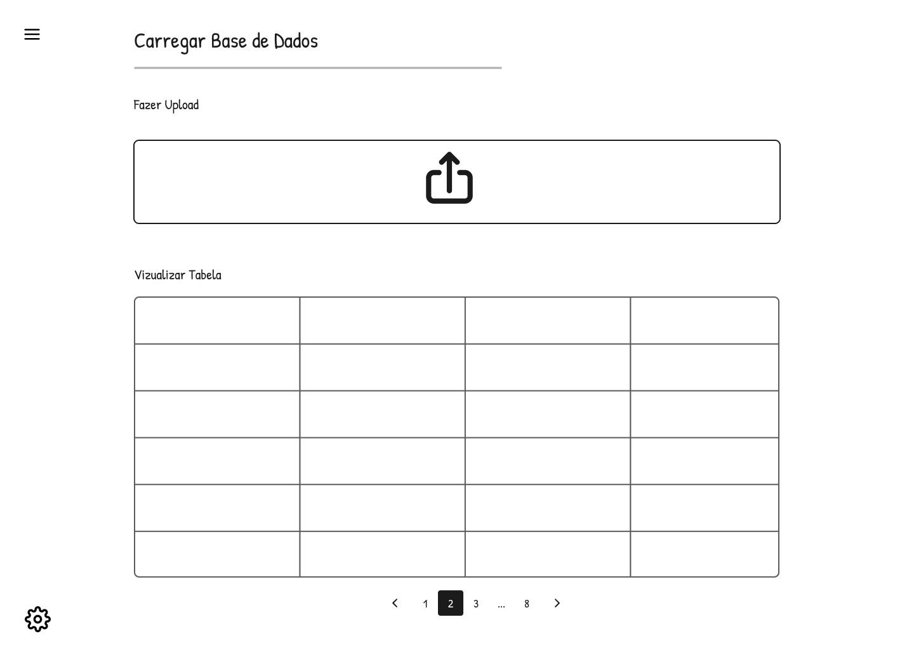
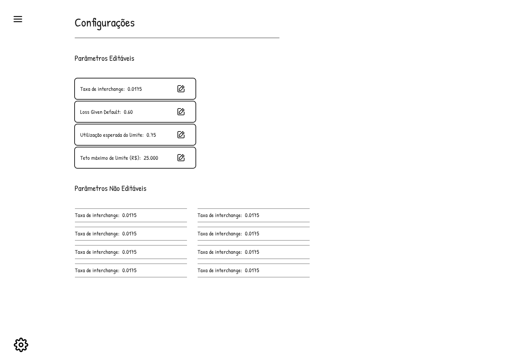
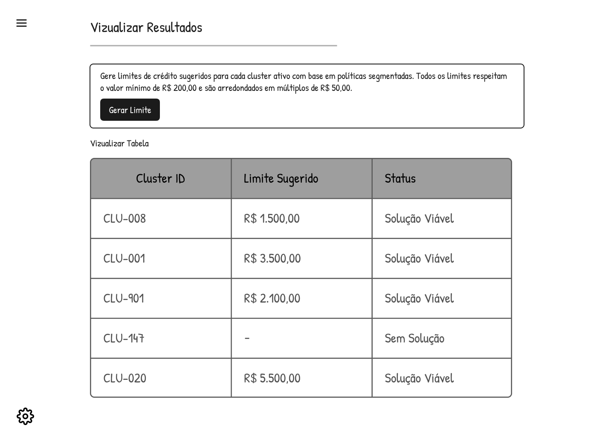

# Documentação do Protótipo — Sistema de Otimização de Limites de Crédito

## 1. Visão Geral da Solução

Este documento apresenta a especificação de interface e fluxos de interação para a solução de otimização de limites pré-aprovados de crédito do Banco PAN. Atualmente, dispomos de rascunhos conceituais que definem o comportamento esperado de cada tela. O protótipo de alta fidelidade com design visual completo e componentes finalizados será desenvolvido em fases subsequentes, baseado nessas especificações detalhadas.

A solução tem como foco principal apoiar o time de Estratégia de Crédito na análise e definição de políticas segmentadas de concessão de limites, utilizando técnicas de clusterização e otimização matemática. Além disso, o sistema também atende às necessidades do time de Data Science, responsável pela preparação dos dados, parametrização técnica e manutenção contínua do modelo em produção.

O documento foi construído considerando diretamente as User Stories mapeadas durante as etapas anteriores do projeto, bem como os problemas reais identificados nas personas e nas jornadas de usuário. Dessa forma, cada funcionalidade descrita para as telas busca resolver dores concretas: falta de transparência nas decisões, dificuldade em simular cenários rapidamente, dependência técnica constante quando mudanças de parâmetros são necessárias, e baixa explicabilidade das decisões em contextos de comitê.

O fluxo operacional esperado é linear e natural, refletindo a sequência de atividades que ocorrem no banco. Primeiro, o usuário carrega a base de dados de clientes elegíveis. Em seguida, configura os parâmetros do modelo conforme o cenário de negócio (metas comerciais, apetite de risco, etc.). Depois, executa a otimização para gerar os limites sugeridos. Finalmente, analisa e interpreta os resultados antes de levar ao comitê de crédito. Este documento funciona como especificação de requisitos de interface que orientará o design visual e a implementação técnica do protótipo.

## 2. Estrutura Geral da Interface

A interface foi planejada seguindo princípios de consistência visual e facilidade de navegação ao longo de todo o sistema. Todas as telas adotam o mesmo padrão estrutural, o que permite que o usuário compreenda rapidamente como o produto está organizado e consiga executar tarefas sem necessidade de treinamento extenso.

A navegação principal ocorre através de um menu lateral representado pelo ícone "hambúrguer" (três linhas horizontais), localizado no canto superior esquerdo. Esse padrão foi escolhido porque é amplamente reconhecido em aplicações modernas e web, permitindo expansão futura do sistema sem comprometer o espaço visual disponível para o conteúdo principal.

Além da navegação, todas as telas compartilham elementos visuais consistentes: cada página tem um título principal bem visível da funcionalidade, há divisão visual clara entre diferentes seções através de cartões ou áreas demarcadas, os componentes estão alinhados consistentemente, a tipografia é padronizada em toda a aplicação, e dados são organizados em cartões e tabelas quando apropriado. Um ícone de acesso rápido às configurações aparece consistentemente, permitindo que o usuário mude parâmetros em qualquer ponto do fluxo.

A identidade visual geral é minimalista e sem excesso de decoração, uma escolha deliberada para priorizar legibilidade e interpretação rápida dos dados. Esse é um aspecto crítico considerando o contexto corporativo e altamente analítico da solução: Rodinei (analista de crédito) não quer interfaces bonitas, quer dados claros e rápidos de entender sob pressão de comitê.

## 3. Rascunhos das Telas

Este documento especifica os rascunhos (protótipos conceituais) das telas principais do sistema de otimização de limites de crédito. Cada tela é apresentada com seu propósito, arquitetura visual, componentes principais e fluxo de usabilidade esperado. Os rascunhos visuais aqui inclusos representam a base para o posterior desenvolvimento do protótipo de alta fidelidade.

## 3.1 Tela de Carregamento da Base de Dados

### 3.1.1 Propósito e Contexto

A tela de carregamento de base de dados representa o primeiro passo operacional da solução. Seu objetivo primário é permitir que o usuário importe a base de clientes elegíveis que será utilizada no processo de clusterização e, subsequentemente, de otimização dos limites de crédito. Sem dados de qualidade aqui, tudo que vem depois é construído em areia.

Essa funcionalidade está diretamente relacionada à User Story US01 ("Carregar base de dados"), cujo foco é garantir que o modelo utilize informações corretas, padronizadas e completas. O principal usuário dessa tela é o time de Data Science, responsável pela preparação inicial e validação técnica das informações que alimentam o modelo. Larissa, a persona de cientista de dados, é quem passa mais tempo aqui.

Figura 1: Tela Carregar Base de Dados

  

Fonte: Material produzido pelos autores

### 3.1.2 Arquitetura da Tela

A tela foi dividida em duas áreas principais com propósitos distintos mas complementares. A primeira área é destinada ao upload do arquivo, ocupando posição de destaque visual para deixar claro que essa é a ação principal esperada. A segunda área apresenta uma visualização da tabela carregada, permitindo que o usuário valide rapidamente se os dados foram importados corretamente.

Essa separação espacial é intencional: primeiro você foca em trazer os dados para dentro do sistema, depois você valida se vieram certos. Essa sequência reduz confusão e ajuda Larissa a confiar que está trabalhando com a base certa.

### 3.1.3 Componente de Upload

O componente de upload foi desenhado em formato de grande caixa central com ícone visual de upload, reforçando visualmente a ação de importação de arquivos. Quando o usuário chega nessa tela pela primeira vez, fica imediatamente claro o que precisa fazer: trazer um arquivo.

O componente aceita apenas arquivos no formato `.parquet`, o formato padrão para dados estruturados que Larissa usa no pipeline de processamento do banco. O sistema valida automaticamente a estrutura do arquivo quando é recebido, verificando se as 17 variáveis obrigatórias (conforme listado no termo de abertura do projeto) estão todas presentes. Se alguma coluna estiver faltando, o sistema exibe uma mensagem de erro clara listando exatamente qual variável está ausente, permitindo que o usuário corrija e reenvie rapidamente.

O sistema também valida a integridade geral da base. Se o arquivo estiver corrompido ou incompleto, um aviso específico é exibido. O sistema foi projetado para aceitar grandes volumes de dados—a base operacional do banco contém aproximadamente 1,8 milhão de registros elegíveis—sem queda de desempenho notável.

Como um recurso adicional para fins de desenvolvimento e teste, o sistema permite que Larissa carregue uma base mock (dados sintéticos) em vez da base real, útil quando ela quer testar o fluxo sem expor dados sensíveis do cliente.

### 3.1.4 Visualização e Validação dos Dados

Após o upload bem-sucedido, o sistema apresenta uma tabela contendo uma amostra dos dados importados. Essa funcionalidade possui papel psicológico importante na experiência do usuário: reduz insegurança operacional e permite que Larissa valide visualmente se os dados fizeram sentido antes de prosseguir para fases posteriores de processamento.

A tabela foi desenhada de maneira simplificada e visual, priorizando clareza sobre detalhe técnico. As colunas principais estão visíveis, os valores aparecem em formato legível, e há uma paginação na parte inferior para navegar através de grandes conjuntos de dados sem poluir a tela ou consumir memória. Larissa consegue rapidamente scrollar alguns registros e confirmar: "sim, esses são os dados que esperava".

### 3.1.5 Fluxo de Usabilidade Completo

O fluxo esperado é direto: Larissa acessa a tela, seleciona o arquivo parquet em seu computador, o sistema valida a estrutura, processa o upload em background, e finalmente exibe a tabela com uma amostra dos dados. Se algo der errado—arquivo corrompido, colunas faltando—ela recebe mensagem clara de erro e consegue corrigir imediatamente. Resultado final: a base fica disponível e validada para utilização no processo de clusterização e otimização subsequente.

## 3.2 Tela de Configurações do Modelo

### 3.2.1 Propósito e Contexto

A tela de configurações foi projetada com um objetivo específico: permitir que parâmetros do modelo matemático sejam ajustados sem necessidade de alteração direta no código-fonte. Isso é crucial para habilitar o time de Estratégia de Crédito—especialmente Rodinei—a testar cenários diferentes de negócio de forma rápida e independente.

Essa autonomia resolve diretamente a dor de Rodinei: anteriormente, qualquer mudança de parâmetro exigia que ele abrisse um chamado técnico com Larissa, esperasse dias, recebia resultados em planilhas desorganizadas, e precisava manualmente processar tudo para levar ao comitê. Agora, ele configura na tela, simula em minutos, e tem respostas imediatas.

A tela implementa principalmente as User Stories US02 ("Ajustar clusterização") e US03 ("Configurar metas de produção"), permitindo que tanto cientista de dados quanto analista de crédito tenham seu espaço de controle.

Figura 2: Tela de Configuração

  

Fonte: Material produzido pelos autores

### 3.2.2 Organização Inteligente dos Parâmetros

A tela foi dividida em dois grandes grupos: parâmetros editáveis (aqueles que Rodinei pode mudar para simular cenários) e parâmetros não editáveis (aqueles que são estruturais ou requerem aprovação antes de mudar).

Essa divisão tem propósito: separa claramente o que é operacional (pode ser testado rapidamente) do que é estrutural (mudanças requerem processo formal). Rodinei não tenta mexer em parâmetros que não deveria; Larissa consegue auditar quais parâmetros estão sendo variados.

### 3.2.3 Parâmetros Editáveis: A Verdade Operacional

Os parâmetros editáveis representam as variáveis que podem ser alteradas conforme necessidades estratégicas mudam. Cada um foi apresentado em formato de cartão individual contendo o nome do parâmetro, seu valor atual, e um ícone de edição que ativa o modo de alteração. Esse formato visual melhora a identificação rápida das configurações e facilita futuras expansões sem sobrecarregar a tela.

A **Taxa de Interchange** é o primeiro parâmetro. Representa a taxa de receita obtida em transações realizadas com o cartão, e impacta diretamente a função objetivo do modelo. Se Rodinei aumenta esse parâmetro porque a receita de interchange mudou (negociação com operadora), todo o modelo se recalibra automaticamente, aumentando a prioridade de aprovar clientes para maximizar volume. Se diminui, o modelo torna-se mais conservador. Esse parâmetro é editável porque pode mudar com negociações com operadoras de cartão.

O **Loss Given Default (LGD)** representa a perda esperada em caso de inadimplência—quanto se perde, em percentual, quando um cliente entra em default. Se o LGD histórico era 70% (30% de recuperação), e melhora para 75% de recuperação (25% de perda), o modelo torna-se mais agressivo porque o risco de perda diminuiu. Esse parâmetro possui impacto importante na avaliação de risco da carteira e é utilizado no balanceamento entre crescimento e segurança operacional. Sua presença explícita na interface aumenta transparência: Rodinei vê que o modelo está considerando a taxa de recuperação na decisão, não apenas aprovações.

A **Utilização Esperada do Limite** é o percentual médio esperado de utilização do limite concedido—se você oferece R$ 1.000 de limite mas o cliente usa apenas R$ 300 em média, a utilização é 30%. Esse parâmetro influencia diretamente a receita projetada (mais utilização = mais interchange), a exposição financeira (quanto risco você realmente tem), e a capacidade operacional da carteira. Rodinei pode aumentá-lo se análises recentes mostram que clientes estão usando mais do que era esperado.

O **Teto Máximo de Limite** define o valor máximo permitido para qualquer limite que o modelo pode sugerir. Essa restrição existe para garantir aderência às políticas internas do banco e evitar exposição excessiva em determinados clusters. Se o modelo quer aprovar um cliente com R$ 10.000 de limite mas a política interna diz "limite máximo absoluto é R$ 5.000", então o teto o restringe. Rodinei pode ajustar isso se a política mudar, mas é um parâmetro que requer cuidado.

### 3.2.4 Parâmetros Não Editáveis: Rastreabilidade e Governança

Os parâmetros não editáveis foram intencionalmente incluídos com objetivo de ampliar transparência e rastreabilidade do sistema. Mesmo não sendo alteráveis pela interface, sua exibição serve fins importantes: permite auditoria (você consegue ver exatamente quais premissas foram usadas), facilita entendimento técnico para Larissa revisar, ajuda na interpretação das decisões geradas, e suporta governança formal quando auditorias externas questionam "por que a política ficou assim?"

## 3.3 Tela de Visualização e Geração de Resultados

### 3.3.1 Propósito e Contexto

A tela de resultados representa o ponto de apoio principal à tomada de decisão dentro de toda a solução. É aqui que Rodinei enxerga os limites sugeridos pelo solver de otimização para cada cluster, consegue fazer uma análise rápida dos resultados, e identifica possíveis inconsistências ou surpresas antes de levar ao comitê.

Essa funcionalidade implementa direitamente as User Stories US04 ("Gerar limite por cluster") e US06 ("Visualizar distribuição dos limites"), que endereçam a dor primária de Rodinei: "Preciso de respostas rápidas, legíveis, que eu possa defender em comitê".

Figura 3: Tela de Visualizar Resultados

  

Fonte: Material produzido pelos autores

### 3.3.2 Arquitetura da Tela

A tela foi organizada em três áreas bem definidas. No topo, um cartão informativo que explica o que está acontecendo. No meio, um botão de ação clara ("Gerar Limite") que dispara a otimização. Na parte inferior, a tabela dos resultados que Rodinei vai analisar.

Essa organização busca guiar o usuário de maneira completamente natural: primeiro entender o funcionamento, depois executar a otimização, finalmente interpretar os resultados. Não há ambiguidade sobre o que fazer em seguida.

### 3.3.3 Cartão Informativo: Explicação do Processo

O cartão superior possui papel essencialmente educativo. Seu objetivo é reforçar quais são as regras de negócio sendo aplicadas, quais restrições o modelo está considerando, e como funciona a geração de limites em linhas gerais. Exemplos: "O limite mínimo é R$ 200", "Limites são discretizados em múltiplos de R$ 50", "A otimização respeita os tetos de inadimplência física e financeira que você configurou".

Essa abordagem contribui para três coisas: reduz ambiguidades (Rodinei sabe exatamente que regras estão ativas), aumenta confiança na solução (não é uma "caixa preta" gerando números aleatórios), e melhora a experiência geral porque o usuário entende o contexto antes de agir.

### 3.3.4 Botão de Execução: Simplicidade Escondendo Complexidade

O botão "Gerar Limite" representa a principal ação da tela. Quando acionado, o sistema executa internamente: processamento completo do modelo de otimização linear, aplicação de todas as restrições configuradas, validação de todas as regras de negócio, e cálculo dos limites finais para cada cluster. Tudo isso levando apenas alguns segundos.

O fluxo foi intencionalmente pensado para transmitir simplicidade operacional mesmo tratando de um processo matematicamente muito complexo. Rodinei clica um botão e recebe resultados. Larissa, por trás das cenas, tem certeza de que a matemática está correta e as restrições estão sendo respeitadas.

### 3.3.5 Tabela de Resultados: O Centro da Decisão

A tabela apresenta os resultados do otimizador de forma estruturada. Cada linha representa um cluster ativo, e as colunas mostram: o identificador único do cluster, o limite sugerido em reais, e o status da solução (se foi viável ou não).

Os resultados estão em formato tabular porque esse é o formato mais apropriado ao contexto altamente analítico da aplicação. Rodinei consegue rapidamente varrer os dados com os olhos, identificar outliers (clusters com limite muito alto ou muito baixo comparado aos vizinhos), e entender o padrão geral da política.

A coluna de status é crítica para explicabilidade e rastreabilidade. Uma solução "Viável" significa que o solver encontrou um limite compatível com todas as restrições que foram definidas. Uma indicação "Sem Solução" significa que o conjunto de restrições configuradas é tão apertado que é matematicamente impossível gerar um limite válido para aquele cluster.

Quando "Sem Solução" aparece, Rodinei sabe imediatamente que tem um problema: as restrições estão conflitando. Ele pode voltar para a tela de configurações e afrouxar o teto de inadimplência ou aumentar o teto máximo de limite, por exemplo. Essa visibilidade de conflitos é fundamental porque evita que uma política inviável seja implementada.

### 3.3.6 Fluxo Completo de Decisão

O fluxo esperado é: Rodinei acessa a tela de resultados, examina o cartão informativo para relembrar as regras, clica em "Gerar Limite", o solver executa, e a tabela é exibida. Ele analisa rapidamente os valores, verifica se algum cluster ficou "Sem Solução" (se sim, volta para configurações), examina os extremos para confirmar que fazem sentido. Se tudo parece correto, ele exporta os resultados e prepara sua apresentação para o comitê. Resultado final: Rodinei consegue analisar os limites sugeridos e tomar decisões estratégicas com apoio robusto do modelo.

## 4. Fluxo Operacional Integrado

As três telas funcionam de forma sequencial e integrada. Larissa começa carregando a base, configura parâmetros estruturais que não mudam frequentemente, e valida tudo localmente. Depois, Rodinei acessa a mesma ferramenta, navega para a tela de configurações e ajusta parâmetros operacionais conforme o cenário do momento (metas comerciais, apetite de risco), e finalmente vai para a tela de resultados para gerar e analisar os limites.

Não há perda de informação entre telas, não há reprocessamento desnecessário, e não há confusão sobre quem é responsável por quê. A interface espelha claramente a divisão de papéis do projeto real.

## 5. Princípios de UX Aplicados

O desenvolvimento das telas seguiu deliberadamente um conjunto de princípios de usabilidade consolidados na comunidade de experiência do usuário. Consistência visual foi priorizada: cada elemento visual aparece da mesma forma em todas as telas. Clareza das ações foi mantida: sempre fica óbvio o que o usuário deve fazer em seguida. Organização hierárquica das informações garante que o mais importante apareça primeiro: para Rodinei, os limites sugeridos importam mais do que os parâmetros que os geraram.

Feedback visual ocorre em tempo real: quando um arquivo é enviado, o usuário vê uma animação de carregamento, não um vazio. Quando um parâmetro é alterado, há confirmação visual de que foi registrado. Redução de complexidade foi uma constante: a otimização linear é matematicamente sofisticada, mas a interface não expõe essa sofisticação—expõe apenas o que importa.

A solução deliberadamente evita violações das Heurísticas de Nielsen, especialmente: visibilidade do status do sistema (usuário sempre sabe o que está acontecendo), consistência e padrões (mesmos elementos em mesmas posições em todas as telas), reconhecimento em vez de memorização (ícones são intuitivos, não precisam ser decorados), e controle do usuário (é sempre possível voltar atrás, não há ações irreversíveis sem confirmação).

## 6. Notas Sobre Telas Faltantes e Fase de Prototipagem

Este especificação cobre as três telas principais do fluxo: carregamento de dados, configuração de parâmetros, e geração de resultados. Duas telas que ainda precisam ser documentadas em detalhe são: a tela de consulta de restrições ativas (User Story US05), que permite Rodinei investigar por que um cluster específico recebeu um determinado limite; e a tela de exportação de resultados (User Story US07), que permite Larissa exportar os limites em formato que outros sistemas do banco conseguem consumir. Essas telas serão desenvolvidas em próximos sprints e documentadas conforme o padrão estabelecido aqui.

**Sobre as imagens incluídas:** Os rascuhos visuais apresentados (tela_Carregar_base_de_dados.png, tela_config.png, tela_resultados.png) representam conceitos iniciais que demonstram o layout e o fluxo de informações esperados. O protótipo de alta fidelidade com design visual final, cores, tipografia refinada e todos os componentes polidos será desenvolvido na fase subsequente de design. Este documento serve como especificação e requisitos para guiar esse trabalho de design e prototipagem posterior.

## 7. Síntese e Próximos Passos

A especificação de interface apresentada neste documento representa os principais fluxos operacionais da solução de otimização de limites de crédito. As descrições detalhadas de cada tela foram construídas deliberadamente para equilibrar simplicidade de uso (o que o usuário operacional precisa), clareza visual (dados legíveis rápido), governança (rastreabilidade de decisões), e transparência (nenhuma "caixa preta").

Este documento funciona como a ponte entre a fase de requisitos (consolidada nas User Stories e jornadas de usuário) e a fase de design visual. As especificações detalhadas aqui orientarão o desenvolvimento do protótipo de alta fidelidade, garantindo que as decisões de design visual, layout final e componentes interativos estejam alinhados com as necessidades reais dos usuários.

Os fluxos demonstram como o sistema será utilizado pelos times de Estratégia de Crédito e Data Science, com clara aderência às User Stories mapeadas e às necessidades identificadas durante o processo de levantamento de requisitos.

Os fluxos demonstram como o sistema será utilizado pelos times de Estratégia de Crédito e Data Science, com clara aderência às User Stories mapeadas e às necessidades identificadas durante o processo de levantamento de requisitos.
